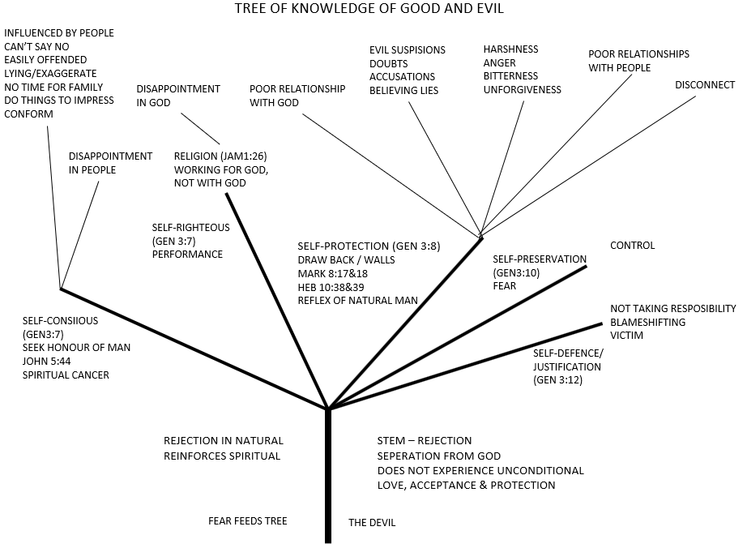
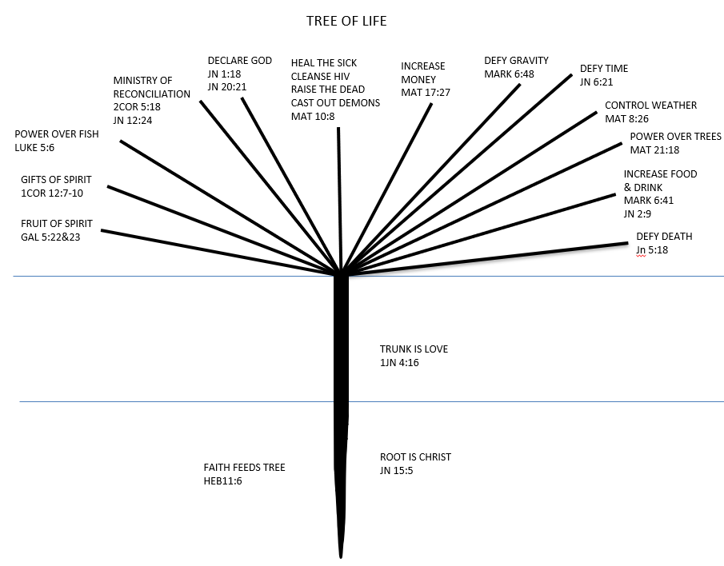
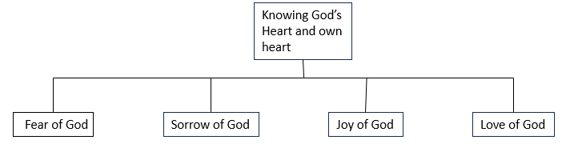
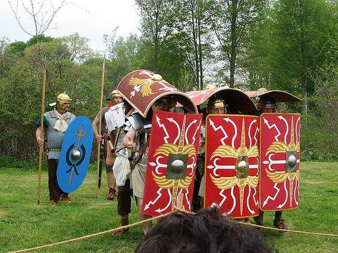

## 0. Prologue {named}

A few years ago, I read “Callsign Chaos” by Gen. Jim Mattis. Being a former soldier, it immediately resonated with me. The key point I took from this book is the importance of the intent of the commander. With modern warfare becoming so fluid, it is important that everyone, even at the lowest level, should be aware of what the commander’s intent is.

Spiritually, this point is just as strategic, if not more so. We as believers are at war! We have a Commander! It is crucial for us to know what the Commander’s intent is. This caused me to meditate on God’s overall intent.

The Holy Spirit explained to me what God’s intent is from 2 Peter 1:11 and 2 Peter 3:13:

An eternal kingdom in which righteousness dwells.

Everything we do should align to achieve His eternal intent.

Thus, the intent of this book is to help/point/inspire believers to live a life by the power of God. God’s primary characteristic is that He is righteous and His desire is for us to live righteously before Him. It is only when living by His Spirit that we will be able to live righteously.

From the Scriptures it is clear that the gospel of Christ is the power of God to salvation to everyone who believes (Romans 1:16&17).

In 1998, while wrestling with why there is such a discrepancy with what we see in Scripture, what we see in the church and also in our individual lives, I got the phrase: “The Gospel of Christ”. It is a phrase Paul often uses in his writings. Meditating on it, I came to the conclusion that the gospel which Paul believed and preached and the gospel which I believed and preached is not the same – simply because the result was not the same.

Over the last 25 years, the Lord has been teaching me what the gospel of Christ is. Since it is the gospel of Christ and God being endless, this learning process is ongoing, never to end. I am still in training.

Disciple making is what really excites me. There are two reasons why writing does not: firstly, I am not good at it and secondly, too many believers would rather read a Christian book than the Scriptures. The reason I am writing is because the Lord told me to.

I also am very aware that the spiritual insights I share have nothing to do with me. I simplified the following quote from Destined for the Throne (Paul Billheimer): “I believe that the insights were given to me by the personal ministry of the Holy Spirit through the Word. I, therefore, relinquish all claim to ownership. I would like my brothers to feel free to use these insights in their ministry and any material herein which the Spirit may quicken to you. The truths were given by the Spirit. They belong to the Body.”

This book is not intended as Christian entertainment, but to be used as self-study. The purpose of it is to challenge the reader to search and check the Scripture, to take it into the secret place and to enquire from the Lord if it is true. It is meant to be meditated on.

Although my thoughts are written in the first person, I have drawn on many interactions with other believers. Where I have remembered through whom the Lord gave me something, I have acknowledged it. However, there is a lot that I received from faceless saints who do not even realise the impact they had in my life. You will notice the author is ”A Team”. There are two reasons for this:

1. So much of what I shared, I received from other saints, so I perceive it to be a team effort.
2. We live in Central Asia and all ministry happens under the radar. It is very important for us to stay anonymous. Many readers will know who we are, but if you pass it on to someone who does not know us, please keep us anonymous.

### Introduction

Why the title IN?

A number of years ago, when I did a teaching on the topic of spiritual warfare, I used Ephesians 6:10-20. Having asked the audience which verse and word they thought to be the most important, since this is such a vital portion of Scripture, there were many opinions. I chose Ephesians 6:10, “Finally, my brethren, be strong in the Lord and in the power of His might.” Whilst meditating, I realised the word “in” is the most pivotal.

There are two verses which I believe explain the New Covenant; the first from Jesus and the second from Paul:

1. “Do you not believe that I am in the Father, and the Father in Me? The words that I speak to you I do not speak on My own authority; but the Father who dwells in Me does the works.” John 14:10 Here Jesus explains the essence of the New Covenant – Man in God and God in Man with God doing the work.
2. “I have been crucified with Christ; it is no longer I who live, but Christ lives in me; and the life which I now live in the flesh I live by faith in the Son of God, who loved me and gave Himself for me.” Galatians 2:20 Paul’s summary of the New Covenant: I am dead and it is Christ who lives in me.

These verses clearly show the importance of the little word “in”. If I am not in Christ and He is not in me, the Scripture is clear that I am then not His (Romans 8:9) and by default I am Satan’s (John 8:44).

Let’s look at some verses in the first few chapters of Ephesians to illustrate this point.

| God’s kingdom | Chapter: verse | World | Chapter: verse
| --- | --- | --- | ---
| Faithful in Christ | 1:1 | Were dead in trespasses and sins | 2:1
| Blessed us with every spiritual blessing in Christ | 1:3 | In which you once walked | 2:2
| He chose us in Him | 1:4 | The spirit who now works in the sons of disobedience | 2:2
| Without blame before Him in love | 1:4 | In the lusts of the flesh | 2:3
| He made us accepted in the Beloved | 1:6 | When we were dead in trespasses | 2:5
| In Him we have redemption | 1:7 | Gentiles in the flesh | 2:11
| His good pleasure which He purposed in Himself | 1:9 | Without God in the world | 2:12
| Gather together in one all things in Christ – in Him | 1:10
| In Him also we have obtained an inheritance | 1:11
| We who first trusted in Christ | 1:12
| In Him you also trusted | 1:13
| In whom also having believed | 1:13
| Your faith in the Lord Jesus | 1:15
| Spirit of wisdom and revelation in the knowledge of Him | 1:17
| The glory of His inheritance in the saints | 1:18
| Which He worked in Christ | 1:20
| God who is rich in mercy | 2:4
| Made us sit together in the heavenly places in Christ | 2:6
| Riches of His grace in His kindness towards us in Christ | 2:7
| His workmanship, created in Christ Jesus | 2:10
| We should walk in them | 2:10
| But now in Christ | 2:13
| Having abolished in His flesh the enmity | 2:15
| To create in Himself one new man | 2:15
| In whom the whole building, being fitted together | 2:21
| In whom you also are being built | 2:22
| For a dwelling place of God in the Spirit | 2:22
| Partakers of His promise in Christ | 3:6
| The eternal purpose which He accomplished in Christ | 3:11
| Strengthened with might through His Spirit in the inner man | 3:16
| That Christ may dwell in your hearts through faith | 3:17
| That you, being rooted and grounded in love | 3:17
| The power that works in us | 3:20

The rest of the book shall be dedicated to proving why man needs God in him.

Note: Wherever the word “man” is used, it signifies man and woman (Genesis 1:27), humans or people.

# PART ONE: Fall of Man – Death through Sin

## 1. Man as God Intended

Let’s start at the very beginning of history. If you do not understand the first three chapters of the Bible, you will not understand the rest of the Bible.

“Then God said, ‘Let Us make man in Our image, according to Our likeness; let them have dominion over the fish of the sea, over the birds of the air, and over the cattle, over all the earth and over every creeping thing that creeps on the earth.’ 27 So God created man in His own image; in the image of God, He created him; male and female He created them.” Genesis 1:26-27

Here man is introduced to us. Firstly, God reveals something vital to us about Himself: when God is involved, it is “Us” (God and I). When Satan is involved, it is always “I” (Satan and I). “How you are fallen from heaven, O Lucifer, son of the morning! How you are cut down to the ground, You who weakened the nations! 13 For you have said in your heart: ‘I will ascend into heaven, I will exalt my throne above the stars of God; I will also sit on the mount of the congregation On the farthest sides of the north; 14 I will ascend above the heights of the clouds, I will be like the Most High.’ 15 Yet you shall be brought down to Sheol, To the lowest depths of the Pit.” Isaiah 14:12-15

God gave this revelation to me through a homeless man who was in the kingdom for only one week. When I visited him, he said God showed him something and he shared the above Scriptures and revelation with me. I immediately knew that this is from God. There is just no way he could figure that out by himself. Later you will realise why this is so profound. “When God created the universe, it was with the one object of making man the partaker of His perfection and blessedness, and of showing in it the glory of His love, His wisdom, and His power.” (Humility – Andrew Murray – Chapter 1).

Mankind was created in God’s image and likeness. Mankind was created by God, for God, to be inhabited by God. In all of history there were only two men who lived as God intended: Adam before the fall and the Man Christ Jesus. Not much is revealed about Adam before the fall, but a lot is revealed about Jesus. Therefore, we shall study His life, as it is a perfect prototype of what man should be like.

“No one has seen God at any time. The only begotten Son, who is in the bosom of the Father, He has declared Him.” John 1:18. The Man Jesus showed us what the Father is like. How can we do the same? “’If you had known Me, you would have known My Father also; and from now on you know Him and have seen Him.’ 8 Philip said to Him, ‘Lord, show us the Father, and it is sufficient for us.’ 9 Jesus said to him, ‘Have I been with you so long, and yet you have not known Me, Philip? He who has seen Me has seen the Father; so how can you say, “Show us the Father”? 10 Do you not believe that I am in the Father, and the Father in Me? The words that I speak to you I do not speak on My own authority; but the Father who dwells in Me does the works.’” John 14:7-10.

From verse 10 it is clear that Jesus abided in the Father, and the Father dwelt in Jesus. The Man Christ Jesus could live a supernatural life, because a supernatural God was living in Him. This is God’s plan, provision and will for each of us.

Some further proof that Jesus did or said nothing of Himself can be found in: John 5:19, 30 & 41; 6:38; 7:16, 28; 8:28, 42, 50; 14:10, 24. (Andrew Murray – Humility – Chapter 3).

It is important to note that God gave mankind dominion over all the earth.

## 2. The Two Trees

“And out of the ground the LORD God made every tree grow that is pleasant to the sight and good for food. The tree of life was also in the midst of the garden, and the tree of the knowledge of good and evil.” Genesis 2:9

Understanding Genesis 2:9 is crucial to understanding the Gospel. Here we see the goodness of God because there were trees that were pleasant to the eye and good for food. When we come to the fall of man we shall see why this is so important.

In the Old Testament, God uses types and shadows to reveal spiritual truths. The tree of life is a type of Christ; our life supply. In John 14:6 Jesus said that He is the way, the truth and the life. As the Father was the source of Jesus, He (Jesus) should be our source. The tree of life represents a life of dependence on God.

The tree of the knowledge of good and evil is a type of Satan. These two trees stand opposed to one another. It is important to note that it is the tree of the knowledge of good and evil. Good and evil are in the same tree and both stand opposed to life.

These two trees represent two different sources from which we can live.

## 3. God’s Law

“And the LORD God commanded the man, saying, ‘Of every tree of the garden you may freely eat; 17 but of the tree of the knowledge of good and evil you shall not eat, for in the day that you eat of it you shall surely die.’” Genesis 2:16-17

Reading the Scriptures, we see that the man did eat but still lived for another few hundred years. It is then obvious that “die” in the above is not physical. The death He warns about is spiritual death, which is separation from God.

God has some laws through which He controls the universe. There are natural laws such as gravity, but also spiritual laws such as, ‘if you sin, you will die’ (Romans 6:23).

In Romans 6:16 we are given a primary law of God: “Do you not know that to whom you present yourselves slaves to obey, you are that one’s slaves whom you obey, whether of sin leading to death, or of obedience leading to righteousness?” Romans 6:16

In the next few chapters, we will see this law at work.

## 4. Satan’s Tactics

“Now the serpent was more cunning than any beast of the field which the LORD God had made. And he said to the woman, ‘Has God indeed said, ‘You shall not eat of every tree of the garden?’ 2 And the woman said to the serpent, ‘We may eat the fruit of the trees of the garden; 3 but of the fruit of the tree which is in the midst of the garden, God has said, “You shall not eat it, nor shall you touch it, lest you die.”’ 4 Then the serpent said to the woman, ‘You will not surely die. 5 For God knows that in the day you eat of it your eyes will be opened, and you will be like God, knowing good and evil.’” Genesis 3:1-5

Here Satan is introduced and his tactics are exposed: doubts, lies and accusations.

Doubts:

The first of Satan’s tactics is to sow doubt about what God has said. This can take many forms: • Has God said?

• Is it really so bad?
• Does it still apply today?
• Surely once is not so serious?

Lies:

Doubts will always be followed up with lies. God said you will surely die; Satan says you will not surely die. In John 8:44 we are told that he (Satan) was a murderer from the beginning, and does not stand in the truth, because there is no truth in him. When he speaks a lie, he speaks from his own resources, for he is a liar and the father of it.

Accusations:

The root of all sin is the suspicion that God is not good. In Revelation 12, Satan is described as the accuser. Some examples include:

• Satan accuses God of not wanting us to be like God, which we have already seen is not so. He really wants us to be like Him.
• When something bad happens, Satan accuses God of being the author, while he himself is actually the author.
• Satan accuses us before God (Job 1), God before us, as well as us before one another. In Revelation 12:10 Satan is described as the “accuser of our brethren”, who accuses believers before our God day and night.

The kingdom of Satan is opposed to the kingdom of God. God’s kingdom is characterised by humility, as seen in the life of Jesus who did nothing and said nothing of Himself. He lived a life of perfect dependence on God. Satan’s kingdom is characterised by pride. He tempted man to live independently of God. Pride is wanting to be God – to be utterly in control.

Satan deceived man into believing that man can be man without God.

## 5. Love of the World

“So, when the woman saw that the tree was good for food, that it was pleasant to the eyes, and a tree desirable to make one wise, she took of its fruit and ate. She also gave to her husband with her, and he ate.” Genesis 3:6

From Genesis 2:9 we already saw that all the trees that man was allowed to eat from were pleasant to the eye and good for food. The tree of life was also in the midst of the garden. The tree of life is Christ and in 1 Corinthians 1:24 we see that: Christ [is] the power of God and the wisdom of God. Through His goodness, God already made perfect provision for man. “Do not love the world or the things in the world. If anyone loves the world, the love of the Father is not in him. 16 For all that is in the world – the lust of the flesh, the lust of the eyes, and the pride of life – is not of the Father but is of the world.” 1 John 2:15-16

The ruler of the world (Satan) uses these same things to tempt us as he tempted Eve. Lust of the flesh = good for food. Lust of the eye = pleasant to the eye. Pride of life = to make one wise.

A man walks past the BMW showroom and sees a red M3 on the floor. He immediately stops and feasts his eyes on the car (lust of eyes). He is then enticed to take it for a test drive. When he experiences the acceleration, he knows that he wants this car (lust of the flesh). He realises that he can’t afford it, but then he considers what his neighbour will think if he sees this car in his driveway (pride of life). So, he buys a car he does not need or cannot afford with money he does not have. 1 John 2:15 explains the 2008 worldwide financial crisis. In short, it was a debt crisis; people took out credit which they could not service. The deceitful lust to want bigger and better was the major driver behind this.

Only the love of God can drive out the love of the world. Only God can satisfy man completely. Ephesians 4:22 speaks of deceitful lusts/desires. Man is deceived into believing that things, people, or objects in the world can satisfy him.

## 6. Fall of Man / First Transaction

When Adam ate the fruit of the tree of the knowledge of good and evil, the law of God which states that ‘you are that one’s slaves whom you obey’ (Romans 6:16) came into effect. It is clear from Scripture that Adam disobeyed God and obeyed Satan. The result was that the dominion that God gave man over all the earth in Genesis 1:26 went from man to Satan.

Jesus acknowledged that Satan is the ruler of this world (Matthew 4:8-10 and John 14:30). Adam sold not only himself but all of mankind into slavery under Satan (Romans 5:12). We are all born with the law of sin and death at work in us. “When the old serpent – he who had been cast out from heaven for his pride, whose whole nature as the devil was pride – spoke his words of temptation into the ear of Eve, his words carried with them the very poison of hell. And when she listened and yielded her desire and her will to the prospect of being as God – knowing good and evil – the poison entered into her soul. It destroyed forever that blessed humility and dependence on God which would have been our everlasting happiness.” (Humility – Andrew Murray – chapter 2).

Pride is wanting to be God. Sin is the satanic pride of total independence from God; it is when we want to do our own will and not God’s will. Satan deceived Adam into believing you can lose God and lose nothing. The lie he fed them is that you can be good without God. Adam ate and he died! When Adam obeyed Satan, God withdrew His Holy Spirit from man’s spirit, which left man uninhabited by God. The result is that death and darkness entered and from henceforth reigned in man and the created world (Major Ian Thomas).

Man without God is not neutral. He is satanically polluted. Man became worse than an animal. “As it is written: ‘There is none righteous, no, not one; 11 There is none who understands; There is none who seeks after God. 12 They have all turned aside; They have together become unprofitable; There is none who does good, no, not one.’ 13 ‘Their throat is an open tomb; With their tongues they have practiced deceit’; ‘The poison of asps is under their lips’; 14 ‘Whose mouth is full of cursing and bitterness.’ 15 ‘Their feet are swift to shed blood; 16 Destruction and misery are in their ways; 17 And the way of peace they have not known.’ 18 ‘There is no fear of God before their eyes.’” Romans 3:10-18

At the time of memorising this portion of Scripture, I was also reading a book about the Second World War which described life in Germany under the Nazis. While meditating on it, I realised two things:

• The Nazis did each of these things described in verses 10-18.
• The second, scarier thing I realised is that if I had lived in Germany at that time and had been exposed to those circumstances, I could have been “that man” (2 Samuel 12:7). If you do not realise that you, in similar circumstances, could be that man, you do not understand what happened with the fall of man.

When Adam obeyed Satan, he came under Satan’s dominion. The law of Romans 6:16 kicked in – in other words, a transaction took place. Adam gave away something and he received something:

• He gave up dominion and received slavery.
• He gave up life and received death.
• He gave up intimacy and received separation.

## 7. Man under Satan’s Dominion (Fruit of the Flesh)

In Genesis 3:7-12, God reveals how man reacts/behaves under Satan’s dominion. “Then the eyes of both of them were opened, and they knew that they were naked; and they sewed fig leaves together and made themselves coverings. 8 And they heard the sound of the LORD God walking in the garden in the cool of the day, and Adam and his wife hid themselves from the presence of the LORD God among the trees of the garden. 9 Then the LORD God called to Adam and said to him, ‘Where are you?’ 10 So he said, ‘I heard Your voice in the garden, and I was afraid because I was naked; and I hid myself.’ 11 And He said, ‘Who told you that you were naked? Have you eaten from the tree of which I commanded you that you should not eat?’ 12 Then the man said, ‘The woman whom You gave to be with me, she gave me of the tree, and I ate.’” Genesis 3:7-12

### 7.1 They Saw That They Were Naked – Self-Conscious

When man obeyed Satan, Satan’s pride was breathed into man. The root of self-consciousness (being mindful of self) and of being concerned about what people think or say is pride. “How can you believe, who receive honour from one another, and do not seek the honour that comes from the only God?” John 5:44

Here, Jesus warns us of the danger of seeking honour from one another. Why? Because it kills faith. Without faith one cannot believe! Being self-conscious and worrying about what people think or say about you is spiritual cancer. It kills faith.

The root cause of seeking the honour of man is rejection. The separation that took place after the fall makes all people vulnerable to rejection. Before the fall, man felt secure and accepted because there was no spiritual separation from God.

This sin manifests itself in worrying what people think, fear of man, man pleasing and not being able to say no. Either you are crippled by what others think, resulting in an obvious shyness or cowering away, or you try your utmost to be the best so that others will honour you. The fear of man often falls somewhere on this spectrum. This sin is being obsessed with self or SELF-LOVE. You are concerned about how you look, seeking public approval of people, ‘selfies!’, comparing yourself, and/or an inflated or deflated opinion of self, all point to the number one in your life: SELF.

### 7.2 Made Themselves Coverings – Self-Righteous

The covering of themselves with fig leaves was their effort to make themselves acceptable and presentable to God. All forms of human religion fall into this category and consist mostly of ritual. The source of their effort, however, is not God, but the good part from the tree of knowledge of good and evil.

However, you also get sincere people who don’t only observe rituals; they work for God. Working for God is when we do ministry by our own abilities, plans, visions and ideas. This form of ministry is very dangerous as it always leads to burnout or at least disillusionment. Its source is the wrong tree.

We should work with God. From John 14:10 we have already seen how this was the case in Jesus’ life. The Father in Him did the work.

Practically, self-righteousness manifests itself through things we do to be accepted by God. Pride causes man to think that by his efforts he can make himself acceptable to God. As we explore the gospel, we will realise how wicked this is.

### 7.3 Hid Themselves from the Presence of the LORD – Self-Protection (drawing back and hardened heart)

Before the fall, Adam had fellowship with God. After he sinned, he went and hid himself, thus drawing back from God.

The Scripture is clear that sin/disobedience will cause hardness of heart. In order to sin, one needs to harden one’s heart against what God wants or commands. “Lest any of you be hardened through the deceitfulness of sin.” Hebrews 3:13

Sin causes death, meaning separation from God. When we draw back from God, separation takes place. It is important to note that the separation is not from God’s side. As someone once said: ‘When you feel God is distant, guess who moved?’ “But Jesus, being aware of it, said to them, ‘Why do you reason because you have no bread? Do you not yet perceive nor understand? Is your heart still hardened? 18 Having eyes, do you not see? And having ears, do you not hear? And do you not remember?’” Mark 8:17-18

Here Jesus shares with us five things that will result from a hard heart:

1. You do not perceive.
2. You do not understand.
3. You do not see.
4. You do not hear.
5. You do not remember.

A hard heart can’t access the spiritual realm. It cuts you off completely from God.

Everyone understands that sins such as adultery, fornication, uncleanness, lewdness, idolatry and sorcery will lead to hardness of heart and separation from God. Very few people, however, realise that drawing back from people has the exact same effect.

When a natural man is offended, hurt or disappointed by someone, his reflex is to draw back. He needs to put some distance between himself and that person. He builds walls around his heart to protect himself. What he does not realise is how devastating this is to his relationship with God.

It is impossible to draw back from man and not draw back from God. In Colossians 3:12&13 we are given clear instructions on how to respond to one another. When one draws back, he has already disobeyed God by hardening his heart towards God. By the time you have decided to put distance between yourself and someone, there is already distance between you and God. Drawing back is protecting yourself, which is rooted in pride. You are accusing God of not being able to protect you, therefore you start protecting yourself. In essence you are demonstrating that you believe you can do it better than God. “’Now the just shall live by faith; But if anyone draws back, My soul has no pleasure in him.’ 39 But we are not of those who draw back to perdition, but of those who believe to the saving of the soul.” Hebrews 10:38-39

In this Scripture, it is crystal clear that God is not pleased with drawing back. Worse still, it warns that those who deliberately draw back will end in perdition.

### 7.4 I Was Afraid – Self-Preservation (Unbelief)

The only reason that a person fears is because he does not believe that God is in control. Fear is more than the lack of faith; it is a belief system. Fear is the belief that God is:

• not good
• not in control
• not able. “Beware, brethren, lest there be in any of you an evil heart of unbelief in departing from the living God.” Hebrews 3:12 “So, we see that they could not enter in because of unbelief.” Hebrews 3:19

From these two Scriptures it is clear that unbelief is detrimental to one’s walk with the LORD. Where fear exists, control is always present. Again, behind fear is pride: “I don’t believe God is in control or good and therefore I need to control the situation or people.”

### 7.5 The Woman You Gave Me – Self-Defence, Self-Justification

Adam is blame shifting. It is not he who was guilty, but God, because God gave him the woman. This is very instructive. Every time you blame-shift, you are accusing God. It is God who gave the wife or He who allowed the circumstances. Blame shifting makes you a victim. “For I did not come to call the righteous, but sinners, to repentance.” Matthew 9:13

Jesus came to save sinners, not victims!

Any repentance with a ‘’but” is self-defence. When you repent with a “but”, it shows that you believe you are a victim. I did wrong, but it was due to someone else’s fault. We need to take responsibility for our sin, for only then can Jesus save us from it.

From these fruits it is clear that man, separate from God, only has the flesh to fall back on. “For if you live according to the flesh you will die; but if by the Spirit you put to death the deeds of the body, you will live.” Romans 8:13

This portion or warning is critical. If you live according to the flesh, you will die! You should have a clear understanding of the working of the flesh in your own life.

It is evident that the fall was disastrous for the man Adam and the entire human race, including us. How do you think God felt when they had disobeyed? Pause and think on this. Satan did not overpower man, or even negotiate with him, he simply deceived him. Nothing changed; man is still overcome through deception.

Figure 1 Tree of knowledge of good and evil

# PART TWO: Redemption of Man – Death for Sin

## 8. Introduction to Death for Sin / The Second Transaction

After the fall of man, there are two fundamental points to take note of:

1. The penalty for sin is spiritual death – separation from God.
2. God is perfectly just; therefore, all sin needs to be punished – Numbers 14:18.

Man sold us into slavery of sin; therefore, Man had to redeem us: The Man Christ Jesus.

“And coming in the likeness of men. 8 And being found in appearance as a man…” Philippians 2:7-8 To fulfil the requirement of God, He had to be without sin. “Who committed no sin, nor was deceit found in His mouth…” 1 Peter 2:22 “Conceived of the Spirit, born of a woman, very man, yet without sin.” – Paraphrase of Westminster Confession of Faith.

God’s purpose in sending His Son was twofold:

1. To reconcile man to God. To bring us back to Him in order to make peace between Him and us.
2. To save us from sin so that we could live righteously. A people fit for His everlasting kingdom.

God made both possible through the cross of Christ. His twofold purpose is made clear from Romans 5:10, “For if when we were enemies we were reconciled to God through the death of His Son, much more, having been reconciled, we shall be saved by His life.”

## 9. Redemption of Man (Reconciliation)

“For I determined not to know anything among you except Jesus Christ and Him crucified.” 1 Corinthians 2:2 This statement from Paul reveals to us the importance of the cross. Without the cross of Christ there is no gospel, no salvation and no hope for man. Jesus crucified is God’s answer to man’s separation problem.

Read the following Scriptures carefully and meditatively. Through them, God personally revealed to me what happened on the cross. “You have not yet resisted to bloodshed, striving against sin.” Hebrews 12:4 “And He was withdrawn from them about a stone’s throw, and He knelt down and prayed, 42 saying, ‘Father, if it is Your will, take this cup away from Me; nevertheless, not My will, but Yours, be done.’ 43 Then an angel appeared to Him from heaven, strengthening Him. 44 And being in agony, He prayed more earnestly. Then His sweat became like great drops of blood falling down to the ground.” Luke 22:41-44 “Now from the sixth hour until the ninth hour there was darkness over all the land. 46 And about the ninth hour Jesus cried out with a loud voice, saying, ‘Eli, Eli, lama sabachthani?’ that is, ‘My God, My God, why have You forsaken Me?’” Matthew 27:45-46

In 2017, while I was meditating on Hebrews 12:4, I realised that there was a Man who had “resisted to bloodshed”. This led me to Luke 22:42-44. The first thing that struck me was that it was against the sin of doing His own will that Jesus had to “resist to bloodshed.” The next thing that struck me was the cause of His agony. When I asked people what they thought, they all said it was the cruelty of the cross. This did not satisfy, since many people were crucified in those days. One morning while praying, I asked the Lord what caused the agony on the cross. I clearly heard the words, “My God, My God, why have you forsaken Me?” This caused me to weep bitterly. The fact that my sin caused Him to be separated from the Father broke my heart, while filling me with awe and thanksgiving. Jesus suffered separation from God so that we need not suffer separation from God! “…who Himself bore our sins in His own body on the tree.” 1 Peter 2:24

Christ became the sacrifice. “For He made Him who knew no sin to be sin for us, that we might become the righteousness of God in Him.” 2 Corinthians 5:21

Christ took the punishment instead of us. “Yet the LORD was pleased to crush Him severely. When You make Him a restitution offering…” Isaiah 53:10 (HCSB)

Restitution = the restoration of something to its proper owner.

Christ redeemed us. Redeem – to regain possession of something in exchange for payment. “In Him we have redemption through His blood, the forgiveness of sins, according to the riches of His grace…” Ephesians 1:7 “Knowing that you were not redeemed with corruptible things, like silver or gold, from your aimless conduct received by tradition from your fathers, 19 but with the precious blood of Christ, as of a lamb without blemish and without spot.” 1 Peter 1:18-19

One day, while discussing redemption with some students, one used the example of a pawnshop. A pawnshop works on the principle that when you sell them something of value, they give you money in return. When you want to redeem your property, you need to give more money and they then return your property. The student then pointed out that if someone else pays the money on your behalf, all you need to do is receive your property. This illustrates the way Christ paid the price for our redemption – all we need to do is to receive it!

In the Second Transaction He paid with His blood (life) and legally acquired mankind back in order to restore us to God.

How do you think the Father felt when He sacrificed His only begotten Son for us? Ask God to reveal this to you.

## 10. Satan Was Completely Defeated on the Cross and Dominion Went to Man

“For this purpose, the Son of God was manifested, that He might destroy the works of the devil.” 1 John 3:8 Christ came to destroy the works of the devil in two ways:

1. Satan was defeated on the cross. “Now the ruler of this world will be cast out.” John 12:31 “Having disarmed principalities and powers, He made a public spectacle of them, triumphing over them in it” (the cross). Colossians 2:15 “Which He worked in Christ when He raised Him from the dead and seated Him at His right hand in the heavenly places, 21 far above all principality and power and might and dominion, and every name that is named, not only in this age but also in that which is to come. 22 And He put all things under His feet, and gave Him to be head over all things to the church, 23 which is His body, the fullness of Him who fills all in all.” Ephesians 1:20-23

2. God took away dominion from Satan and gave it to the Man Christ Jesus.

I was a Special Forces soldier when I was a young man. All the operations we did were in other countries. We operated in someone else’s kingdom – something which was paramount in our minds and made us very cautious of every step. Later in life, in 2013, I realised that praying for the sick to be healed was a weak point of mine, so I decided to visit the hospital a few times a week to get practice praying for the sick. Whenever I went, I approached it as a Special Force’s operation because I believed that Satan was the ruler of the world and I went to destroy his work – cautiously – until the Lord revealed to me from the above verses that Satan is a defeated and disarmed foe! With great excitement I shared it with my wife. She disagreed and said I should just look around me. So, who was right? Both – if you are in Christ, I am right, but if you are in the world, she was right.

God has already dealt with the works of Satan in our lives. What Jesus did allowed for the Holy Spirit to be given. “So, Moses cried out to the LORD, saying, ‘What shall I do with this people? They are almost ready to stone me!’ 5 And the LORD said to Moses, ‘Go on before the people, and take with you some of the elders of Israel. Also take in your hand your rod with which you struck the river, and go. 6 Behold, I will stand before you there on the rock in Horeb; and you shall strike the rock, and water will come out of it, that the people may drink.’” Exodus 17:4-6 “And all drank the same spiritual drink. For they drank of that spiritual Rock that followed them, and that Rock was Christ.” 1 Corinthians 10:4 “Now all these things happened to them as examples, and they were written for our admonition, upon whom the ends of the ages have come.” 1 Corinthians 10:11 “On the last day, that great day of the feast, Jesus stood and cried out, saying, ‘If anyone thirsts, let him come to Me and drink. 38 He who believes in Me, as the Scripture has said, out of his heart will flow rivers of living water.’ 39 But this He spoke concerning the Spirit, whom those believing in Him would receive; for the Holy Spirit was not yet given, because Jesus was not yet glorified.” John 7:37-39 “Therefore, being exalted to the right hand of God, and having received from the Father the promise of the Holy Spirit, He poured out this which you now see and hear.” Acts 2:33

The “type” of the Two Trees in the garden has already shown us that God uses “types” in the Old Testament to illustrate spiritual truths in the New Testament. As the Rock (Christ) was smitten and natural water came forth, so, when Jesus was smitten by the Father on the cross, living water (the Holy Spirit) was poured out. When we are filled with the Spirit and live by the Spirit, we live a life free from sin. The works of the devil in our lives have been destroyed! Under the New Covenant it is Christ living in us, through His Holy Spirit, who enables us to live holy, to be a slave of righteousness (this will be further discussed in the next Transaction). It is critical to understand the New Covenant – to know that Christ made provision for the pouring out of the Holy Spirit on the cross.

To summarise the Second Transaction:

• Sin brings separation from a Holy God.
• A perfectly just God requires that all sin be punished.
• Man sold us into sin; Man had to buy us back.
• Christ paid the penalty for our sin.
• Satan was completely defeated on the cross! He rules through deceit over those who are not redeemed. • Dominion went back to the Man Christ Jesus.
• We were not only reconciled to God, but
• empowered through the Spirit to live free from sin and self and the world.

# PART THREE: Translation of Man – Death to Sin

## 11. His Footsteps

“Righteousness will go before Him, and shall make His footsteps our pathway.” Psalms 85:13 “For to this you were called, because Christ also suffered for us, leaving us an example, that you should follow His steps.” 1 Peter 2:21

We need to study the footsteps of Jesus, by which He made the New Covenant possible, if we want to know His pathway for us into the New Covenant.

His footsteps were:

1. Christ crucified – Matthew 27:27-56.
2. Christ buried – Matthew 27:56-66.
3. Christ raised – Matthew 28:1-7.
4. Christ glorified – Acts 1:9-11, Acts 2:33, Ephesians 1:19-23, 1 Peter 3:22.

We need to read these passages carefully.

## 12. Our Pathway

Historically, the New Covenant started on the day of Pentecost. After the first disciples were baptised with the Holy Spirit, Peter stood up and preached to them. He explained to them the New Covenant. The men who stood by were cut to the heart and asked: “’Men and brethren, what shall we do?’ Then Peter said to them, ‘Repent, and let every one of you be baptised in the name of Jesus Christ for the remission of sins; and you shall receive the gift of the Holy Spirit. 39 For the promise is to you and to your children, and to all who are afar off, as many as the Lord our God will call.’” Acts 2:37-39

The way into the New Covenant, as explained by Peter, was: repentance, water baptism and baptism with the Holy Spirit – undergirded, of course, by faith in Christ.

From Psalm 85 we saw that His footsteps are our pathway. He was crucified, buried, raised and glorified. This implies that we also need to be crucified, buried, raised and glorified to enter into the New Covenant. This is exactly how Peter phrased it too.

### 12.1 Repentance – Crucified

It is important to understand that without crucifixion/death none of the other footsteps can take place. “’I have been crucified with Christ; it is no longer I who live, but Christ lives in me; and the life which I now live in the flesh I live by faith in the Son of God, who loved me and gave Himself for me.” Galatians 2:20 “Knowing this, that our old man was crucified with Him, that the body of sin might be done away with, that we should no longer be slaves of sin. 7 For he who has died has been freed from sin.” Romans 6:6-7

From these verses it is clear that we need to be crucified with Christ. Furthermore, it is not possible to live free from sin without being crucified.

How are we crucified with Christ?

In the fall, Satan deceived man into thinking that it is possible to be man without God and to live independently of God. First of all, and most vital, we need to repent of doing our own will, which caused us to live separately from Him. This implies giving up all your plans, dreams and ambitions to fully submit to God’s will for your life. When a man repents of his own will, God takes him 2000 years back in time and crucifies him with Christ. Romans 6:6-7 then applies to that man. This is not philosophy or theology; it is a very real promise of God which He supernaturally performs. God is the One who crucifies and it is His great power that is at work to break the power of sin in our lives.

If you have not repented of doing your own will, then you have not repented!

Many people say a sinner’s prayer in which they repent generally of their sin. One should repent of one’s sins (plural): all the things that brought separation between you and God. Repentance has three phases:

1. Thought – when you realise that what you have done is sin.
2. Word (confession) – when you confess your sin.
3. Deed – when you make restitution for your sin. In other words, when you make right what you have done wrong.

Here are some examples of repentance followed by deeds: “Then Zacchaeus stood and said to the Lord, ‘Look, Lord, I give half of my goods to the poor; and if I have taken anything from anyone by false accusation, I restore fourfold.’” Luke 19:8 “Also, many of those who had practiced magic brought their books together and burned them in the sight of all. And they counted up the value of them, and it totaled fifty thousand pieces of silver.” Acts 19:19

To repent, therefore, means to be sorry enough to stop!

It is important to note that repentance is not regret nor remorse. Regret is when you are sorry that you sinned, because it has had a bad result in your life. Remorse is when you are sorry that your sin has had a bad result in someone else’s life. Sin is against God and repentance is towards God. Other people can benefit from you asking for forgiveness or making restitution, but repentance should be towards God. In Psalm 51, after committing adultery and murder, King David says to God, “Against You, You only, have I sinned, and done what is evil in Your sight.”

Repentance is for the penalty of sin and not for its consequence. The penalty for sin is death/separation from God. Repentance is to restore our relationship with God. God is merciful and gracious; therefore, we can ask that He will have mercy on us and give us grace to deal with the consequences of our sin. An example could be taking out credit to satisfy the lusts of the flesh. After being convicted by the Holy Spirit, you can repent of this sin, but you still need to service the debt. It does not disappear when you repent. God’s mercy and grace are available to help you out of this bondage.

To conclude, after you have repented and been crucified by God with Christ, you are free:

1. From sin – as shown in Romans 6:6&7: “Our old man was crucified with Him, that the body of sin might be done away with, that we should no longer be slaves of sin.”
2. From self (the old man: that old sinful nature) – as shown in Galatians 2:20: “I have been crucified with Christ; it is no longer I who live, but Christ lives in me.”

### 12.2 Baptism – Buried and Raised with Jesus

“Or do you not know that as many of us as were baptised into Christ Jesus were baptised into His death? 4 Therefore we were buried with Him through baptism into death, that just as Christ was raised from the dead by the glory of the Father, even so we also should walk in newness of life.” Romans 6:3-4 “In Him you were also circumcised with the circumcision made without hands, by putting off the body of the sins of the flesh, by the circumcision of Christ, 12 buried with Him in baptism, in which you also were raised with Him through faith in the working of God, who raised Him from the dead.” Colossians 2:11-12

These verses show us that baptism is much more than a step of obedience or a “wet witness” (An outward declaration of an inward commitment). The same power that was at work when God raised Jesus from the dead and set Him at His right hand is at work when we are buried with Christ and raised with Him.

With water baptism, God sets us free from our past and from demons! Let’s first discuss being free from our past:

“For I will be merciful to their unrighteousness, and their sins and their lawless deeds I will remember no more.” Hebrews 8:12. In Hebrews 8:7-12 the writer of Hebrews quotes the promise of the New Covenant as given to the prophet Jeremiah. “There is also an antitype which now saves us—baptism (not the removal of the filth of the flesh, but the answer of a good conscience toward God), through the resurrection of Jesus Christ.” 1 Peter 3:21 “As far as the east is from the west, so far has He removed our transgressions from us.” Psalms 103:12

The promise is sure: as you come out of the water, God raises you for a new life! A new life implies a life completely free from the past. As you come out of the water God gives you a clear conscience, with absolutely nothing between you and God. The emotional impact of your sins, as well as the sins of others against you, is dealt with.

It is wonderful to realise that God has put my sin on Jesus and that between me and God there is nothing separating us. What we have learnt over years of working with people is that it is not only our own sin that messes us up, but also other people’s sin. When God raises you for a new life, He wants you to be free from the baggage that other people’s sin has caused in your life. 1

With baptism, God also sets us free from demons/demonic bondage!

In the Old Testament God uses types and shadows to explain spiritual truths. The most well-known is Israel’s exodus out of Egypt into the Promised land. Pharaoh is a type of Satan – keeping God’s people in bondage. The lamb is a type of Jesus, whose blood saves from death. Egypt is a type of the world. The cloud is a type of the Holy Spirit; as the cloud led them, we are being led by the Holy Spirit. The Red Sea is a type of baptism and Pharaoh’s soldiers are types of evil spirits. In Exodus 14 we are told how God delivered Israel from Pharaoh’s soldiers. Not one remained. “Moreover, brethren, I do not want you to be unaware that all our fathers were under the cloud, all passed through the sea, 2 all were baptised into Moses in the cloud and in the sea.” 1 Corinthians 10:1-2

The new man God raises does not only have a good conscience before God and is free from the past but is also free from all demonic bondage. We have experienced and seen people come free from nationalism,

disconnecting, depression, anger, lust, homosexuality, addictions and much more.

1 See chapter 23 on forgiveness to understand how we can help people to approach baptism/burial with faith that God wants to set them free from their past.

As the cross dealt with sin and self, baptism deals with your past and demonic bondage.

### 12.3 Baptism with the Holy Spirit – Being Glorified

You are glorified when the God of glory comes and lives in you. This happens when Jesus baptises you with His Holy Spirit.

After water baptism, you are clean and empty, which is wonderful but sadly not enough. You now need to be filled by God. Remember man was created by God, for God, and to be inhabited by God.

The Holy Spirit is the promise of the Father (Acts 1:4, 2:33&39, Galatians 3:14, Ephesians 1:13). He is also the gift of the Father (Acts 2:38, 8:20, 10:45, 11:17).

If you look at the promise of the New Covenant which God gave to Jeremiah in Jeremiah 31:33&34, repeated in Hebrews 8, it is clear that the Holy Spirit living in us is key to the New Covenant. “For this is the covenant that I will make with the house of Israel after those days, says the LORD: I will put My laws in their mind and write them on their hearts; and I will be their God, and they shall be My people. 11 None of them shall teach his neighbour, and none his brother, saying, ‘Know the LORD,’ for all shall know Me, from the least of them to the greatest of them. 12 For I will be merciful to their unrighteousness, and their sins and their lawless deeds I will remember no more.” Hebrews 8:10-12

When God promises to put His law in our minds and write it on our hearts, He is promising the indwelling of His Holy Spirit. “And because you are sons, God has sent forth the Spirit of His Son into your hearts, crying out, ‘Abba, Father!’” Galatians 4:6 “That Christ may dwell in your hearts through faith; that you, being rooted and grounded in love … to know the love of Christ which passes knowledge; that you may be filled with all the fullness of God.” Ephesians 3:17&19 “To them God willed to make known what are the riches of the glory of this mystery among the Gentiles: which is Christ in you, the hope of glory.” Colossians 1:27

The promise that none shall teach his neighbour and none his brother, for all shall know God, is explained to us by John in the following verses: “However, when He, the Spirit of truth, has come, He will guide you into all truth; for He will not speak on His own authority, but whatever He hears He will speak; and He will tell you things to come.” John 16:13 “The Helper, the Holy Spirit, whom the Father will send in My name, He will teach you all things, and bring to your remembrance all things that I said to you.” John 14:26

God dwelling in us by His Holy Spirit will reveal God to us: “He will glorify Me, for He will take of what is Mine and declare it to you.” John 16:14

“For the law of the Spirit of life in Christ Jesus has made me free from the law of sin and death.” Romans 8:2 When you are a new man filled with the Spirit, it is as easy to live free from sin, as it was to sin when you were still under the law of sin and death.

When we enter into the New Covenant by following in His steps, God adopts us as His children. The adoption process entails crucifying, burying, raising and glorifying us. In each of these steps, God does the work. God wants us to be in the fulness of the New Covenant and to be able to access His great power from day one. There is a misconception, among many believers, that receiving the Spirit is something achieved only after a certain level of maturity. From John 7:37 and Luke 11:13 it is clear all that is needed is for you to be thirsty, to come to Him and to receive.

If the type – Israel’s exodus from Egypt to the Promised land – is so powerful, should the reality – our translation from the world into God’s kingdom – not be much more powerful?

In the Third Transaction: Death to Sin, you give up death and receive life; you give up slavery and receive freedom.

In Appendix B I explain how the Lord revealed the Three Transactions to me. There you will also find an exercise to help you get revelation from the Spirit of the importance of the three deaths in relation to the gospel of Christ.

### 12.4 Responsibilities of a Midwife

In John 3 Jesus told Nicodemus that he needed to be born of water and of Spirit. We all know how important it is in the natural to have a good birth – how much more important is it spiritually! Therefore, God wants competent midwives. To enter into the New Covenant has been described as being born again (birthing process), or as the laying of a foundation. “Therefore, leaving the discussion of the elementary principles of Christ, let us go on to perfection, not laying again the foundation of repentance from dead works and of faith toward God, 2 of the doctrine of baptisms, of laying on of hands, of resurrection of the dead, and of eternal judgment.” Hebrews 6:1-2

The writer to the Hebrews describes repentance, faith, baptism and baptism with the Holy Spirit (laying on of hands) as foundational. We all know that if a building’s foundation is weak then the building is weak. The New Covenant life which we are promised in the Scriptures is from glory to glory (2 Corinthians 3:18). It is truly grievous to see how few saints in our day experience this. First of all, it is important to make sure of your own foundation. If your own foundation is firm, God wants you to help others, especially new believers, to have a solid foundation too.

#### 12.4.1 Preparation

Our faith activates God’s great power. By taking time to share the Three Transactions with a person, you are opening a window to him which the Holy Spirit can use to convict of truth. In Romans 10:14&15 we see that for a person to believe, he first needs to hear. Preaching is our responsibility. Stirring faith in a heart is the work of the Holy Spirit. The person then needs to act – to give God the opportunity to exercise His great power. Understanding – Believing – Obeying: these steps hold true for all facets of our spiritual life.

#### 12.4.2 Birth / Adoption

The most important thing to remember is that we are only midwives. The Holy Spirit should be doing the work. Just as there are certain things a natural midwife needs to do, there are certain things a spiritual midwife also needs to do. Over the years, the Spirit has led us to the following process, which should be used only as a guideline, to help someone be born again:

First, we pray together that the Holy Spirit will give them peace and convince them that it is He who is going to do the work, and that He is gentle.

In Acts 2:21 and Romans 10:13 it says: “for whoever calls on the name of the Lord will be saved.” We start by explaining to them that they are going through a process of adoption. Their first act is to call on the name of the Lord to save them. The moment a person does this, the enemy needs to open his hands and let the person go. The enemy knows this truth, which is proven by the fact that he sometimes locks their mouth so that they can’t speak. This does not happen often but might occur. You then need to command him to let them go. Next, we do repentance, and we always start with helping the person to repent of their own will. It is the same as marriage when you say, “I do” and then take the rest of your life to find out what you are doing! The same is true when you say to God: “Not my will, but Your will.”

The person should then be encouraged to bring his sin into the open. As long as it is in the dark, the enemy has power over them. Confidentiality is of the utmost importance. When dealing with sins the person has committed or is in bondage to, it is important that they not only ask for forgiveness, but also ask Jesus to save them from that sin. Where people have been involved in other religions or the occult, they need to renounce it.

The person must not only repent of his bad deeds, but also of his good deeds. Here it is very important that he has a good understanding of the tree of the knowledge of good and evil. The five fruits of the flesh discussed in the first transaction will come under this category. People think because everyone does certain things, they are normal and acceptable – for example, to be timid, or anti-social, or impatient or to draw back from people when feeling hurt or offended. No, this is not how God created you to be!

In Matthew 6:14&15, Jesus explains how important it is to God that we forgive. If we do not forgive, God will not forgive us.2

Sexual sins and pornography need to be specifically repented of. With these sins, it is especially important that there is not only asking for forgiveness but also asking that Jesus will set the person free from these sins. With the rise of the internet, people are bombarded with material that a few years ago would have been classified as pornography.

After a person has repented, we ask the Holy Spirit to reveal to him if there is something that he has left out which Holy Spirit wants to remind him of. This is to place one on solid ground, in case the enemy tries to bring some guilt or accusations. A person can then boldly declare that God has said there is nothing else. You cannot repent of all the sin you have committed in your life but the sins that caused guilt and shame are the ones to focus on.

This initial repentance is only the first step in a life of repentance. As the Spirit convicts, one should be quick to repent.

After God has crucified one’s old man with Christ, he now needs to be buried so that God can raise him for a new life. This takes place when he is immersed in water. One is baptised in the name of the Father, the Son and the Holy Spirit. The Father because it is His plan, the Son because the person is being buried and raised with Christ, and the Holy Spirit because the Spirit raises for a new life.

I always explain to the person that when I dunk him, I will hold him down for a few seconds. During this time, he needs to think about how God is clearing his conscience, how he is being washed, so that when he comes out of the water there is absolutely nothing between him and God. He is also encouraged to believe that as he comes out of the water and the water closes after him, every demon that has ever worked in his life stays behind. He is raised clean and free!

This clean and empty person now needs to be filled with the Holy Spirit. Remember that God created man to inhabit him. It is clear from Scripture that Jesus baptises with the Holy Spirit. Since the Spirit is a gift from God, we encourage the person to look up with his hands stretched out, as a small child would if he expects a gift. The person is first encouraged to invite Jesus to come dwell in his heart by the Holy Spirit. After that we lay hands on him and ask Jesus to baptise him with the Holy Spirit. We then wait on the Holy Spirit to minister to him.

2 See chapter 23.

After we have prayed for a person to receive the Holy Spirit and allowed some time for the ministry of the Spirit, we also ask the Holy Spirit to give the gifts of the Holy Spirit as seems good to Him. We always pray that He will give the gift of tongues. Because of the great controversy in Christian circles concerning tongues, it is important to show what the Scriptures say about this gift. It is the only spiritual gift that God gives us to edify ourselves. Our experience is that if someone wants this gift, God loves to give it. God is very eager to pour out His Spirit. We have found that people with no Christian background are more open to receiving the ministry of baptism of the Spirit. People with some religious baggage usually find it a bit more difficult. One just needs to be patient with them, giving them the Scriptural proof and encourage them to ask the Spirit themselves concerning this truth.

I would like to share the first time I prayed for someone for baptism with the Spirit. Just some background to place it in context. My wife had been converted two years before me. God saved my life miraculously while I was a soldier. Though I was very thankful towards Him, I was totally clueless as to what it meant to be a New Covenant believer. I could see that my wife had this wonderful relationship with God and so I also desired it. One evening, after reading Appointment in Jerusalem by Derek Prince’s late wife, I was lying on the carpet and crying, telling God that I also wanted to know Him. I told Him that I was so serious, that the next evening I would go with my wife to the charismatic church she sometimes visited and I would answer the altar call. To my shame I did not. However, at the end of the meeting the pastor said that God showed him that there is a young man who wants a meeting with the Holy Spirit. I knew it was me, but only after the third call did I go forward. They prayed for me and I fell down. When I got up, I was a different man.

Growing up in the army meant that swearing was part of my vocabulary. For four years I had tried to break the habit but could not. After that day I was set free from swearing. I also had a desire to praise God and read the Bible. Only later did I realise what had happened there was that I had been baptised with the Holy Spirit.

Despite a huge change in my heart and life, staying in the denomination where we were, which did not practice believer’s baptism or baptism with the Holy Spirit, and with no spiritual input, I backslid. After eighteen months God told me to get out or I would die spiritually.

We then joined a charismatic church, where we did a Life in the Spirit course. After the course they asked if I would be a helper for the next course. Every team had a mature believer and a helper. It was a six-week course and culminated in praying for people to receive the baptism of the Holy Spirit in the last week. In the second last week, my team leader told me that he would be out of town that last week and that I would need to take the last session. I was truly very clueless at that stage and the guy I had to pray for was about thirty years older than me. That week I prayed like never before, as I realised how important an event it was in this person’s life. Jesus baptised him with the Holy Spirit, which made me realise two things: (i) Jesus baptises, not I! (ii) Oh, how eager God is to baptise with the Holy Spirit!

How does God see you after you have been adopted/born from above? “For as many of you as were baptised into Christ have put on Christ.” Galatians 3:27

When you were baptised into water and Spirit, you were baptised into Christ. “But of Him you are in Christ Jesus, who became for us wisdom from God—and righteousness and sanctification and redemption.” 1 Corinthians 1:30 “And such were some of you. But you were washed, but you were sanctified, but you were justified in the name of the Lord Jesus and by the Spirit of our God.” 1 Corinthians 6:11

From the above we see that God sees you as:

Righteous – right with God, free from guilt, shame and sin.

Sanctified – set apart and declared holy.

Redeemed – bought back.

Washed – clean.

Justified – proven or shown to be right, declared not guilty.

You can never be closer to God than when you have just been born! “Men are looking for methods, God is looking for men.” EM Bounds

Bearing the above quote in mind, we should guard against making the Third Transaction a method. God is looking for men who will do all His will (Acts 13:22).

# PART FOUR: Righteousness

## 13. Introduction to Righteousness

After we have been translated from Satan’s kingdom into God’s kingdom, we are born again. You need to be born to be able to grow. Consider natural life: a newborn child is a very long way from being mature. Our salvation entails 3 phases:

Phase 1 is when you are translated from Satan’s kingdom into God’s kingdom. You were saved.

Phase 2 is your transformation: being changed into the image of His Son. You are being saved.

Phase 3 is your ultimate or future glorification, when you will receive a new body. You are going to be saved. These stages can also be described as saved from the penalty, power and presence of sin.

In this part we will look at the 2nd phase: Transformation.

Before we look at some truths that will apply to us for the rest of our lives, let’s look at some key points to bear in mind:

• Although God has done a wonderful work in the process of new birth, it is important to note that, when it comes to our character, nothing has changed. We are still carnal/spiritually immature.
• The glorification God promises us (giving us His Holy Spirit) is not any external thing apart from Himself. All that He can give is more of Himself – His aim is to take more complete possession of us. The glorification is not like an earthly prize, something arbitrary (subject to your individual will or judgement without restrictions). For example: a father gives his son a bicycle as a present. The son can then use this bicycle as he wants or sees fit. The Holy Spirit is not given to us for that purpose.
• When we were reconciled to God, He gave us His Spirit with the main purpose of making it possible for us to live by the Spirit. He did not annihilate/exterminate the flesh, nor did He improve/sanctify the flesh! Romans 6:16 still applies: “to whom you present yourself slaves to obey, you are that one’s slave.” Now, however, by the power of the Spirit, it is possible to make the right choice. This was previously impossible, for we always defaulted to sin, because we were a slave of sin.
• Christ defeated Satan on the cross, but he was not annihilated. When Satan rebelled, it was possible for God to cast him in the lake of fire immediately, but He chose not to do it.
• When God removes the heart of stone and gives us a heart of flesh (New Covenant promise in Ezekiel 36:26), it enables us to discern, understand, see, hear and remember spiritual things (Mark 8:17&18). It is now possible to be taught by the Spirit, yet it does not imply perfection.

Righteousness is the quality of being right in the eyes of God, including character (nature), conscience (attitude), conduct (action), and command (word). Righteousness is based on God’s standard.

Since God is now our Father and Jesus our Commander, it is necessary for us to again consider what His intent is: an eternal kingdom in which righteousness reigns. This makes righteousness extremely serious. The Scriptures are very clear that the unrighteous will not enter God’s kingdom (1 Corinthians 6:9).

During my study of Romans, God gave me a nexus (a means of connection or the core/backbone of an idea) to help me understand and explain this very important topic.

1. “There is none righteous, no, not one…” Romans 3:10

Man without God is unrighteous. The best he can do is ‘good’ with the tree of knowledge of good and evil as his source.

2. God alone is righteous. Here are some of the verses that prove this: Romans 1:17, 3:5, 3:21, 3:22, 3:25, 3:26, 10:3.

3. Righteousness is a gift. “For if by the one man’s offense death reigned through the one, much more those who receive abundance of grace and of the gift of righteousness will reign in life through the One, Jesus Christ.” Romans 5:17

Righteousness is a gift from God. When God comes to dwell in us by His Holy Spirit, He gives us the Spirit of righteousness as a gift!

4. We need to present ourselves to God. “I beseech you therefore, brethren, by the mercies of God, that you present your bodies a living sacrifice, holy, acceptable to God, which is your reasonable service.” Romans 12:1 See also Romans 6:13, 16, 19. We see that in the life of Jesus it was the Father who did the work (John 14:10). In the New Covenant the same holds for us: Jesus through His Spirit does the work. However, we need to present ourselves to Him to enable Him to do it. As we present ourselves to Him, He puts His truth in our hearts. If we present ourselves to Him, He will do the rest.

5. With the heart we believe. “For with the heart, one believes unto righteousness, and with the mouth confession is made unto salvation.” Romans 10:10

The only way to believe is when God has placed it in your heart. “Abraham believed God, and it was accounted to him for righteousness” – Romans 4:3. Faith is directly linked to righteousness.

6. We obey from the heart. “But God be thanked that though you were slaves of sin, yet you obeyed from the heart that form of doctrine to which you were delivered.” Romans 6:17

It is possible to obey from the heart, because God has placed His truth, will, and desire in our heart. We do it because we want to do it!

7. Obedience leads to righteousness. “Do you not know that to whom you present yourselves slaves to obey, you are that one’s slaves whom you obey, whether of sin leading to death, or of obedience leading to righteousness?” Romans 6:16

If we present ourselves to God to obey, obedience will lead to righteousness.

8. Grace reigns through righteousness. “So that as sin reigned in death, even so grace might reign through righteousness to eternal life through Jesus Christ our Lord.” Romans 5:21

## 14. Faith and Righteousness

In David Pawson’s book, The Normal Christian Birth, he describes our path into the New Covenant as repentance, faith, water baptism and receiving of Holy Spirit. Let’s now discuss faith. “And not being weak in faith, he (Abraham) did not consider his own body, already dead (since he was about a hundred years old), and the deadness of Sarah’s womb. 20 He did not waver at the promise of God through unbelief, but was strengthened in faith, giving glory to God, 21 and being fully convinced that what He had promised He was also able to perform. 22 And therefore ‘it was accounted to him for righteousness’.” Romans 4:19-22

Faith in God is being fully convinced that what He has promised, He is able to perform. When starting our spiritual walk, it is crucial that we have the solid foundation of knowing what God has done in the process of new birth. He has set you free from sin, self, past, demons and has come to inhabit you. Most Christians struggle, either because the above has not happened or if it has happened, they are not fully convinced that God has done what He promised.

Faith is accounted to us as righteousness. The root of all sin is the suspicion that God is not good. Unbelief is the belief that God is not good, not in control and not able.

## 15. Present Yourself to God

If you study the nexus of righteousness, you will realise that God does everything! All we need to do is to present ourselves to Him. In everything that pertains to our salvation it is God who takes the initiative!

### 15.1 Provision

“But into the second part the high priest went alone once a year, not without blood, which he offered for himself and for the people’s sins committed in ignorance …” Hebrews 9:7

Under the Old Covenant the high priest entered the Most Holy Place once a year. “Then the sun was darkened, and the veil of the temple was torn in two. 46 And when Jesus had cried out with a loud voice, He said, ‘Father, into Your hands I commit My spirit’. Having said this, He breathed His last.” Luke 23:45-46

When Jesus died on the cross, the veil of the Most Holy Place was rent from top to bottom. “Therefore, brethren, having boldness to enter the Holiest by the blood of Jesus, 20 by a new and living way which He consecrated for us, through the veil, that is, His flesh.” Hebrews 10:19-20

Through His death on the cross His flesh (the veil) was rent. The Rock was smitten, so that the Living Water could be poured out. The veil was not rent so that we could go in; it was rent so that God could get out. We are the temple in which He now dwells.

• “Do you not know that you are the temple of God and that the Spirit of God dwells in you?” 1 Corinthians 3:16
• “Or do you not know that your body is the temple of the Holy Spirit who is in you?” 1 Corinthians 6:19 • “In whom the whole building, being fitted together, grows into a holy temple in the Lord, 22 in whom you also are being built together for a dwelling place of God in the Spirit.” Ephesians 2:21-22

Through His death on the cross, Christ made it possible for us to have 24/7 access to God.

### 15.2 Secret Place – Prayer

“But you, when you pray, go into your room, and when you have shut your door, pray to your Father who is in the secret place; and your Father who sees in secret will reward you openly.” Matthew 6:6

Imagine you are a boss and one of your employees comes into the office. When he enters you say, ‘Close the door.’ What does that imply? I want to spend time with you alone and do not want to be disturbed. Think of this incredible privilege that you have: the Ruler of the universe invites you into His presence. The Father wants to spend time with you and tells you to close the door behind you – only you and Him! To get to know the heart of the Father, it is essential to spend time with Him alone. It is the Father’s desire that His children should spend time with Him.

We were predestined not only to be sons, but to have the same relationship with the Father that Jesus had. “For whom He foreknew, He also predestined to be conformed to the image of His Son, that He might be the firstborn among many brethren.” Romans 8:29

#### 15.2.1 The Purpose of Prayer

We spend time with God to get to know Him. “And this is eternal life, that they may know You, the only true God, and Jesus Christ whom You have sent.” John 17:3

Eternal life starts the moment you enter God’s kingdom. The only way to get to know a person is to spend time with him. Since God is endless, we will spend the rest of our life getting to know Him. Knowing God is not possessing some information about Him. It is knowing His heart, what He feels, His will, desires, plans and hopes. Today many people grow up without fathers, or with absent or bad fathers. Our Father in heaven wants us to get to know Him because He wants to be a good Father to us. “But you have not so learned Christ, 21 if indeed you have heard Him and have been taught by Him, as the truth is in Jesus.” Ephesians 4:20-21

We get to know Jesus by hearing Him and being taught by Him. “Beloved, now we are children of God; and it has not yet been revealed what we shall be, but we know that when He is revealed, we shall be like Him, for we shall see Him as He is.” 1 John 3:2

Although this speaks of Jesus’ return, a very important spiritual principle is given – if you behold Jesus, you will be changed into His image. It is impossible to meet with Him in the secret place and not be changed. “But we all, with unveiled faces, beholding as in a mirror the glory of the Lord, are being transformed into the same image from glory to glory, just as by the Spirit of the Lord.” 2 Corinthians 3:18

When we meet face to face with the Lord we are changed from glory to glory by His glory. In Exodus 29:43, it speaks of the tabernacle that is sanctified by His glory. How much more so with us – the living tabernacle!

We spend time with Him, so that His Spirit can teach us:

• “But the Helper, the Holy Spirit, whom the Father will send in My name, He will teach you all things and bring to your remembrance all things that I said to you.” John 14:26
• “However, when He, the Spirit of truth, has come, He will guide you into all truth; for He will not speak on His own authority, but whatever He hears He will speak; and He will tell you things to come. 14 He will glorify Me, for He will take of what is Mine and declare it to you.” John 16:13-14
• “But the anointing which you have received from Him abides in you, and you do not need that anyone teach you; but as the same anointing teaches you concerning all things, and is true, and is not a lie, and just as it has taught you, you will abide in Him.” 1 John 2:27

Notwithstanding the euphoria of being born again, having God as a Father and being part of His household, you now embark on a lifelong journey of being a disciple of Jesus. To be a disciple implies enrolling as a learner. Christ died on the cross so that He could live in you through His Spirit and that He Himself could teach you. Dear brother and sister, one word spoken by the Lord into your heart is more precious than a thousand teachings from man! “He who has My commandments and keeps them, it is he who loves Me. And he who loves Me will be loved by My Father, and I will love him and manifest Myself to him.” John 14:21

Many years ago, I read that Watchman Nee met peasants who could not read or write but knew Jesus better than he did. In my spirit I knew that it was true. However, I could not even imagine how it was possible. Then the Spirit gave me John 14:21 and explained to me that the only way to know Jesus is if He manifests Himself to you.

If you are not hungry for Jesus, it is because you are full of self.

#### 15.2.2 Jesus Our Example

“Who, in the days of His flesh, when He had offered up prayers and supplications, with vehement cries and tears to Him who was able to save Him from death, and was heard because of His godly fear,” Hebrews 5:7 From the gospels we can glean a lot about the prayer life of Jesus, but this verse shows us the intensity. He offered up prayers and supplications with vehement cries and tears to be saved from death. This death was not the cross; it was separation from God. If He sinned once, He would have become a slave of Satan just like Adam. We will discuss godly fear later.

#### 15.2.3 What Prayer Is Not

Prayer is not sacrifice. Shockingly, many Christians see prayer as a sacrifice or burden. It is exactly the opposite. Prayer is the indescribable privilege of having access to the King of kings, the most wonderful Person in the universe.

Prayer is not handing out tasks to the “Work Horse”. I read a book about a student (unbeliever) at a liberal university in the U.S.A. who then decided to attend a Christian university to try and understand Christians better. Early in the book he describes a prayer meeting he attended and he noted that: “These Christians pray about everything, from good marks in the exam, chicken nuggets for lunch, their football team to win and revival in America.” He concluded: “Their God is a real work horse God.” Initially I laughed, but the more I thought about it, the sadder I felt. After this I paid attention to how people pray, and to our shame most people see God as a work horse. We should rather go to Him to find out what He wants to do.

#### 15.2.4 Practical Points

Pray first thing in the morning: “For those who live according to the flesh set their minds on the things of the flesh, but those who live according to the Spirit, the things of the Spirit.” Romans 8:5

By starting our day with the Spirit, it helps us to set our mind on the things of the Spirit and we will come out of the secret place in the Spirit. On the other hand, if you oversleep, burn the toast and get caught in the traffic, you will be in the flesh – and if you are in the flesh, you will put your mind on the things of the flesh.

Find out what it is that God wants to do: “The effective, fervent prayer of a righteous man avails much. 17 Elijah was a man with a nature like ours, and he prayed earnestly that it would not rain; and it did not rain on the land for three years and six months. 18 And he prayed again, and the heaven gave rain, and the earth produced its fruit.” James 5:16-18

When you read the Old Testament, it seems that God brought about the drought and just informed Elijah. The New Testament, however, shows us that Elijah prayed for the drought. God does nothing without prayer. God revealed to Elijah that He wanted to punish Israel using a drought. Then Elijah prayed and God caused a drought. Afterwards, Elijah also broke the drought. If we approach God to find out what it is that He wants to do, and then pray until He does it, our prayer life will be very exciting. Then God, through us, can change the course of history. This is infinitely better than telling God what we think He should do.

Offensive Prayer: “And Jesus answered and said to him, ‘Get behind Me, Satan! For it is written, you shall worship the LORD your God, and Him only you shall serve.’” Luke 4:8

Be it war or rugby, we all know that if you are merely defensive, you will never win. You need to go on the offensive to win. Many believers pray only defensively: Lord, help me, protect me, etc. From Jesus’ example we can learn what it means to pray offensively. Praying Scripture, the Word (the sword of the Spirit), puts us on the offensive. Appendix A is an example of warfare prayer for a new believer.

Proactive Prayer:

If you know that you are going to face a challenging situation today, you should pray proactively. This implies that you pray yourself into a position where you will react in the Spirit. You align yourself with God’s will, truth and ways. This will enable you to draw from God’s power and ability when you need it. This will become clearer when we look at grace.

Questioning Prayer:

We all know that children love asking their parents questions. You will be amazed at how eager God is to answer our questions. These questions come from a place of faith, not criticism or accusation.

Read, study, memorise and meditate on the Scriptures. When I was a very young believer, I attended a seminar. The speaker, Jeff Adams, made a huge impression on me and I had the desire to be a man of God like him. So, I listened carefully to everything he said to find out what he did to make him so spiritual. At one stage he mentioned that when he was younger, he read though the Bible every month, but now that he is older, he reads through the Bible every two months. The Spirit then put it in my heart that if I want to be a man of God, I need to read the Bible. I got a pocket Bible and started reading every free moment I had. Next to baptism with the Spirit, I believe that this had the biggest impact in my life. Many people complain that they have nothing to pray about. If you take the Scriptures seriously, the Spirit will always make sure you have more than enough to pray about and your prayer life will not become stale.

## 16. Obey from the Heart

I need to give some background to make it clear why this chapter is so important. God, through the process of the new birth, has adopted us into His family. A good father trains the character of his child. When I watched “Growing kids God’s way” by the Ezzos, it explained some significant points with regards to raising kids:

The standard Children need to be raised to a standard. This standard is not to be determined by the child’s temperament but is determined by the father. Many parents will make excuses for their child’s bad behaviour by giving the child’s temperament as an excuse. Many children of God do the same: “I am not a people’s person” or “I am not a morning person” etc. The standard is determined by God and we need to be transformed to line up with His standard. The standard of God’s family (kingdom) is revealed to us through the Scriptures and that which God has spoken to us. God’s standard is the culture of God’s kingdom (see chapter 20).

Training is necessary for us to be conformed to the Father’s culture/standard When training natural children, there are different levels of discipline. First is the “eye treatment” – the way you look at the child is enough to change his behaviour. Should this not work, the next level is words – you give him a verbal warning to change his behaviour. If he still does not respond you ramp it up to physical engagement – you apply the rod (causing physical pain). Some references from Proverbs to show that it is biblical: Proverbs 13:24, 22:15, 23:13, 29:15. Although training in conflict is important, it should be the exception and not the rule. “As many as I love, I rebuke and chasten. Therefore, be zealous and repent.” Revelation 3:19 From this verse it is clear that our heavenly Father also trains us. The bulk of training should not take place in conflict, but during the normal run of life. For this to happen, the father needs to be present, spending quality and quantity time with the child. The good news is that through fellowship of the Spirit we have a Father that is available 24/7 and who desires to spend time with us. Our Father in heaven is 100% committed to shaping our characters. Discipline is training and not punishment. The outcome of discipline is “changed character”.

Internal in the heart If truths are not deposited in the heart, they are merely external and will not influence our behaviour. If you merely give your child certain rules or laws which he needs to adhere to (or else there will be conflict), these rules will be external. As soon as the child leaves home, and the ‘or else’ falls away, he will break those rules. The father needs to put the rule/law into his child’s heart. How does he do that? By explaining the WHY! By explaining the why, it enters the heart and becomes part of you. God created us so that truths can only be imparted in the heart by the Father and not by a brother. This truth brought me great relief. For years I have been agonizing over why some of my disciples did not change. God revealed to me that these disciples did not spend time with Him in order for Him to place it into their hearts. We as disciple-makers can present the truth to people and be an example, but it is only as they take those truths to the Father that it can be imparted into the heart by the Spirit. We all have a primary conscience and a taught conscience. When we come to God, our moral warehouse3 is empty. By spending time with Him and in the Scriptures, we allow Him to fill our moral warehouse; also known as renewing of the mind. If the Father has put something in your warehouse, then it is in your heart! If you live by what the Father has put in your moral warehouse, you will not be under the law (Galatians 5:18).

If something is in your heart, it becomes what and who you are and therefore it is easy to obey from the heart.

3 The place that receives and stores moral knowledge, such as the principles of honourable conduct.

## 17. Obedience Leads to Righteousness

If obedience leads to righteousness, obedience must be very important. To be convinced that it is important we need to find out the WHY.

Let us start by considering the seriousness of disobeying. “Now all these things happened to them as examples, and they were written for our admonition, upon whom the ends of the ages have come.” 1 Corinthians 10:11

Here we are told that what was written in the Old Testament was for our warning. In 1 Samuel, God gave King Saul instructions to attack and annihilate the Amalekites. Saul attacked them but spared the king and all the best animals. When confronted by Samuel as to why he had spared the animals, Saul said it was to sacrifice to God. Samuel’s answer follows: “Has the LORD as great delight in burnt offerings and sacrifices, As in obeying the voice of the LORD? Behold, to obey is better than sacrifice, And to heed than the fat of rams. 23 For rebellion is as the sin of witchcraft, And stubbornness is as iniquity and idolatry. Because you have rejected the word of the LORD, He also has rejected you from being king.” 1 Samuel 15:22-23

Some of the things this Scripture teaches us about disobedience are:

• To obey is better than sacrifice. When you don’t obey promptly and then rather do something you think will be pleasing to God, you are sacrificing. Delayed obedience is disobedience.
• Disobedience is rebellion and stubbornness. You disobey because you think you know better than God. Thus, disobedience is pride.
• Disobedience is sin, which always brings separation from God and could eventually lead to God rejecting you (Romans 11:22). “For this is the love of God, that we keep His commandments. And His commandments are not burdensome.” 1 John 5:3

We obey God because we love Him. If you have a spiritual revelation of who He is and what He has done, you will love Him. When you are motivated by love, obeying/doing something is not burdensome but a joy. “He who has My commandments and keeps them, it is he who loves Me. And he who loves Me will be loved by My Father, and I will love him and manifest Myself to him.” John 14:21

What an amazing thing Jesus said: if you obey Him, you love Him and He and the Father will love you. Not only that, but He will also show Himself to you. The only way to get to know Jesus is for Him to show Himself to you. “But why do you call Me ‘Lord, Lord,’ and not do the things which I say? 47 Whoever comes to Me, and hears My sayings and does them, I will show you whom he is like: 48 He is like a man building a house, who dug deep and laid the foundation on the rock. And when the flood arose, the stream beat vehemently against that house, and could not shake it, for it was founded on the rock.” Luke 6:46-48

Jesus, with great economy of words, explains to you what is necessary to withstand all the world and the enemy can throw at you: you need to come, hear and do! Thus, when you are obeying, you are doing.

It requires faith to obey. Unconditional obedience requires that you believe the Lord is good, righteous, able, willing and in control. “But without faith it is impossible to please Him, for he who comes to God must believe that He is, and that He is a rewarder of those who diligently seek Him.” Hebrews 11:6

We please and honour God when we obey Him.

In 1 John 5:3 we saw that His commandments are not burdensome – it is not difficult to obey. Many people will not agree with this statement. Let me explain with the help of the following diagram:

“For it is God who works in you both to will and to do for His good pleasure.” Philippians 2:13 If God works in you to will and to do, then it can’t be burdensome/difficult. From the incident in Chapter 15.2.4 where I explained how I became a Bible reader, I will explain the above:

Come

I went to the seminar because I was spiritually hungry and wanted to know God better. There, I asked God how I could become a godly man like the speaker.

Hear

I heard the Spirit say that I must read the Bible. God gave me spiritual understanding that to spend time in the Scriptures is important. With my mind I understood – it was put into my mind.

This spiritual understanding caused it to become the desire of my heart. It was in my heart.

Do/Obey

Since I had the desire to read the Bible, I bought myself a pocket format and used every free moment I had to read. Because it was my will, I then did/obeyed it!

## 18. Mercy

Following the nexus at the beginning of Part 4, we should now qualify “grace reigns through righteousness”. Most believers define grace as unmerited favour. This defines mercy rather than grace.

Mercy is God treating us better than we deserve.

We will first study mercy to ensure we don’t confuse it with grace.

Mercy – Old Testament example:

From the study of 2 Samuel 11&12, it is clear that David committed adultery and murder. According to the law both these were punishable by death. Psalm 51 reveals that David knew this, therefore he starts by asking for mercy. “Have mercy upon me, O God, According to Your lovingkindness; According to the multitude of Your tender mercies,” Psalm 51:1

The ultimate act of mercy “For He made Him who knew no sin to be sin for us, that we might become the righteousness of God in Him.” 2 Corinthians 5:21

Everyone is born in Satan’s kingdom and so, by default, is an enemy of God and therefore deserves to be cast into hell. If you are in God’s kingdom, God has treated you better than you deserve. We all deserved a young, cruel, lonely death (the death Jesus died in your place).

David’s sin was paid for by Jesus. God’s mercy and justice met at the cross of Christ.

Scriptural proof that God deals with us better than we deserve: “He has not dealt with us according to our sins, nor punished us according to our iniquities.” Psalm 103:10

After memorising Psalm 103 and discussing it with many people, I understand that there is one prerequisite to obtain God’s mercy:

• “For as the heavens are high above the earth, So great is His mercy toward those who fear Him;” Psalm 103:11
• “As a father pities his children, So the LORD pities those who fear Him.” Psalm 103:13
• “But the mercy of the LORD is from everlasting to everlasting On those who fear Him,” Psalm 103:17

From these three verses it is clear that God’s abundant mercy is available to those who fear Him.

David Pawson, in his teaching on mercy, said that God gives His mercy to:

• Those who ask for it (Psalm 51). The Scriptures tell us that God is full of mercy, and that His mercies endure forever. It is the one thing God can’t refuse if we ask for it.
• Those who pass it on. “Blessed are the merciful, for they shall obtain mercy” – Matthew 5:7. If you show mercy, God will show mercy to you.
• Those who do not abuse it. God’s mercy can be abused, by sinning wilfully and thinking all you need to do is to ask for forgiveness (Hebrews 10:26-29).

God’s mercy is needed in all three phases of your salvation:

1st phase of salvation. Translation (Transferring / Bringing / Rescue of a person from one kingdom to another): “But when the kindness and the love of God our Saviour toward man appeared, 5 not by works of righteousness which we have done, but according to His mercy He saved us, through the washing of regeneration and renewing of the Holy Spirit, 6 whom He poured out on us abundantly through Jesus Christ our Saviour, 7 that having been justified by His grace we should become heirs according to the hope of eternal life.” Titus 3:4-7

2nd phase of salvation. Transformation: “I beseech you therefore, brethren, by the mercies of God, that you present your bodies a living sacrifice, holy, acceptable to God, which is your reasonable service.” Romans 12:1 “Let us therefore come boldly to the throne of grace, that we may obtain mercy and find grace to help in time of need.” Hebrews 4:16

3rd phase of salvation. The Resurrection / Redemption of our bodies / Saved at last!

Why is mercy necessary at this stage? At judgement all will appear before the Judge and give account for all thoughts and deeds done in the body.

• “The Lord grant to him that he may find mercy from the Lord in that Day.” 2 Timothy 1:16-18 Although Onesiphorus was commended by Paul as being a good disciple, he nevertheless knew that in the Day of the Lord, God will deal better with him than he deserved.
• “For we must all appear before the judgment seat of Christ, that each one may receive the things done in the body, according to what he has done, whether good or bad.” 2 Corinthians 5:10

In the New Covenant, it is Jesus in you who does the work. On that day God will reward you for what Jesus has done, which is obviously treating you better than you deserve.

## 19. Grace Reigns through Righteousness

The New Covenant is the dispensation of grace. “And of His fullness we have all received, and grace for grace. 17 For the law was given through Moses, but grace and truth came through Jesus Christ.” John 1:16-1

Jesus Christ came to make grace available to us.

Grace is God doing in me and through me that which I cannot do. “Do you not believe that I am in the Father, and the Father in Me? The words that I speak to you I do not speak on My own authority; but the Father who dwells in Me does the works.” John 14:10

Jesus lived by the grace of God. The Father did in Him and through Him what the Man Christ Jesus could not do.

God opened a window in my mind to what grace is through the testimony of George Chen. In a one-page testimony, I read of this Chinese man who was put in a camp because he was a believer. As he was a Christian, the communists gave him the worst job, so he had to work in the cesspool, shovelling sewage. While working in the cesspool, he used to sing the hymn “In the garden (I come to the garden alone)”. When I meditated on it, the Spirit showed me that grace is receiving God’s supernatural ability to experience the cesspool as a rose garden (Watch YouTube video: George Chen - In the garden).

In my own life God taught me grace through this verse: “But He said to me, ‘My grace is sufficient for you, for My strength is made perfect in weakness.’” 2 Corinthians 12:9

Before we were sent out as missionaries in 1999, I received this verse while fasting in the mountains and my wife received it at the same time at a seminar she attended. Great was our excitement and less our understanding! Little did we realise, at that time, that without His grace we would never have made it. His revelation of grace enabled us not only to overcome, but to flourish under very difficult circumstances.

God not only promises us that His grace is sufficient (2 Corinthians 12:9), but also that He gives more grace (James 4:10) and abundant grace (Romans 5:17).

How do you access this grace? In James 4 God gives us the recipe for grace: “But He gives more grace. Therefore, He says: ‘God resists the proud, But gives grace to the humble.’ 7 Therefore submit to God. Resist the devil and he will flee from you. 8 Draw near to God and He will draw near to you. Cleanse your hands, you sinners; and purify your hearts, you double-minded. 9 Lament and mourn and weep! Let your laughter be turned to mourning and your joy to gloom. 10 Humble yourselves in the sight of the Lord, and He will lift you up.” James 4:6-10

It will stand you in good stead to memorise this portion and pray it every day.

Firstly, it states that God gives more grace. What does this wonderful promise mean? No matter how difficult your circumstances are, He gives more grace! By His exceeding great power, it is possible to overcome under all circumstances.

Next follows a very serious warning: God resists the proud. Followed with a wonderful promise: He gives grace to the humble.

In this recipe for grace, He shows us certain steps to take to humble ourselves:

Submit to God

Submitting to God does not imply agreeing with Him. On the contrary, it implies submitting to Him when we don’t agree. It is only possible to submit to God in all circumstances if you believe that He is good, in control and able. Your faith can be measured to the extent you are willing to submit to Him. The scary thing is that Romans 6:16 shows you that if you do not submit to God, you are by default submitting to the devil. Jesus went to the cross because He submitted to the Father when He said, “nevertheless not My will, but Your will be done.” “Then He said, ‘Behold, I have come to do Your will, O God’ He takes away the first that He may establish the second.” Hebrews 10:9

By submitting to God’s will, Jesus established the New Covenant. You enter the New Covenant by submitting to God’s will. By continuing to submit to His will, you will stay/live in it.

Resist the devil and he will flee from you

You have already seen how Jesus resisted the devil in the garden. You should follow His example by countering the devil’s doubts, lies and accusations with truth from the Scripture. God promises you that if you resist the devil, He will make sure that the devil flees.

Draw near to God and He will draw near to you

You draw near to God by presenting yourself to Him and by spending time with the Holy Spirit in the Scriptures. If you are faithful in your small part, God will be faithful in drawing near to you.

Cleanse your hands and purify your hearts, you doubleminded = Repent with godly sorrow “For godly sorrow produces repentance leading to salvation, not to be regretted; but the sorrow of the world produces death.” 2 Corinthians 7:10

Godly sorrow is His sorrow. If you know how your sin influences your heavenly Father, you will lose your appetite for sin. Sometimes, when you are in a self-induced difficulty, you need to repent that you first resorted to fixing the problem yourself, or that you reacted instead of calling on the name of the Lord for grace.

If you have followed these steps, then you have humbled yourself in the sight of the Lord and His promise is sure: He will lift you up to be conformed to His Son. “Likewise, you also, reckon yourselves to be dead indeed to sin, but alive to God in Christ Jesus our Lord.” Romans 6:11

How do you reckon yourself dead to sin? We do it by following God’s recipe for grace. The same holds for Romans 8:13: “For if you live according to the flesh you will die; but if by the Spirit you put to death the deeds of the body, you will live.” You put to death the deeds of the body by accessing grace; by living by God’s supernatural power.

We access grace by faith, believing God is good, in control and able.

Overcoming

Submitting to God, resisting the devil, drawing near to God and repenting can also be described as God’s tactics to overcome the enemy. Let us first consider why overcoming is crucial to your spiritual survival, growth and productiveness. “To him who overcomes I will grant to sit with Me on My throne, as I also overcame and sat down with My Father on His throne.” Revelations 3:21

By studying the first three chapters of Revelation, it is abundantly clear that only overcomers will enter into God’s everlasting kingdom. “For by whom a person is overcome, by him also he is brought into bondage.” 2 Peter 2:19 “Do not be overcome by evil, but overcome evil with good.” Romans 12:21

We are at war. In a later chapter we shall look at spiritual warfare. It will suffice for the moment to take note of the fact that we are at war and that these are the devil’s tactics: Doubts, Lies and Accusations. Since the time of Eve, he has not changed his tactics and they are as effective today as they were then.

Soldiers are at war; therefore, they are taught tactics. One of the tactics we were taught was how to react if you come under enemy fire while on patrol: ‘dash, down, crawl, sights and fire’. The reason you dash and don’t just go down is because the enemy can see where you go down and will fire there. You go down to be as small a target as possible and you crawl a little distance for the same reason that you dash. You then line up your sights and fire. This is a simple tactic that can be explained in a few lines. However, we spent days practicing it until it became a reflex.

Professional sportsmen, such as boxers or martial artists, understand this. They say there are four stages of competence. The first stage is where you don’t know that you don’t know. Stage 2 is that you know that you don’t know. Stage 3 is you know and you can do it, and stage 4 is that you do it and don’t know that you are doing it.

By giving us the tactics of how to humble ourselves, God has given us the tactics to overcome every time. As soldiers and sportsmen practice until it becomes a reflex, you as a spiritual soldier need to practice submission to God, resisting the devil, drawing near to God and repenting until it becomes a reflex. You do it without thinking and therefore neutralise the tactics of the enemy.

God’s tactics make you bulletproof. To be bulletproof implies that you overcome every time. The wonderful thing about grace is that you overcome by His power, not your own! Some promises from the Scriptures concerning this:

• “You are of God, little children, and have overcome them, because He who is in you is greater than he who is in the world.” 1 John 4:4
• “These things I have spoken to you, that in Me you may have peace. In the world you will have tribulation; but be of good cheer, I have overcome the world.” John 16:33

Jesus warns that you will experience difficulties but gives you the assurance that He has overcome and, if you are in Him, you will also be an overcomer.

# PART FIVE: The Kingdom of God

## 20. The Culture of the Kingdom

It is not possible to abide in Jesus without understanding the culture of God’s kingdom. It is revealed to us in Philippians 2: “Let this mind be in you which was also in Christ Jesus, 6 who, being in the form of God, did not consider it robbery to be equal with God, 7 but made Himself of no reputation, taking the form of a bondservant, and coming in the likeness of men. 8 And being found in appearance as a man, He humbled Himself and became obedient to the point of death, even the death of the cross.” Philippians 2:5-8

“This mind in you” refers to your moral warehouse which God has filled (Chapter 16).

There are four things mentioned here about God’s culture which reveal Jesus to you:

1. Be free from comfort. Jesus left the comfort of heaven to come to earth and to ultimately lay down His life for us in a very cruel, degrading and painful way. You are called to a life free from comfort. Comfort is your enemy. The flesh is addicted to comfort. Laying down your life and living for comfort are opposed to one another.
2. Be of no reputation. Jesus made Himself of no reputation and we are called to follow Him. You saw in the first transaction how seeking the honour of man and worrying about a reputation makes faith impossible. You should embrace as dew from heaven any situation that ruins your reputation.
3. Be a bondservant. “Just as the Son of Man did not come to be served, but to serve, and to give His life a ransom for many.” Matthew 20:28 You are called to serve. Much of laying down your life will involve serving. A bondservant serves without expecting anything in return. You do it as a sweet-smelling aroma to God. A bondservant has also chosen to serve, rather than being forced into servitude.
4. Humble yourself. You should be obedient to the point of death, even the death of the cross of Christ. By submitting to God and obeying Him, you are demonstrating that you are dead to your own will and alive to His will.

## 21. Bearing Fruit

God’s intent is an everlasting kingdom in which righteousness dwells. A kingdom needs subjects. Since there are “none righteous”, God needs to do something to find citizens for His kingdom. 1 Timothy 2:4 and 2 Peter 3:9 reveal to us that God desires all men to be saved and is not willing that any should perish. God, in His wisdom, has decided that as He used the Older Brother (Jesus), He is going to use all the brothers to accomplish this.

How God planned to do this is revealed to us in John 15:1-17. Careful study of this portion of Scripture shows you the importance of fruit. This raises the question, what is fruit in this context? “’Go therefore and make disciples of all the nations, baptising them in the name of the Father and of the Son and of the Holy Spirit, 20 teaching them to observe all things that I have commanded you; and lo, I am with you always, even to the end of the age.’ Amen.” Matthew 28:19-20

Disciples produce disciples. As a healthy apple tree bears apples, so a healthy Christian bears Christians.

From John 15, you will notice that there are four reasons why bearing fruit is important:

1. “By this My Father is glorified, that you bear much fruit; so, you will be My disciples.” John 15:8 First and most important – it glorifies God.
2. “You did not choose Me, but I chose you and appointed you that you should go and bear fruit, and that your fruit should remain, that whatever you ask the Father in My name He may give you.” John 15:16 Therefore, it is God’s will, so He appointed us to it.
3. “Every branch in Me that does not bear fruit He takes away;” John 15:2 “If anyone does not abide in Me, he is cast out as a branch and is withered; and they gather them and throw them into the fire, and they are burned.” John 15:6 If you don’t bear fruit, you will be cast out as a branch.
4. “These things I have spoken to you, that My joy may remain in you, and that your joy may be full.” John 15:11 If you bear fruit, you will be full of joy.

The Lord explained bearing fruit to me through a nexus He gave me from John 15:

• To bear fruit, you need to abide in Jesus. “I am the vine; you are the branches. He who abides in Me, and I in him, bears much fruit; for without Me you can do nothing.” John 15:5
• You abide in Him, by abiding in His love. “As the Father loved Me, I also have loved you; abide in My love.” John 15:9
• You abide in His love by keeping His commandments. “If you keep My commandments, you will abide in My love, just as I have kept My Father’s commandments and abide in His love.” John 15:10
• His commandment is to love one another. “This is My commandment, that you love one another as I have loved you.” John 15:12
• You love by laying down your life. “Greater love has no one than this, than to lay down one’s life for his friends.” John 15:13
• “By this we know love, because He laid down His life for us. And we also ought to lay down our lives for the brethren.” 1 John 3:16 You lay down your life as an offering and sacrifice to God for a sweet-smelling aroma. “And walk in love, as Christ also has loved us and given Himself for us, an offering and a sacrifice to God for a sweet-smelling aroma.” Ephesians 5:2 It is vital that you understand that you are laying down your life for God, and that the person for whom you are doing it is merely a beneficiary. If you lay down your life for God, you will never be disappointed if people do not react as you had hoped for.

In 2003, while in a season of meditating on our marriage, the Lord gave me this nexus. In the eyes of the world we had a good marriage, but after 25 years of marriage, I sensed that it was not as pleasing to the Lord as it could be. One evening, with this mindset, I was laying on the bed reading and meditating on John 15. The Spirit revealed to me that you abide in Jesus by laying down your life. From the nexus it was clear that if you want to love someone, you need to lay down your life for that person. I then asked the Spirit how I could lay down my life for my wife. He gave me three things to do: vacuum and mop the apartment, wash the dishes and go to the bazaar with her. After doing these things for about two weeks, I realised that I was overcome with love for my wife. I didn’t think that it was possible to love one’s wife as much as I loved her, and this after 25 years of marriage! It was something supernatural that could not be explained. By obeying and laying down my life in such small things, God poured His love for my wife into my heart. The wonderful thing is that these tasks that I detested before became very enjoyable.

To summarise: You abide in Jesus when you lay down your life for others by His Spirit. Laying down your life is doing those things which you initially did not want to do. I use the word initially because the flesh will always be against laying down your life, but if by the Spirit you overcome the flesh and do it, God will make sure that you are full of joy. “These things I have spoken to you, that My joy may remain in you, and that your joy may be full.” John 15:11

“Who for the joy that was set before Him endured the cross, despising the shame, and has sat down at the right hand of the throne of God.” Hebrews 12:2. Initially Jesus, as fully man, also agonised over going to the cross, but He looked to the joy that would follow if He obeyed (see chapter 28.3). If you want to be full of joy, lay down your life! “And I, if I am lifted up from the earth, will draw all peoples to Myself.” John 12:32

Laying down your life by the Spirit of Jesus, by declaring Him and glorifying Him, will lift Him up. The result is that Jesus will draw the lost to Himself.

One of the most inspiring people who lived this type of life was Gladys Aylward (The Little Woman). Her biography demonstrates a life poured out for others. At the end of her life, she said: “I never ate the food I liked, or wore the clothes I liked, or lived in a house I liked. I did not have a husband or children, but I was the happiest woman that stepped the earth.” (Watch on Youtube: Gladys Aylward's Personal Testimony)

WHAT OR WHO YOU ARE CAUSES YOU TO BEAR FRUIT, NOT WHAT YOU DO! “Men are looking for methods, God is looking for men.” – EM Bounds.

## 22. Submit to One Another in the Fear of God

In bearing fruit and submitting to God’s culture first and foremost, the following is important:

• “For if there is first a willing mind, it is accepted.” 2 Corinthians 8:12 The context of this verse is with regards to giving, but there is also a much more important principle given here: the Father requires from us a willing mind. If you are prepared to give yourself fully to Him, He will do the rest.
• “He who sows bountifully will also reap bountifully.” 2 Corinthians 9:6 What a wonderful promise from the Father. If you have a willing mind and give yourself fully, the promise is sure: you will reap bountifully. You will bear much fruit and the Father will be glorified.
• “God loves a cheerful giver.” 2 Corinthians 9:7 God loves it when we obey from the heart. He works only with volunteers – people who have a willing mind. This raises the question: how does God feel if you are not doing it from the heart, but with a grudging, murmuring and complaining spirit? God hates it (1 Corinthians 10:10).

The above background is crucial to having a spiritual understanding of “submitting to one another in the fear of God” (Ephesians 5:21). This is a clear command from God.

| Way of the flesh (Tree of the Knowledge of good & evil): | | Way of the Spirit (Tree of Life):
| --- | --- | ---
| Insecure (Timid) | Insecure (Arrogant) | Secure (Humble)
| Flight | Fight | Lay down life (submission)
| Jn 18:17, 25&26 Peter denies Jesus | Jn 18:10 He cuts off ear | Acts 8:32 As a sheep to the slaughter — 1 Pet 2:23
| Conform | Rebel | Submit
| Accept without inquiring from God | Reject immediately | Eph 5:21 Submit to one another in fear of God
| | Infallible | Inquire of God
| Result: | | Jn 7:16&17 If you want to do God’s will, you will know His will
| Feel under pressure | Individualism | Process:
| Feel condemnation | I will (Isa 14) | Hear what brothers say
| Experience law/control | not let us | Inquire of God
| Give up easily | (Gen 1:26) | If you hear different, discuss
| | | Repeat until unity

Table 1 Submitting vs conforming

If you consider the above table, you will notice that there are two columns. The left column describes the flesh and the right the Spirit. The left, which is the wrong road, will be discussed. The left column is also divided into two. This column describes an insecure person. You can be insecure and it will manifest as being timid, which is the flight mode. An example of this is Peter when he denied the Lord. You can also be insecure, but hide it by being arrogant, which is the fight mode. Peter demonstrated it when cutting off the ear of the soldier. The right side of this column is self-explanatory.

If you are timid, you will conform to what people say without inquiring from God. The problem with conforming is that you do what people say and not what God says. They may be right, but if you don’t obey from the heart, it is not pleasing to God and He will not back you up. This will result in you feeling under pressure, experiencing condemnation, law/control and you will give up easily.

If you are secure, you will be humble and be prepared to lay down your life like Jesus (Acts 8:32 and 1 Peter 2:23). You will have a submitting spirit. A wise monk once said: “I might be wrong, I might be wrong, I might be wrong.” We are to submit to one another in the fear of the Lord, as we acknowledge that we don’t know everything and may be wrong. It is very important that you first inquire of God before you ask others for prayer or council. Submitting to others does not simply imply asking them what to do. “Jesus answered them and said, ‘My doctrine is not Mine, but His who sent Me. 17 If anyone wills to do His will, he shall know concerning the doctrine, whether it is from God or whether I speak on My own authority.’” John 7:16-17

Here a noteworthy principle is given: If you want to do God’s will, you will know what His will is. When you approach God, it is crucial that you are prepared to do His will, otherwise you will never know what His will is. If you are prepared to do His will, your heart will be open and you will be able to hear what His will is. Conversely, if you are not prepared to do His will, your heart is closed and you will not be able to hear from God what He wants you to do.

If you have inquired of God and asked others to also pray about a matter, and they hear differently from you, it is important that both parties go away and pray again. If there is still not agreement, you should do what you perceive God is saying to you. If you have heard wrong, but you have a soft heart, God will reveal to you that you were wrong and you can learn from your mistake. If you do what others say without being convinced in your heart that it is God’s will, things will not work out and you will end up with resentment. Remember, God loves a cheerful giver.

It is important that submitting to one another in the fear of God must always take place in the context of the New Covenant. Chapter 26 will endeavour to make clear your role as the one who does the submitting as well as your role if you are being submitted to.

## 23. Forgiveness

In 2022 God gave us the word: “Tremble at the Word of God.” It had the very good effect on us as churches to revisit all the words we had received over the last 35 years. Shortly after this, the topic of forgiveness surfaced in South Africa and here in Central Asia. This caused me to search the Scriptures and to meditate on forgiveness. Let’s unpack my meditations.

Forgiveness will be discussed under three headings:

1. God

• All sin is against God! Recently my car got stolen. This had a very negative impact on me, but the person who stole it sinned against God. One needs to be God-centered, not self-centered to fully comprehend this truth. • All sin must be punished by God. Because God is just, He can’t pretend it did not happen. Justice requires that sin be punished. “For He made Him who knew no sin to be sin for us, that we might become the righteousness of God in Him.” 2 Corinthians 5:21 If you don’t repent, you will bear the punishment. For those who repent, Jesus bore the punishment. • Only God can forgive sin. This stands to reason; if all sin is against God, then only He can forgive. • Why can/does God forgive sin? When we repent, we are asking for mercy. Since He is full of mercy, it is the one thing He can’t refuse. When He has mercy on us, He treats us better than we deserve. “He has not dealt with us according to our sins, nor punished us according to our iniquities.” Psalm 103:10
• What did David say after the incident with Bathsheba? “Have mercy upon me, O God, according to Your lovingkindness; according to the multitude of Your tender mercies, blot out my transgressions. Wash me thoroughly from my iniquity, and cleanse me from my sin.” Psalm 51:1-2 God answered this prayer. “As for our transgressions, You will provide atonement for them.” Psalm 65:3 Jesus paid for David’s sin.
• Jesus already bore the punishment of sin. It has been paid for.
• Without repentance there can be no forgiveness. Sin brings separation from God. We need forgiveness so that there will not be any separation from God. As we saw in David’s example, forgiveness came after repentance.
• When God forgives, He remembers no more (even better than forgetting! Hebrews 8:12). In a human court the judge can give the order to expunge something from your record. It is then removed and does not appear on your record anymore. When you repent, your record in heaven is expunged. According to God it does not exist anymore. This truth is of crucial importance and needs to be made your own in order to truly live free from our past. It also makes one immune to Satan’s accusations.

2. Scriptures on Forgiveness

Jesus: “And whenever you stand praying, if you have anything against anyone, forgive him, that your Father in heaven may also forgive you your trespasses. 26 But if you do not forgive, neither will your Father in heaven forgive your trespasses.” Mark 11:25-26

From these verses it is clear that to forgive is non-negotiable.

Under the law there are blessings and curses: If you forgive, you will be forgiven – blessing. If you don’t forgive, you won’t be forgiven – curse. Note that we are not under the law! “For Christ is the end of the law for righteousness to everyone who believes.” Romans 10:4

If the law does not move us to forgive, why do we forgive? We forgive because it is a heart’s attitude God has worked in us. He wants us to be merciful because He is merciful. If you are merciful, you are declaring God. Jesus, in the New Testament, demonstrated this standard; it is only after Pentecost that we understand how it is possible: Jesus dwelling in me does the work. “Therefore, as the elect of God, holy and beloved, put on tender mercies, kindness, humility, meekness, longsuffering; 13 bearing with one another, and forgiving one another, if anyone has a complaint against another; even as Christ forgave you, so you also must do.” Colossians 3:12-13

This Scripture exhorts us to put on. How do you do this? Romans 13:14 gives the answer: “But put on the Lord Jesus Christ, and make no provision for the flesh, to fulfil its lusts.”

It is only as you live by the Spirit of Jesus that His mercy, kindness, humility, meekness and forgiveness can be manifested.

3. Man

We saw that if we forgive, we declare God, which will glorify Him. If your heart is to glorify God, you will be immune to offences, hurts and disappointments. Offenses, hurts and disappointments are self-focused. Natural immunity does not imply that you won’t get a disease, but that your body quickly overcomes the disease. The same holds for spiritual immunity. To be immune does not imply bad things will not happen to you, but by reacting in the Spirit, you are able to overcome the emotions they cause.

When you share God’s heart, you will have sorrow and grief (Romans 9:2). “For as the sufferings of Christ abound in us” (2 Corinthians 1:5).

When you have sorrow and grief because you share His heart/suffering, you will be God focused.

When people sin against God, it will impact you. The best example I could think of is what happened to a South African missionary family in Afghanistan. The mother was a medical doctor and one day while she was at work the Taliban came and killed her husband, teenage son and daughter. Since the Muslims bury the same day, they had no facilities to store the bodies until they could be transported home. She then had to inject her own family with formalin to prevent the bodies from decaying. The two people that helped her wanted to know if she wanted revenge against the perpetrators. They were amazed when she said that she has forgiven them, because they sinned against God. If you place yourself in her position, you will realise that although the sin was against God, it caused sorrow and grief in her life, yet she was not spiritually devastated.

Forgiving is acknowledging that the sin was against God and passing it on to God. “Who, when He was reviled, did not revile in return; when He suffered, He did not threaten, but committed Himself to Him who judges righteously.” 1 Peter 2:23

Jesus dealt with it by committing Himself and the situation to God.

All sin should cause godly sorrow. Not only should our own sin cause us sorrow, but also the sin of others. “For as the sufferings of Christ abound in us…” 2 Corinthians 1:5

If you share His heart, other people’s sin will also cause you sorrow. You not only share in His pain, but also in His grief, because His name is being blasphemed.

Some examples from the Scriptures:

Jesus: “Then Jesus said, ‘Father, forgive them, for they do not know what they do.’” Luke 23:34

Here the heart of Jesus is revealed. To hang on a cross and to utter these words is divine. “Who, when He was reviled, did not revile in return; when He suffered, He did not threaten, but committed Himself to Him who judges righteously.” 1 Peter 2:23

We should follow Jesus’ example. When suffering arises, we pass it on to the Father.

Stephen: “And they chose Stephen, a man full of faith and the Holy Spirit.” Acts 6:5 “Then he knelt down and cried out with a loud voice, ‘Lord, do not charge them with this sin.’ And when he had said this, he fell asleep.” Acts 7:60

He was full of the Holy Spirit and empty of self, just like the Man Christ Jesus. Stephen spoke by the Spirit of Jesus.

I once heard a story that had a big impact on me:

A Christian man got home from work and his wife informed him that she was leaving him because she had met someone else on the internet. He was devastated, and when he was crying in his room on the third day, God asked him: “Why are you crying?” He got very upset and angry with God, explaining how bad it is that his wife left him and their kids. God then answered: “You should be concerned for your wife; she is the one in trouble.” This helped him to understand things in perspective. She later left the first guy, moved on to a second man, by whom she became pregnant, and then returned to her husband. He took her back and raised that child as his own. When God opened his eyes, he could look away from self and have compassion on her weakness/sin. One should not for one moment think that after this he did not suffer pain. He still suffered pain, but he partook of Jesus’ suffering. “For as the sufferings of Christ abound in us, so our consolation also abounds through Christ.” 2 Corinthians 1:5

Because the suffering was shared with Jesus, the comfort also came with it. Most men with whom I shared this story say that they would not have taken her back. What they fail to understand is that if you forgive as God does, you remember no more. God gives you the supernatural ability to face the future as though the past never took place.

David Pawson shared that he was once in a prayer meeting where a man with a beaten-up face prayed. David said it was such sweet prayer that he could not bring the face and prayer together, so he asked the person sitting next to him who this man was. He was told this: During the student riots at Berkeley in the sixties, this man, who was a successful business man, stepped between the students and police and told them to stop the violence as it was an abomination to God. Twelve of the students grabbed him, started kicking him and left him for dead. The police did not intervene and only came back to get his body. To their surprise he was not dead, but he had to spend the next few months in intensive care. The outcome of this incident was that all 12 students who assaulted him ended up in full time Christian ministry. His response was definitely not one of revenge, but “God, forgive them, they know not what they are doing.” This pleased God so much that He did more than merely forgive; He saved!

How do we forgive? “Now whom you forgive anything, I also forgive. For if indeed I have forgiven anything, I have forgiven that one for your sakes in the presence of Christ, 11 lest Satan should take advantage of us; for we are not ignorant of his devices.” 2 Cor 2:10-11

Paul shows us how to do it. You take it into the presence of Christ and say: “Father, forgive them for they do not know what they do.” It is a matter of life and death to do it in this manner. For if you don’t do it this way, Satan will take advantage of you. One should not be ignorant of his devices. He came to steal, kill and destroy. His business is to ruin relationships and bring division into the church.

Unforgiveness “Looking carefully lest anyone fall short of the grace of God; lest any root of bitterness springing up cause trouble, and by this many become defiled.” Hebrews 12:15

In any situation one has a choice. You can access grace, which will deliver the result you saw in the examples that were discussed. Alternatively, you can allow a root of bitterness to spring up, which will produce the following fruit: hard heart, offence, evil suspicions, bitterness, wrath, anger, divisions, etc. It is interesting that it springs up if you choose the route of unforgiveness. We know that when we are offended, the old man springs up – it is a reaction, not a process. “For you are still carnal. For where there are envy, strife, and divisions among you, are you not carnal and behaving like mere men?” 1 Corinthians 3:3

Behaving like mere men blasphemes God’s name. On the contrary, if we live by grace and forgive as God does, we glorify His name.

## 24. Worship

“But the hour is coming, and now is, when the true worshipers will worship the Father in spirit and truth; for the Father is seeking such to worship Him. 24 God is Spirit, and those who worship Him must worship in spirit and truth.” John 4:23-24

The context of these verses is the conversation Jesus had with the Samaritan woman. What struck me when I meditated on Jesus’ words is that the Father is seeking worshipers. My understanding up to that point was that God, because He is almighty, does not need or seek after anything. An important question you should be able to answer after studying this chapter is: Why is God seeking such worshipers? The answer will help you to be such a worshiper.

First, we will look at what worship is not. Pause here and read 1 Samuel 15.

God, through Samuel, gave King Saul a command to go and utterly destroy Amalek (vs 3). But Saul spared Agag and the best of the livestock (vs 9). God regretted that He made Saul king (10). In verses 15 & 21 Saul blames the people and in verse 24 he says that he feared the people. God rejected Saul as king (vs 26). Then Saul said, “I have sinned; yet honour me now, please, before the elders of my people and before Israel, and return with me, that I may worship the LORD your God. 31 So Samuel turned back after Saul, and Saul worshiped the LORD.” In 1 Samuel 15:30-31, Saul again blamed the people, feared the people and sought the honour of the people — all fruits of the flesh. Yet he went to worship Samuel’s God. How did he worship? What did he do? This Scripture does not say, but it would be safe to say that he sacrificed (perhaps some of the animals they saved). From this tragic example it is evident that true worship is neither natural nor by sacrifice.

What is worship? “And behold, a woman of Canaan came from that region and cried out to Him, saying, ‘Have mercy on me, O Lord, Son of David! My daughter is severely demon-possessed.’ 23 But He answered her not a word. And His disciples came and urged Him, saying, ‘Send her away, for she cries out after us.’ 24 But He answered and said, ‘I was not sent except to the lost sheep of the house of Israel.’ 25 Then she came and worshiped Him, saying, ‘Lord, help me!’ 26 But He answered and said, ‘It is not good to take the children’s bread and throw it to the little dogs.’ 27 And she said, ‘Yes, Lord, yet even the little dogs eat the crumbs which fall from their masters’ table.’ 28 Then Jesus answered and said to her, ‘O woman, great is your faith! Let it be to you as you desire.’ And her daughter was healed from that very hour.” Matthew 15:22-28

If the words “Lord, help me” were redacted in verse 25, what would you have thought she said? When I meditated on it, I realised that there are many things I would have uttered, but not: “Lord, help me.” This woman (the creature) approached the Creator with a disposition of utter dependence. What the Scriptures reveal to us from this example is that a worshiper is a person who lives a life of utter dependence on God.

Some examples from the Scriptures where worship in spirit and truth are explained:

Let’s consider an event from David’s life. It will help us understand why God gives David such a good testimony in Acts 13. “He raised up for them David as king, to whom also He gave testimony and said, ‘I have found David the son of Jesse, a man after My own heart, who will do all My will.’” Acts 13:22

Everyone knows the incident where David slew Goliath. After this he became commander of Saul’s army. He was so successful that the women sang: “Saul has slain his thousands, and David his ten thousands.” This caused Saul to become so envious that he twice tried to pin David to the wall with his spear. David fled for his life to the Philistines where the following happened: “And the servants of Achish said to him, ‘Is this not David the king of the land? Did they not sing of him to one another in dances, saying: “Saul has slain his thousands, and David his ten thousands”?’ 12 Now David took these words to heart, and was very much afraid of Achish the king of Gath. 13 So he changed his behaviour before them, pretended madness in their hands, scratched on the doors of the gate, and let his saliva fall down on his beard.” 1 Samuel 21:11-13

Take a moment to meditate on what would have gone through your mind if you were in that position. David wrote Psalm 34 when he was in that situation, so let’s time travel back to this incident. Imagine you see this bearded guy scratching the door, with saliva running down his beard. So, you stand closer to listen to what he is saying. To your amazement you hear: “I will bless the LORD at all times; His praise shall continually be in my mouth. 2 My soul shall make its boast in the LORD; The humble shall hear of it and be glad. 3 Oh, magnify the LORD with me, And let us exalt His name together.” Psalm 34:1-3

To me, the heart David displays here is a greater miracle than the slaying of Goliath. This is worship in spirit and in truth. When I asked God how He felt when David reacted this way, I perceive I got the following answer: He was so pleased that He would have said to David what He had said to Enoch: “Come up here!” had He not had a purpose with David’s life. “By faith Enoch was taken away so that he did not see death, ‘and was not found, because God had taken him’; for before he was taken he had this testimony, that he pleased God.” Hebrews 11:5

“For when David had served God’s purpose in his own generation, he fell asleep.” Acts 13:36 (TNIV) Previously it was stated that worship is living utterly dependent on God. Psalm 34 beautifully demonstrates David’s utter dependence on his God: “I sought the LORD, and He heard me, And delivered me from all my fears. 6 This poor man cried out, and the LORD heard him, And saved him out of all his troubles. 17 The righteous cry out, and the LORD hears, And delivers them out of all their troubles.”

From these verses it is clear that the cry of David’s heart was: “Lord, help me!”

Before looking at some other examples, I would like to share an incident in our lives where Psalm 34 greatly helped me. In Central Asia we live on the ninth floor of an apartment building. In 2018 we did some major renovations. The plumber who did the work used the wrong pipe, which burst when we were not at home. By the time our neighbour got hold of us, the whole building was flooded to the third floor. It was a nightmare. All the people whose apartments were flooded were understandably very upset and gave vent to their feelings by screaming at us. The “Presidatel” (person in control of the apartments) came and told everyone to come together the next day to decide what to do. Fortunately, we had some believers to help us clear the 10cm of water in our apartment. Afterwards we prayed and I thanked God that He gives more grace. I really dreaded the next day. That next morning in the secret place, I started by praying Psalm 34:1-3. The Lord settled my heart and worked for us a miraculous outcome. Most of the owners said that they would do their own repairs and did not demand money from us. The rest offered to supply the material for the renovations if we supplied the labour. Furthermore, the believers we know graciously volunteered to do the repairs for us for free. I strongly advise everyone to memorise this Psalm; it will stand you in good stead. It supernaturally helps you to take your eyes off self and circumstances and place them on God.

What Jesus shows us in John 12 also gripped my heart: “’Now My soul is troubled, and what shall I say? “Father, save Me from this hour”? But for this purpose I came to this hour. 28 Father, glorify Your name.’ Then a voice came from heaven, saying, ‘I have both glorified it and will glorify it again.’” John 12:27-28

Even though His soul was troubled because the hour of the cross was approaching, His main concern was the Father’s glory. Jesus, like David, demonstrated a heart of worship.

True worship is also evident in the lives of Paul and Silas. In Acts 16 Paul cast out a spirit of divination from a girl. The owners couldn’t make profit from her any longer and took Paul and Silas to the magistrate. Their clothes were stripped off and they were flogged. They were then put into prison with their feet in stocks. Backs being raw, they could not lay down and sleep. So, what did they do? “But at midnight Paul and Silas were praying and singing hymns to God, and the prisoners were listening to them.” Acts 16:25 “When you worship without seeing His glory, in the midst of your trials, this is worship in Spirit and in truth. The Father seeks such to be His worshipers. Do not waste your trials. Worship the Father. Not for what you will get, but to bring Him joy. You will never be stronger than when you bring Him joy, for the joy of the Lord is your strength.” (Rick Joyner: The Call)

# PART SIX: Ministry

## 25. Your Ministry – Declaring Jesus

If you have a spiritual understanding of this great salvation that the Father has made possible for us, it will stir in your heart the desire to see Him glorified and to be pleasing to Him. Being a disciple of Jesus implies following Him. To be able to follow Him, you need to study His life to understand the example He has left us. “No one has seen God at any time. The only begotten Son, who is in the bosom of the Father, He has declared Him.” John 1:18

Jesus came to declare God by showing people what the God of glory is like. In everything Jesus did, He was mindful of the Father’s glory. If you live by the Spirit, you will declare God, which will glorify Him. On the contrary, if you live by the flesh you declare Satan, which will blaspheme God. “Now My soul is troubled, and what shall I say? ‘Father, save Me from this hour’? But for this purpose, I came to this hour. 28 Father, glorify Your name.” John 12:27-28

Even in His most difficult hour, the thing that was utmost on His heart was the glory of the Father. “I have glorified You on the earth. I have finished the work which You have given Me to do.” John 17:4 His whole life on earth was dedicated to glorifying the Father.

“And whatever you ask in My name, that I will do, that the Father may be glorified in the Son.” John 14:13 Even after being exalted to the right hand of the Father, His concern is still the glory of the Father.

If you study the ministry of the Holy Spirit in John 16:7-15, you will see that it culminates in the Spirit glorifying God. “He will glorify Me, for He will take of what is Mine and declare it to you.” John 16:14

The Holy Spirit will show you what Jesus is like so that you can imitate Him.

If you call to remembrance that you were created in His image and likeness, so that He can inhabit you, it is not difficult to understand what God expects from us.

“So, Jesus said to them again, ‘Peace to you! As the Father has sent Me, I also send you.’” John 20:21 In John 17:18, when Jesus prayed to the Father, He also said: “As you sent Me, I also send them.” If the Father sent Jesus to declare/show Him, and Jesus sends you as the Father had sent Him, your primary ministry is to declare Jesus (not working for God, or being in a full-time ministry).

• “Most assuredly, I say to you, he who believes in Me, the works that I do he will do also; and greater works than these he will do, because I go to My Father.” John 14:12
• “He who says he abides in Him ought himself also to walk just as He walked.” 1 John 2:6
• “Now thanks be to God who always leads us in triumph in Christ, and through us diffuses the fragrance of His knowledge in every place. 15 For we are to God the fragrance of Christ among those who are being saved and among those who are perishing.” 2 Corinthians 2:14-15

When considering and meditating on these verses, it becomes evident that what God expects from us is to show the world what His Son is like. The most important implication of this is that you need to be a 24/7 Christian. “And whatever you do in word or deed, do all in the name of the Lord Jesus, giving thanks to God the Father through Him.” Colossians 3:17

In everything you do, be it work, dealing with people or a crisis, the tree of life (see Fig 2), the Spirit of Jesus, should be your source. You have been called to something much higher than mere religious rituals or observances. “God created man to be the partaker of His perfection and blessedness, and of showing in it the glory of His love, His wisdom, and His power. God wished to reveal Himself in and through created beings by communicating to them as much of His own goodness and glory as they were capable to receive.” (Andrew Murray: Humility.)

Fig 2 Tree of Life

## 26. New Covenant Ministry

2 Corinthians 3 is probably the best chapter in Scripture to help understand the New Covenant spiritually. Before getting into the detail, it is crucial to take note that under the Old Covenant the glory passes away, becomes less, and under the New Covenant the glory increases.

| Old – glory passes away | New – from glory to glory
| --- | ---
| which glory was passing away (vs 7) | how will the ministry of the Spirit not be more glorious? (8)
| ministry of condemnation had glory (9) | ministry of righteousness exceeds much more in glory (9)
| had no glory in this respect (10) | because of the glory that excels (10)
| what is passing away was glorious (11) | what remains is much more glorious (11)
| the end of what was passing away (13) | from glory to glory (18)

Table 2 Old Covenant vs New Covenant

This is a handy diagnostic tool to determine whether you are living in the New or Old Covenant. If your relationship with the Lord has cooled and you have lost your first enthusiasm, it is a good indication that you have drifted from the New into the Old, or maybe you never fully entered into the New. Christ made provision for the New and it is your inheritance!

In the table below, the right-hand column (2 Corinthians 3:16-18) applies to all believers and is the foundation for making it possible to submit to one another in the fear of the Lord (Chapter 22). Our focus shall be on the left-hand column, where you as a disciple maker have people submitting to you. As God wants all disciples to be disciple makers, this applies to all of us.

| 2 Corinthians 3:1-6 | 2 Corinthians 3:16-18
| --- | ---
| Leadership/disciple makers | All Believers
| 1. You are our epistle | 1. When one turns to the Lord, the veil is taken away
| 2. Known and read by all men | 2. The Lord is the Spirit. Where the Spirit is, there is liberty (from sin and self)
| 3. An epistle of Christ | 3. We all with unveiled face behold the glory of the Lord
| 4. Ministered by us | 4. Transformed from glory to glory
| 5. Not with ink | 5. By the Spirit of the Lord
| 6. By Spirit of the living God
| 7. Not on tables of stone
| 8. On tablets of flesh – heart
| 9. Trust through Christ toward God
| 10. Our sufficiency is from God, who made us sufficient as ministers of the New Covenant
| 11. Letter kills
| 12. Spirit gives life

Table 3 New Covenant Ministry

“You are our epistle written in our hearts, known and read by all men; 3 clearly you are an epistle of Christ, ministered by us, written not with ink but by the Spirit of the living God, not on tablets of stone but on tablets of flesh, that is, of the heart. 4 And we have such trust through Christ toward God. 5 Not that we are sufficient of ourselves to think of anything as being from ourselves, but our sufficiency is from God, 6 who also made us sufficient as ministers of the New Covenant, not of the letter but of the Spirit; for the letter kills, but the Spirit gives life.” 2 Corinthians 3:2-6

Because of the importance of this portion, it will be discussed phrase by phrase:

You are our epistle (letter)

In the chapter on bearing fruit, we saw that our fruit is disciples. Your fruit is also your letters. For most people the intent is more important than the deed or result. In God’s kingdom it is not so – you will be judged by what you do and not just by your intentions (2 Corinthians 5:10). Faith without works is dead (James 2:17). Read by all men

When I want to know if a man is a competent minister of the New Covenant, I don’t listen to his teachings but look at his disciples/letters. Unfortunately, this also applies to me. This is one of the major things God has used to keep me humble. Talk is cheap, but to produce disciples who declare Jesus can only be done with Him. You are an epistle of Christ

A disciple who declares Christ, who shows the world what He is like, is definitely a letter of Christ. As Jesus was of the Father, He told Philip in John 14:9 that “if you have seen Me, you have seen the Father.” Written by the Spirit on tablets of flesh

The promise given through Jeremiah in Jeremiah 31:31-34 and repeated in Hebrews 8:10-12 explains this: “I will put My laws in their mind and write them on their hearts; and I will be their God, and they shall be My people.” Hebrews 8:10

Our sufficiency is from God

The Spirit does the work; therefore, it is important to minister in the Spirit.

The letter kills, but the Spirit gives life

If you try to manage people’s behaviour through laws, it will bring death. Only the Spirit working in the heart can bring sustainable change that will bring glory to God.

Ministering by the letter implies that you are doing things by your own ability, in the flesh. One way of doing this can be when you use the Scriptures as a rule book. You should have a high regard for the Scriptures, while bearing in mind that the promise of the New Covenant is not the Scriptures, but the Holy Spirit. If you use the Scriptures as the law or letter, it will bring death. How? Ministering the law to someone in the flesh will have the opposite result. “Because the carnal mind is enmity against God; for it is not subject to the law of God, nor indeed can be.” Romans 8:7

Telling a natural man what to do has the opposite of the desired effect.

How then should you do it? Where there is a clear Scripture or principle given, you should share it with the disciple and encourage him to take it into the secret place and ask the Holy Spirit to reveal God’s heart to him. By doing this, he gives the Father an opportunity to put it in his heart, which will enable him to obey from the heart. If he does not take it into the secret place, not even God can help him. It is important for the disciple maker to then hold back. Any more pressure will have the opposite result.

The key verse God gave me for discipleship is: “But He turned and said to Peter, ‘Get behind Me, Satan! You are an offense to Me, for you are not mindful of the things of God, but the things of men.’” Matthew 16:23 The context of this verse is when Peter tried to prevent Jesus from going to the cross. The disciple maker’s main responsibility is to help the disciple to be mindful of the things of God and not of man. Being mindful of God’s will, desire, hope and heart will encourage him to engage God in the secret place concerning these things.

Only that which God has placed in our hearts will have effect in our lives. Many times I have had situations where I endeavoured to help a disciple to understand something – without success. Then one day he will with great excitement share with me what God has shown him — the same thing I have tried to communicate to him many times! One thing I am convinced of is: unless a man hears from God, he has not heard.

Below is a practical example from my life to illustrate the difference of the law/flesh and Spirit:

In 2002 the South African currency collapsed and we had to make the choice of returning to our home country or using my pension to buy an apartment. We bought an apartment but the process of doing renovations to it took six months. It was physically and emotionally a very difficult time. During the last month of renovations, I developed an abscess in my rectum. Other than being really painful, it sapped my strength. On top of this we developed some difficulty in our marriage with regards to physical intimacy.

Because my wife and I were both exhausted after the renovations, we decided to take a needed rest. Since we had no one to leave the children with, we did what the locals do: first the wife goes away to a sanitorium for a week and after that the husband goes. When my wife dropped me off on the Sunday and drove away, I asked myself how I could go back to a home where the wife does not love the husband. It is important to stress that this was my selfish perception; not rooted in reality. In all areas except physical intimacy, we had a good marriage. I believed the devil’s lie: if she does not want to make love, she does not love me. Some spiritual maturity and a big portion of the fear of God made me realise that I would go back.

The first few days away I spent a lot of time praying and crying before the Lord. I was mostly asking that He would change my wife. On the Thursday after lunch I was laying on the floor crying before the Lord – acknowledging that our marriage does not bring glory to Him and that I really want it to glorify Him. I was then moved by the Spirit to pray that: “Even if we never make love again, I choose to love my covenant wife.”

This simple prayer caused the heavens to open. The moment I submitted to God’s command – husbands, love your wives – His grace flooded my heart. Two things caused this breakthrough: first I focused on God’s glory and second, I submitted to Him.

At this time, I was memorising Romans 5-8 and had previously memorised 2 Corinthians 3. From these portions the Spirit started explaining to me what went wrong. The Spirit convicted me that “I am the man” as in 2 Samuel 12:7 (when Nathan told David he is the man – read 2 Samuel 12 for the context). The Spirit reminded me of Romans 8:7 – the flesh is against the law of God. The law brings death as follows: when the law says ‘do it’, the flesh says ‘no I won’t’ and when the law says ‘don’t do it’, the flesh says ‘I will do it’. This situation had developed because of me.

When my wife had a lapse, I reacted wrongly (in the flesh). I made it all about me, with the result that I would put pressure on her – “you must do it”. To my shame I even used the Scripture from 1 Corinthians 7:5: “Do not deprive one another…” Unfortunately, she also reacted in the flesh. When I said “you must”, she reacted with “no I won’t”. This put us into a negative spiral. The law brought death.

The Spirit convicted me that I had been ministering the law, which made the situation worse. I immediately repented – with the result that God flooded my heart with love for my wife. From a few days before, when I did not know how I would go home, the situation had changed to the point where I phoned my wife and told her to leave the kids for one night and to come and visit me.

God resolved the situation by taking me from the flesh to the Spirit. When I chose to go the way of the Spirit, grace came in and the heavens opened to allow God’s power to work. When I shared what happened with my wife, she also repented and our relationship was fully restored.

A disciple once shared with me that there is pain that heals and pain that makes you sick (and eventually kills you). This was a very painful episode in my life, but because I was able to eventually respond in the Spirit, the pain healed. I can truthfully say that I am very thankful for this experience. The spiritual understanding that I gained practically – that the letter kills – is priceless.

It was shortly after this that the Spirit gave me the revelation on bearing fruit (discussed in Chapter 21). When God floods your heart with His love, you will have an overflow of love and not live with a love deficit.

IF YOU LIVE ACCORDING TO THE FLESH, YOU WILL BE UNDER THE LAW (and you will die – Romans 8:13). BUT IF YOU ARE LED BY THE SPIRIT, YOU ARE NOT UNDER THE LAW (Galatians 5:18).

# PART SEVEN: God’s Eternal Purpose

## 27. Jesus’ Wife

We saw that God’s intent is an everlasting kingdom in which righteousness reigns. This helps one to understand how important righteousness is to God. However, although righteousness is very important, He is looking for something much more than a place with righteous citizens. “Let us be glad and rejoice and give Him glory, for the marriage of the Lamb has come, and His wife has made herself ready.” 8 And to her it was granted to be arrayed in fine linen, clean and bright, for the fine linen is the righteous acts of the saints.” Revelation 19:7-8

God’s eternal purpose is to get a wife for His Son. The wonderful news is that we are not only going to be a citizen in this kingdom, but also the eternal companion of Jesus.

“Looking unto Jesus, the author and finisher of our faith, who for the joy that was set before Him endured the cross, despising the shame, and has sat down at the right hand of the throne of God.” Hebrews 12:2 What was the joy set before Jesus? His bride! You! We saw in the second transaction that Jesus endured agony to redeem His bride. “To him who overcomes I will grant to sit with Me on My throne, as I also overcame and sat down with My Father on His throne.” Revelation 3:21

We are not only going to be His bride; we are going to reign with Him (2 Timothy 2:12)! “Let not your heart be troubled; you believe in God, believe also in Me. 2 In My Father’s house are many mansions; if it were not so, I would have told you. I go to prepare a place for you. 3 And if I go and prepare a place for you, I will come again and receive you to Myself; that where I am, there you may be also.” John 14:1-3

(Watch YouTube video: The last supper – Mike Donehey). In the video, Mike explains that when Jesus offered the disciples the cup, they understood that He asked them to be His bride. In Jewish tradition the groom offered the bride the cup, and if she accepted he would then go away to his family. There the groom would prepare a place for her and come for her when it is deemed completed to the father’s standards. This is what Jesus offers us. As the bride waits with great expectation, in like manner, we should be eagerly waiting for His return. The joy set before Jesus, to be finally united with His bride, should also be the joy set before us.

### 27.1 Make Yourself Ready

In Revelation 19 it states that the wife has made herself ready. Are you busy making yourself ready? How do you make yourself ready? “I counsel you to buy from Me gold refined in the fire, that you may be rich; and white garments, that you may be clothed, that the shame of your nakedness may not be revealed; and anoint your eyes with eye salve, that you may see.” Revelation 3:18

An amazing thing Jesus said here is: I counsel you to buy from Me. In a meeting we had some years ago, where we were discussing this letter of Jesus to the Laodicean church, one Japanese lady mentioned that God always gives freely – yet here Jesus says to buy. When she prayed about it, the Spirit revealed to her that “humility is heaven’s currency.” When she shared this, I immediately knew it was the Spirit speaking. If you recall what was written about God giving grace to the humble, you will realise this is true. So, the first step is to humble yourself, and this is done by submitting to God.

#### 27.1.1 Buy Gold – Faith

Buy gold refined in fire. “In this you greatly rejoice, though now for a little while, if need be, you have been grieved by various trials, 7 that the genuineness of your faith, being much more precious than gold that perishes, though it is tested by fire, may be found to praise, honour, and glory at the revelation of Jesus Christ.” 1 Peter 1:6-7

Here we are told that our faith is more precious than gold. “Listen, my beloved brethren: Has God not chosen the poor of this world to be rich in faith and heirs of the kingdom which He promised to those who love Him?” James 2:5

Faith is true riches. Hebrews 11:6 tells us that without faith it is impossible to please God. It is natural for a bride to want to please her groom. Jesus is our perfect Groom!

#### 27.1.2 Buy White Garments – Righteous Acts

It is important to note that the white garments are the righteous acts of the saints. Memorise and meditate on Hebrews 12:5-11. “My son, do not despise the chastening of the LORD, Nor be discouraged when you are rebuked by Him; 6 For whom the LORD loves He chastens, And scourges every son whom He receives.” Hebrews 12:5-6

The most important thing to realise is that God chastens/disciplines us because He loves us. He loves us too much to leave us as we are.

Why does God chasten/discipline us? For the simple reason that we need it! A good father finds disciplining a child far more difficult than the child finds receiving it, but he does it because it is important for the child. His love for the child motivates him. “Though He was a Son, yet He learned obedience by the things which He suffered.” Hebrews 5:8

If it was necessary for Jesus to be taught obedience through the things He suffered, how much more do we need it?

How does God chasten/discipline us? We live in an age where discipline has fallen into disrepute. Fortunately, in God’s kingdom, it is not so. He, as a good Father, disciplines His children. You saw in the third transaction that when you enter God’s kingdom, the flesh is not annihilated, and Romans 8:7 tells us that the carnal mind (flesh) is at enmity with God. So, God needs to train you to have the character of Christ and to have His culture. Everything in your life is either allowed by God or ordained by Him. When you enter the kingdom, you are still carnal. The carnal/fleshly man is proud, loves comfort, reputation, wants to be served and wants to do his own thing. The Father works everything in your life to expose these things. Discipline can come in the form of a still, small voice. Perhaps you have been harsh with someone and the Spirit convicts by simply asking, “Why did you do that?” Discipline can even be more grave. Examples are George Chen’s six years in the cesspool, David’s seven years and Moses’ 40 years in the wilderness. “If you endure chastening, God deals with you as with sons; for what son is there whom a father does not chasten?” Hebrews 12:7

How do you endure discipline? If you know the why and how, it will enable you to submit to it. Submission is the first step in receiving grace – God’s supernatural help. As you go through trials and tribulations by God’s grace, your attitude towards it will start changing. Consider Paul’s attitude: • “And not only that, but we also glory in tribulations, knowing that tribulation produces perseverance; 4 and perseverance, character; and character, hope.” Romans 5:3-4

• “Therefore, I take pleasure in infirmities, in reproaches, in needs, in persecutions, in distresses, for Christ’s sake. For when I am weak, then I am strong.” 2 Corinthians 12:10

2 Corinthians 11:23-28 lists the trials that Paul experienced (in which he gloried and took pleasure).

“Furthermore, we have had human fathers who corrected us, and we paid them respect. Shall we not much more readily be in subjection to the Father of spirits and live? 10 For they indeed for a few days chastened us as seemed best to them, but He for our profit, that we may be partakers of His holiness.” Hebrews 12:9-10 We are in subjection to God so that we can live. Chastening is for our profit! It is for our good! “Now no chastening seems to be joyful for the present, but painful; nevertheless, afterward it yields the peaceable fruit of righteousness to those who have been trained by it.” Hebrews 12:11

Romans 3:10 states that there are none righteous. You need to be trained in righteousness. Since only God is righteous, only He can train you. “As many as I love, I rebuke and chasten. Therefore, be zealous and repent.” Revelation 3:19 “Therefore, since Christ suffered for us in the flesh, arm yourselves also with the same mind, for he who has suffered in the flesh has ceased from sin, 2 that he no longer should live the rest of his time in the flesh for the lusts of men, but for the will of God.” 1 Peter 4:1-2

We arm ourselves by embracing trials, tribulations and infirmities. In this context, embrace means to accept willingly and enthusiastically, thus submitting to God. The reason we do it is because ‘he who has suffered in the flesh has ceased from sin’, thus living free from the lust of the flesh. Everything that outwardly happens to you will profit you – if it finds in you this humble state of mind.

I would like to use one example from my own life to practically illustrate this – a physical trial I experienced between 2003 and 2016. As I knelt down to pray in mid-2003, the Spirit reminded me of John 14:12: “Most assuredly, I say to you, he who believes in Me, the works that I do he will do also.”

Should someone have asked me at that point if I had faith, I would have answered in the affirmative. I left my job, my family and country to move to Central Asia, where I knew no one, nor the language. Undoubtedly that did require some faith (by God’s grace). However, as I meditated on John 14:12, I realised that there was no way I did the works Jesus did. This exposure of my lack of faith had a sobering effect on me. Having understood how crucial faith in Jesus is, I enquired from Him why, notwithstanding my zeal, I was still so lacking in faith. The Spirit revealed to me that all people have faith. One can have faith in Jesus, the world and self (own ability). I understood that I definitely had faith in Jesus, but unfortunately, I also had faith in the world and self. One has faith in the world when you trust in medicine, insurance, security companies, etc. Shortly after this, I developed Crohn’s disease. I would need a book to chronicle the next 13 years, so I will mention only two events:

After spending 2004 and 2005 in bed, refusing to take medicine because I was trusting God for healing, I could eventually not carry on and started taking medicine again. During this time a lot of people, understandably, felt sorry for me as I had lost a third of my weight and went to the toilet between 18-21 times a day. I was under a lot of pressure from people to take medicine. To strengthen myself against this pressure, I often prayed: ‘Let not the one who waits on You be ashamed’ (Psalm 25:3 & 20). After going back on medication, I was meditating on the fact that I had trusted the Lord and now I was not only ashamed, but had egg all over my face. The very next moment I had an epiphany: I realised that I truly did not mind what people said or thought. This was a significant breakthrough in believing. Remember what we saw in Part 1: John 5:44 – how can you believe if you worry about what other people think? (my paraphrase).

At the end of 2016, in South Africa, I went for my fifth colonoscopy where the specialist gave me a very bad report. He said that the medication I was on was not working and that I had to change to new medication. When I explained to him that there was no way that I could afford this new, extremely expensive medicine, the specialist went to a lot of trouble to arrange for the state to pay for it. Unfortunately, that would have meant that I had to live in South Africa. Although I appreciated his trouble, I had to inform him that I could not stay in South Africa as I believed God wanted us in Central Asia. This really upset him and he told me that I would be dead in 5 years if I persisted with my foolishness. Shortly after this I was lying on my bed meditating. As I revisited the last 13 years, I had the thought, “This has crushed my spirit.” The next day as I passed my wife’s bedside table, I saw a card with a Bible verse on it. Reading the card, I saw that it was Psalm 34:18 in the HCSB translation. I knew this verse well, as I had memorised that Psalm. In my translation it read: “The LORD is near to those who have a broken heart, and saves such as have a contrite spirit.”

The translation on the card did not use the word contrite, but crushed. A day after I thought that this illness crushed my spirit, God showed me that He saves those who have a crushed spirit. This illness was His mercy to save me.

Why is a crushed spirit so important to God and why would He go to such extreme lengths to achieve it? A crushed spirit is meek, lowly of heart, humble and trusting. The opposite is being arrogant, proud, independent and wise in one’s own opinion. Such a man cannot be used by God. He uses only broken men. Oh, the love of God that passes all understanding! I did not have this revelation in 2015, when I again lost a third of my body weight. That time I purposefully did not look at myself in the mirror. The image in the mirror caused me to have compassion on myself and I would get the accusing thought, “Why does He not feel compassion for me?” I now understand that saving me was more important to Him than feeling sorry for me. Although those 13 years were incredibly difficult, I am eternally thankful that I have a Father who does what is good and not what is nice. After I had the revelation of what God wanted to achieve during this prolonged trial, I started cutting back on the medication. Since 2018 I am no longer on medication; God has completely restored my health.

In the beginning it was stated that the white garments/clothes are the righteous acts of the saints. “For in this manner, in former times, the holy women who trusted in God also adorned themselves, being submissive to their own husbands, 6 as Sarah obeyed Abraham, calling him lord, whose daughters you are if you do good and are not afraid with any terror.” 1 Peter 3:5-6

The godly women who trusted in God clothed themselves by being submissive to their husbands. Likewise we, the bride, clothe ourselves by submitting to our Groom. The man who lives a life of total submission to God shall live a righteous life.

#### 27.1.3 Buy Eye Salve – Soft Heart

You will remember that in the first transaction we saw from Mark 8:17-18 that a hard heart prevents you from seeing. If a hard heart prevents you from seeing, it stands to reason that a soft heart will enable you to see. The same holds for hearing.

“Then He said, ‘Go out, and stand on the mountain before the LORD.’ And behold, the LORD passed by, and a great and strong wind tore into the mountains and broke the rocks in pieces before the LORD, but the LORD was not in the wind; and after the wind an earthquake, but the LORD was not in the earthquake; 12 and after the earthquake a fire, but the LORD was not in the fire; and after the fire a still, small voice.” 1 Kings 19:11-12 It is very instructive that the LORD was in the still, small voice. A soft heart is essential to be able to discern the still, small voice.

# PART EIGHT: Eternal Life

## 28. Knowing God

“And this is eternal life, that they may know You, the only true God, and Jesus Christ whom You have sent.” John 17:3

Two things you learn from Jesus’ words:

1. Eternal life has already started if you are in the New Covenant and
2. It is essential that you know God.

It is possible to be religious by knowing about God, but it is not possible to have eternal life without knowing God.

There is a life and death difference between knowing about someone and knowing that person after the heart. God the Father is a person and desires for us to know His heart. Since we are the dwelling place of God in the Spirit, it is possible to know Him personally.

Why is it so important to know God’s heart?

Our emotions are seated in our heart. We have already seen that we obey from the heart and that the Father needs to put His emotions in our heart. We do that which is in the heart, not that which is in the mind.

You are moved by your emotions!

There are two types of emotions: Godly emotions or carnal emotions. We have already seen that there are only two sources that man can live from: the tree of life, which represents Jesus (life in the Spirit), or the tree of knowledge of good and evil, which represents the devil (life in the flesh). Your emotions can therefore stem from only one of these sources. Let’s start with the negative since so many people suffer from it.

For many years we have noticed that if a believer is not doing well, it is often because he lives by his carnal emotions. Carnal emotions are those emotions that are rooted in self – it is all about you! Here are examples of some: depression, disappointment, offense and discouragement. These are all negative and easy to recognise, but you also get emotions such as happiness, elation and expectation, which are perceived as positive. The problem with carnal emotions is that they are rooted in the flesh and are dependent on circumstances. The moment the circumstances change, the emotion also changes. This is the reason why so many believers have the testimony that their spiritual life is like a roller-coaster.

We used to counsel these believers to live by faith and not by feelings (emotions). Although theoretically this is good advice, the results showed us that it was not of much practical help.

What then is good practical advice?

Repentance! This is not a facetious answer. If focusing on self, being mindful of the things of man, has produced the wrong emotions, then the answer is to have a change of mind – thus, to rather focus on God and be mindful of the things of God.

I once read that you only need to know two things: God’s heart and your own heart. As you get to know Him, your heart will be exposed. When your focus is God, you will get to know His heart.

The above figure lists some of God’s emotions: fear, sorrow, joy and love. For you to really know God, He needs to reveal His heart to you: His emotions that show how He feels.

For a long time, I thought that godly sorrow or fear of God was something seated in you. However, the Spirit revealed to me that it is His fear, His sorrow, His joy and His love. He needs to reveal it to me and IN me for it to become mine. It is called the fear of God, because it is His fear and therefore can only be given by Him. I can’t give it to you and you can’t get it by yourself.

You need to live by faith and God’s feelings.

Many people find it difficult to grasp that God has emotions. If you recall Genesis 1:26 it says that we were created in God’s image and likeness. If we have emotions, then God must also have them, because we were created in His image and likeness. He created us like Him.

We saw under “the fall of man” (part 1), that a hard heart cuts you off from spiritual understanding. This implies that a soft heart is essential, a prerequisite, for knowing God’s heart. This is the main reason we spend time in the secret place – in order to get to know Him, to know His heart!

### 28.1 Fear of God

“They shall be My people, and I will be their God; 39 then I will give them one heart and one way, that they may fear Me forever, for the good of them and their children after them. 40 And I will make an everlasting covenant with them, that I will not turn away from doing them good; but I will put My fear in their hearts so that they will not depart from Me.” Jeremiah 32:38-40

In the promise of the New Covenant, God said He will put His law in your mind and write it in your heart. In verse 39 He explains that it is so that we may fear Him. In verse 40 He says that He will put His fear in our heart, so that we will not depart from Him (do anything without Him).

To many it is strange to think that God has fear. The fear that God has is the fear a father has for his children: that they will depart from the right way. God has this fear for us, for He understands perfectly the eternal consequences of this.

Most people think of fear as something bad, and of course if fear is rooted in unbelief, it is sin. However, there is also a healthy fear: the fear of being separated from God – the fear God has for us. “Then I saw another angel flying in the midst of heaven, having the everlasting gospel to preach to those who dwell on the earth—to every nation, tribe, tongue, and people— 7 saying with a loud voice, ‘Fear God and give glory to Him, for the hour of His judgment has come; and worship Him who made heaven and earth, the sea and springs of water.’” Revelation 14:6-7

It is very instructive to see that the first thing mentioned in the everlasting gospel is to fear God. We also saw, when mercy was discussed, that the fear of God is a prerequisite for His mercy. These two facts make it crucial to understand the fear of God.

“Who (Jesus), in the days of His flesh, when He had offered up prayers and supplications, with vehement cries and tears to Him who was able to save Him from death, and was heard because of His godly fear.” Hebrews 5:7 Jesus was heard because He had the fear of God. Understanding this verse will be instrumental in helping you understand the fear of God. Jesus understood Romans 6:16. He knew that if He had presented Himself once to obey the devil, He would have gone the same way as Adam. The consequence of this is too terrible to contemplate. If you study chapter 3 of Humility by Andrew Murray, it will become clear that Jesus did nothing without God. The fear He had of God was not being scared of God but realising that He could do nothing without God, and that God’s laws cannot be broken.

A while ago I had a conversation with one of the guys I am discipling. He mentioned that he was wondering what caused the change in his life. He first thought it was when he had a revelation of God’s love, but as he meditated, he realised that it was when he had a revelation of the fear of the Lord. God also showed him that fear of the Lord is: the fear of doing something without God.

When he said that, I immediately knew this was something the Spirit had revealed to him. When I considered my own life, I realised that in my life the fear of the Lord also came before His love for me. As a new believer I could not get up early to spend time with the Lord. I knew that I needed Him and without His help I was in trouble. I cried to the Lord until He gave me victory in this area. What I now realise, with the wisdom of hindsight, is that it was the fear of doing something without God (in the flesh) that made me cry out for help.

Jesus gives a clear warning in Luke 12:4-5: “And I say to you, My friends, do not be afraid of those who kill the body, and after that have no more that they can do. 5 But I will show you whom you should fear: Fear Him who, after He has killed, has power to cast into hell; yes, I say to you, fear Him!” “For if you live according to the flesh you will die; but if by the Spirit you put to death the deeds of the body, you will live.” Romans 8:13

If you live according to the flesh/self/own will then you will die. This is a law of God. We should fear doing things without God – living according to the flesh and independent of Him.

When you do things by the flesh, your source is the tree of the knowledge of good and evil and the result will always be death (separation from God). Most people fear natural death, but why is it that so few Christians do not fear spiritual death? They don’t believe that God is perfectly just and that His laws e.g. Romans 8:13 cannot be broken. They see Him as a loving grandfather to whom obedience and holiness (right living) are optional.

In ancient times, when people practiced idolatry, they took a piece of wood and formed an idol according to their imagination. Modern day idolatry is the same: people also make God according to their imagination. However, God has given us the Scriptures and the Spirit of truth to reveal what He is really like.

It is clear that it was Jesus’ godly fear that caused Him to live a holy, blameless life before God. Let’s look at some of the other examples of men whom God deemed to be righteous:

• Noah – “By faith Noah, being divinely warned of things not yet seen, moved with godly fear, prepared an ark for the saving of his household, by which he condemned the world and became heir of the righteousness which is according to faith.” Hebrews 11:7. Noah was moved with godly fear.
• Job – “Then the LORD said to Satan, ‘Have you considered My servant Job, that there is none like him on the earth, a blameless and upright man, one who fears God and shuns evil?’” Job 1:8
• Abraham – “And He said, ‘Do not lay your hand on the lad, or do anything to him; for now, I know that you fear God, since you have not withheld your son, your only son, from Me.’” Genesis 22:12

### 28.2 The Sorrow of God

“For godly sorrow produces repentance leading to salvation, not to be regretted; but the sorrow of the world produces death.” 2 Corinthians 7:10

This verse gives you a law of God:

Repentance leads to salvation. Without repentance there can be no salvation.

Godly sorrow produces repentance. The sorrow of God, His sorrow, produces repentance – a change of mind. Only when God reveals how He feels, His sorrow, will it produce repentance. This is called godly sorrow, because only God can give it. However, the sorrow of the world – regret and remorse — produce death.

To understand God’s sorrow, we need to look at it on three levels:

The first level is personal and involves my personal relationship with God. You not only need the Spirit to convict of sin (John 16:8&9), but you also need Him to reveal to you how God feels about it.

It is best understood by looking at some examples from the Scriptures and my own life. “So, Peter went out and wept bitterly.” Luke 22:62

Why? He was grieved in his heart that, notwithstanding his best intentions, he denied Jesus. He realised the futility of the flesh and understood how God felt when he did things by relying on his own ability.

In 1990 I took my best friend from school to a Holy Spirit weekend camp. We grew up in a denomination that does not believe in baptism with the Spirit. I thought it would be good for him to get some exposure to the things of the Spirit. On the Saturday afternoon, when one of the leaders was doing a session in which he demonstrated the gifts of the Spirit, I was doing a stock-take to determine if it was worth my while to have come to the camp. I concluded that it was not, since I felt that I had learnt nothing new. The still small voice of the Holy Spirit then asked me: “Can you do what this man does?” This question exposed me as a puffed-up, powerless believer, which caused me to start weeping bitterly. After the meeting, I told my friend that I would not be going to the evening meal. I went into the veld and sat at a dam. There I told God that I couldn’t go on being such a proud, powerless believer and that He must change me or kill me, but I couldn’t go on like that. I believe the sorrow I experienced there was the sorrow God experiences when we are puffed-up.

In 1994 there was a move sweeping through the church called ‘The Toronto Blessing’. It was characterised by a lot of external manifestations. During this time, one evening at home while I stood praying, I had the following experience: I was pressed down onto my knees, with my head to the carpet. My head was then pushed forward until I was lying flat on my face. Next, my right arm stretched out in front of me and started shaking violently. When I asked what was happening, I heard: “I am washing your bloodstained hands.” By the help of the Holy Spirit, I answered: “It happened at Calvary.” My left hand then came up and tried to strangle me. I called on the name of Jesus and then it broke, which left me weeping tears of thankfulness.

This incident really spooked me, as I realised that it was a demonic manifestation. Up until this point we, as a church, were very open to the working of the Holy Spirit. As I was still a young believer, I unfortunately did the pendulum thing, swinging away from the Spirit and relying more on the Scriptures. On top of that, I was exposed to a lot of “discernment ministry”, which pointed out all that is wrong. During our first year in Central Asia, God showed me that focusing on the wrong road (that which is wrong) produces fear and not faith. Having a high regard for the Scriptures is good, but drawing back from the things of the Spirit due to fear is sin. As a leader this sin did not only impact my life, but also the people in the church. When the Spirit convicted me, I wept for two weeks. This godly sorrow produced a change of mind in me, which set me free from having anything to do with the wrong road. It also taught me not to be reactive, but to take things into the secret place to get God’s understanding and His instructions.

When God not only exposes one’s heart, but also shows you how He feels about it, it works such an abhorrence in you for it that you never ever want to do it again. You will be saved from it. The process is as follows: God shows you His sorrow, then you have deep spiritual understanding and change how you think about it (repent). Because you never want to do it again, you are saved from it. Godly sorrow produces repentance that leads to salvation.

In 1996 a pastor from Brazil visited our church and shared with us that there are two things on God’s heart:

1. Perfecting of the church and
2. Reaching of the lost.

If these 2 things are happening, it will cause Him joy. On the other hand, if it is not happening, it will cause Him sorrow.

The second level is the church – His body. The perfecting of the church is one of the two things that are utmost on God’s heart. Perfecting is a process, not a state. A perfect church does not exist but it is the desire of the Head of the church that every local church should grow. As you grow and mature as an individual, it is also Jesus’ desire that His body should grow and mature. “For you are still carnal. For where there are envy, strife, and divisions among you, are you not carnal and behaving like mere men?” 1 Corinthians 3:3

If the members of the body are carnal and behaving like mere men, it causes Jesus great sorrow. You need Him to reveal His sorrow to you. Only as you experience His sorrow will you be moved to act. Even if your personal relationship is good, it is important to experience His sorrow for the church. It will motivate you to work with Him to bring change (repentance) into the church.

In an effort to explain a situation where the sorrow of God, with regards to the church, became clear, I will share an example from my life. A few days before I turned 65, my wife said that we should have a celebration on the coming Sunday. I immediately told her to forget about it, but she persisted in saying that it was a milestone. The next morning in the secret place, when I prayed about it, I realised that I am very thankful to God for saving me, but more still for all that He has done in my life. I then told my wife that we could have a gathering, but that there are certain conditions: The focus should be Jesus – it should be a spiritual meeting and not just a social meeting. We could have tea and cake after the meeting but not go overboard with food (as is the culture here in Central Asia). Only people with whom we have a spiritual relationship should be invited.

From the beginning things went wrong. My wife asked one of the ladies to help her organise it. This lady then put it on a chat group with all the ladies, not only the ones we wanted to invite. Next, another lady phoned and said her birthday is on the same day so she would bring the national dish. We tried to explain to her that we are not having a food feast.

When I prayed about how we should do the meeting, the Lord told me that I must share the first few years of my spiritual life with them, to encourage them to allow Him to do the same for them. After that we would have tea and break into small groups so that the people who were doing well spiritually could encourage the ones that were not doing so well. I also told them that I did not want presents, but that each must get a word or picture for me from God as a present.

Unfortunately, some of the people who were doing well could not make it. Five minutes into the meeting I realised that Jesus was not there – it was death. I then tried to keep the meeting as short as possible. I ended off by telling them that as a birthday present from Him, I want Him to do something for each of them. I prayed for them and encouraged them to quietly wait on the Spirit. After this I explained to them that we would now have refreshments. All of a sudden ‘glory’ appeared on their faces and everyone was excited. The next moment they carried the kitchen table into the room and started piling food on it. I could not believe my eyes; it was exactly what I did not want! As is so often the case, when you have a big group which includes unspiritual people, the loud, unspiritual people dominated the conversation.

After the meeting I decided that I would read until I was tired and then sleep. I did not want to think about what had happened, because I knew I would then not sleep. The next morning in the secret place I had a debrief with the Lord. I knew that I was very upset in my spirit. However, I also understood that I should not be upset because my plans did not work. After praying about it, I was convinced that it was the Spirit in me that was upset. During teatime my wife told me that she could see that I was very upset and suggested for us to pray. When we prayed, I started weeping and all I could say was: “Jesus, I am so sorry.” I was completely heartbroken. God revealed to me something of His heart: how He feels if His people are carnal and only focus on the natural. The godly sorrow I had was not because of personal sin, but because He showed me His heart when the church sins. Godly sorrow produces repentance. The one thing I knew was that I would never again have such a meeting. Later, I had a meeting with each one individually, where I explained what had happened and how God felt about it.

The third level pertains to the lost. “But God demonstrates His own love toward us, in that while we were still sinners, Christ died for us.” Romans 5:8

God went to a lot of trouble to make provision for man to be reconciled to Him. He really desires that all should come to the knowledge of the truth. It is one of the things that is utmost upon His heart. If it does not happen, it causes great sorrow to Him.

If you don’t allow God to reveal His heart (His sorrow) for the lost to you, your heart will be cold towards the lost. “That I have great sorrow and continual grief in my heart.” In Romans 9:2, Paul shares Jesus’ heart for Israel.

A few years ago, I heard someone say that, worldwide, for every unreached people group, there are on average 600 churches. To me it was shocking! Later, when I shared this statistic in a meeting, I started weeping uncontrollably. When I asked myself why I wept, the Spirit showed me that Jesus had revealed how it makes Him feel.

### 28.3 The Joy of the Lord

Natural or self-centered man, who only has access to the tree of the knowledge of good and evil, can only experience happiness – not joy. The world confuses happiness with joy. Happiness is an elusive, fickle, and fragile emotion.

In 1996 I developed a deceitful lust for a motorcycle. I ordered it and it needed to be picked up in Cape Town, so I organised a work trip there and came back with the bike. When I pulled it into the garage, I was elated and full of “joy”. I called my wife to come and look, but when I got off the bike, I forgot to put out the stand and it tumbled to the ground with some serious damage to the fairing. I just sat against the wall and wept because I really felt heartbroken. This illustrates how elusive and fragile happiness is. It can be shattered in seconds.

Joy is rooted in the tree of life. Here are two descriptions:

• Joy – The supernatural response to external circumstances with contentment and satisfaction – no matter what those circumstances are.
• Joy – The response to delight in what God delights in. “The joy of the LORD is your strength.” Thus, He is the source of joy, so the joy is His. HIS JOY.

In Nehemiah 8:7-12, the Levites helped the people to understand the law. With understanding came the realisation that they had not lived according to God’s law. This led to godly sorrow and weeping. They were told not to sorrow, for the joy of the LORD is their strength. This caused them to rejoice greatly because they had understood the explanation. If you understand God’s ways and submit to them, His joy will fill your heart. “Restore to me the joy of Your salvation.” Psalm 51:12

When studying David’s adultery with Bathsheba in 2 Samuel 11&12 and Psalm 51, the following nexus will become clear:

David’s sin separated him from God. He had godly sorrow (Psalm 51:1-4), which produced repentance, leading to salvation (2 Corinthians 7:10). David understood that he needed God’s salvation in order to experience the joy of the Lord.

Understanding and appreciating God’s salvation not only fills you with joy but also gives you the strength to keep standing when you naturally would have succumbed to fear, temptation, drawing back or depression.

“These things I have spoken to you, that My joy may remain in you, and that your joy may be full.” John 15:11 In the Bearing Fruit chapter (part 4), one of the reasons why we should bear fruit is so that we could be full of joy. Looking carefully at this portion, we again see that it is His joy. What are “these things” mentioned by Jesus that will cause His joy to remain in us?

• Abide in Me (vs 5).
• Abide in My love (vs 9).
• If you keep My commandments, you will abide in My love (vs 10).
• That My joy may remain in you (vs 11).
• This is My commandment, that you love one another (vs 12).
• Greater love has no one than this, than to lay down one’s life for his friends (vs 13). “By this we know love, because He laid down His life for us.” 1 John 3:16 “And walk in love, as Christ also has loved us and given Himself for us, an offering and a sacrifice to God for a sweet-smelling aroma.” Ephesians 5:2

John 15:11 is a litmus test. Laying down your life by the Spirit of Jesus will cause you to be full of the joy of the Lord. You will be immune to deceitful lusts and will rather be perfectly content and satisfied. On the other hand, if you are struggling with deceitful lusts, it is an indication that you are not laying down your life as you should.

In Joshua 3:13, we are given a spiritual principle. When the feet of the priests touched the water of the Jordan River in flood, the water stopped flowing. It was only as they took the step of faith that God’s power kicked in. The same holds true in laying down your life: It is only after you have done it that the joy will come.

“Looking unto Jesus, the author and finisher of our faith, who for the joy that was set before Him endured the cross, despising the shame, and has sat down at the right hand of the throne of God.” Hebrews 12:2 The love of Jesus moved Him to lay down His life (1 John 3:16). Jesus’ willingness to lay down His life gave the Father joy. The joy of the Father gave Him the strength to go to the cross (Hebrews 12:2). “Now may the God of hope fill you with all joy and peace in believing, that you may abound in hope by the power of the Holy Spirit.” Romans 15:13

If you truly believe the gospel of Christ, through which God has saved you, the Scriptures are clear: you will be filled with joy and peace. This will cause you to always abound in hope by the power of the Holy Spirit. Depression is not something that should be part of a believer’s life because the God of all hope lives in us! “Great is my boldness of speech toward you, great is my boasting on your behalf. I am filled with comfort. I am exceedingly joyful in all our tribulation.” 2 Corinthians 7:4

The truth is we could and should be exceedingly joyful under all circumstances. When we are filled with joy and peace and abound in hope no matter what the circumstances, we will bring God joy. “Do not waste your trials. Worship the Father. Not for what you will get, but to bring Him joy. You will never be stronger than when you bring Him joy, for the joy of the Lord is your strength.” (Rick Joyner: The Call.)

### 28.4 The Love of God

Before looking at the love of God, we will discuss the different types of love. The following types of love can be found in natural man, who has access only to the tree of knowledge of good and evil:

• Epithumia – Lust. This is the animal type of love portrayed by pornography.
• Eros – Love of attraction. Sexual love or infatuation.
• Phileo – Love of affection/brotherly love.

The reason I placed Eros and Phileo under the tree of knowledge of good and evil is because, for natural man, this love is always selfish. As a spiritual man there is nothing wrong to have Eros love for your wife, but you should not have it for your neighbour’s wife.

The love that is seated in the tree of life is Agape love – Love of action (John 3:16, 1 John 3:16). This means serving or laying down your life through unselfish actions. It is a love of the will – to do what is in your heart. “Now hope does not disappoint, because the love of God has been poured out in our hearts by the Holy Spirit who was given to us.” Romans 5:5

The love of God has been poured out in our hearts by the Holy Spirit who was given to us. As was explained under righteousness (part 4), God can only give more of Himself. Just as He gave us the Spirit of righteousness, which enables us to act righteously, He also gave us the same Spirit of love, which enables us to love as He does. It is He who dwells in us who does the work/loving. When, by the Spirit of Jesus, we lay down our life, we enable God to do the work. This emphasises the absolute need to abide in Him.

To illustrate Romans 5:5 I will share what happened to me early in my walk with the Lord while we were members of a Baptist church. Roger Voke (an old, well-known minister) visited and preached that we need to be baptised with the Holy Spirit. After the teaching he invited everyone who wanted to be baptised with the Holy Spirit to come forward. Although I had already been baptised with the Spirit, I hungered and thirsted for more of God. I was one of 6 people in a congregation of more than 200 who went forward. I knelt down, and when one of the elders asked if I wanted prayer, I declined. Romans 5:5 then happened: the love of God was poured out into my heart by the Holy Spirit who was given to me. When I got into the car to drive home, I was overwhelmed with the love of God and wept tears of joy. While driving home, I had to stop a few times to collect myself and dry my eyes.

When meditating on this event, I was reminded of Jesus’ words in John 7:37-39: “’If anyone thirsts, let him come to Me and drink. 38 He who believes in Me, as the Scripture has said, out of his heart will flow rivers of living water.’ 39 But this He spoke concerning the Spirit.”

By His grace I believed, thirsted, came and drank.

• “’You shall love the LORD your God with all your heart, with all your soul, and with all your mind.’38 This is the first and great commandment. 39 And the second is like it: ‘You shall love your neighbour as yourself.’ 40 On these two commandments hang all the Law and the Prophets.” Matthew 22:37-40
• “A new commandment I give to you, that you love one another; as I have loved you, that you also love one another. 35 By this all will know that you are My disciples, if you have love for one another.” John 13:34-35 From these Scriptures it is abundantly clear that we are to love God and our neighbour!
• “For this is the love of God, that we keep His commandments. And His commandments are not burdensome.” 1 John 5:3 We demonstrate our love for God by keeping His commandments. We show God that we love Him by laying down our lives for people whom Jesus loves and serves. Take note that His commandments are not burdensome – it is not difficult! Most believers have a scarcity mentality; they believe that there is little to give. God has an abundance mentality. If you abide in Him, there will be abundance as shown by such phrases as: the love of God compels us (2 Corinthians 5:14), and the love of God is poured out (Romans 5:5). If the branch is connected to the vine, the vine will ‘push’ His love into the branch. The branch will be full of love and the most natural thing will be to pass it on to others.

“My little children, let us not love in word or in tongue, but in deed and in truth.” 1 John 3:18 How do we love in deed and not in word? (Agape love – love of actions). The nexus we did from John 15, when we looked at bearing fruit, gives the answer:

• Since it is the love of God, you need to abide in Him (John 15:5).
• You abide in Him by abiding in His love (John 15:9).
• You abide in His love by keeping His commandments (John 15:10).
• His commandment is to love one another as He loved us (John 15:12).
• You love by laying down your life (John 15:13 & 1 John 3:16).

It is crucial to always bear Ephesians 5:2 in mind – we do it as an offering and sweet-smelling aroma to God!

To conclude: when we disperse His love, the result will be that you will be full of the joy and love of God. Full to overflowing. It is impossible to out give God.

Up to now we have looked at how the love of God is working in our lives. The focus was more on our response. Now we will look at the love of God as it pertains to Him. To have a stable walk with God, it is crucial to understand His love for you. “But God demonstrates His own love toward us, in that while we were still sinners, Christ died for us.” Romans 5:8

For a long time, I quoted this verse using the verb demonstrated. It was only when I did a study of Romans that I realised He demonstrates. A concerning number of Christians doubt God’s love. At every little hiccup in their lives, they question His love. The reason that they don’t understand this verse is that they lack revelation of what God did on the cross. This is why Part 2, the Second Transaction, is so important. You need to study it prayerfully until the issue of God’s love for you is personally settled. Since we are busy with God’s emotions, it will be very helpful to ask Jesus how He felt going to the cross and to ask the Father how He felt.

A few years ago, I was discipling a group of men. From our discussions it became clear that their understanding of God’s love was dependent on circumstances in their lives. If things were going well, then ‘God loved them’, and if it did not go well, then ‘He did not love them’. We did a study of the New Testament and they were shocked to see that nearly every time the love of God is mentioned, the context is Jesus’ sacrifice on the cross. God’s love is not demonstrated by circumstances, but by what He did on the cross.

Another grave mistake Christians make is to think that God’s love is unconditional. They are shocked when they are informed that God loves righteousness more than people. Let me explain. God’s intent is an everlasting kingdom in which righteousness dwells. For this reason, the Scriptures are very clear that the unrighteous will not inherit the kingdom of God. God loves His Son, as well as the saints who will inherit the kingdom, too much to allow unrighteousness into His everlasting kingdom. His love for mankind is so great that He sent His Son to reconcile man to Himself. He also poured out His Holy Spirit, the Spirit of righteousness, to enable man to live righteously. It is part of God’s provision.

If you only consider God’s love in the context of the cross (Jesus being made sin for us), then it is easy to think of God’s love as unconditional and that He loves you no matter what you do. There is, however, another side of His love that needs to be considered.

The table needs to be set for what I am about to share now. There are some words/concepts that need to be made clear or explained.

Chasten / Discipline – “inflict suffering upon for the purpose of moral improvement” (Dictionary.com). Many Bible translations use the word discipline. In Chapter 27.1.2 we saw that discipline is applied in different degrees.

The meaning of a word is derived from the source the word is rooted in. For example, fear and sorrow. If they are rooted in the tree of life, they have a completely different meaning than when rooted in the tree of knowledge of good and evil. The same is true for chastening/discipline. In the age we live in, discipline has fallen into disrepute. To make sure we do not conform to the pattern of this world, we need to do two things:

1. Take the Scriptures seriously, accepting it as the absolute authority.
2. Not make God after our own image (imagination or presumption).

Cruel – this word poses an even bigger problem. For most people cruel has a very negative connotation, and if it is rooted in the tree of knowledge of good and evil it is terrible. I, however, believe that cruel can also be rooted in the tree of life.

Definition of cruel – “willfully causing pain or suffering” (Oxford Dictionary).

• In the tree of knowledge of good and evil – Causing pain and suffering brings the inflictor joy. • In the tree of life – Cause pain and suffering because it is a matter of life and death, not out of enjoyment.

Agape love sometimes needs to be cruel.

How God explained it to me from examples in my own life:

The first happened soon after starting a new job as a project manager when an incident occurred that taught me a very important lesson. The project I took over was in chaos. In a meeting with the programme manager, he vented his frustration and made comments about our division which I thought were inappropriate. To my shame I also reacted out of frustration and told my manager that I thought he was wrong. The incident snowballed and the general manager had a meeting where he gave the programme manager a real scrubbing. A week later when I had a meeting with the programme manager, he explained to me how things would work in the future. He stopped, looked at me and said that what he was doing now had nothing to do with the incident, but that “he was going to be cruel to be kind.” Which he then demonstrated. The changes he implemented made my life very difficult – he caused me some serious pain. The positive outcome was that I learned a very important lesson and never had a project get into such trouble ever again. Even better was that we realised that we both were believers and we started praying together once a week! It is clear that although my introduction into “to be cruel to be kind” was very painful, it was also hugely beneficial.

The second entails child discipline. A few months after moving to Central Asia my daughter did something that required some training. In our household, if it was required to use the rod, the child had to go to the room and lie on their stomach to receive three whacks. Normally it was over very quickly and we would hug, she would repent and I would forgive. On this occasion however, she refused to turn over. I explained to her that if she does not turn over and present her bottom, I was going to turn her over and give her a hiding and that it would be for not turning over. She would then still get another hiding for the original offense. Still she refused and I then forcefully turned her around and disciplined her. The result was terrible. She was screaming like a Banshee; her hair was a mess and she crawled under the bed. When I pulled her out, she was as stiff as a ramrod. The most agonising thoughts go through one’s head, for example: Is this behaviour caused by the trauma of moving country? But by God’s grace I didn’t succumb to doubts. I sat her on the bed and explained to her that she should submit and turn over. Again, she refused. After the third round she submitted.

We had a Chinese girl visit us that day and when I went into the kitchen where she was sitting, it looked as though she had seen a ghost. If I were to ask her whether she thought I was cruel, I am sure she would have answered in the affirmative. Many years later, when I shared this incident with a group (which my daughter was part of), I asked her for her thoughts on the incident. She said that it was not pleasant, but that she was very thankful that I persisted as she had a very strong and willful character. As I meditated on this incident later, I perceived that it was more painful for me than for her, even though my pain was emotional and not physical.

Being “cruel” when you don’t enjoy it, but doing it for the other person’s benefit, is laying down your life.

God’s love also entails rebuking and chastening. “As many as I love, I rebuke and chasten. Therefore be zealous and repent.” Revelation 3:19

In Chapter 27.1.2, a very instructive portion on discipline was discussed from Hebrews 12:5-11. The principle that God’s chastening/discipline is rooted in His love is absolutely crucial to understand. There are circumstances that require God to be ‘cruel to be kind.’

Let’s discuss some examples from Scripture: “And when they came to Nachon’s threshing floor, Uzzah put out his hand to the ark of God and took hold of it, for the oxen stumbled. 7 Then the anger of the LORD was aroused against Uzzah, and God struck him there for his error; and he died there by the ark of God. 8 And David became angry because of the LORD’s outbreak against Uzzah; and he called the name of the place Perez Uzzah to this day. 9 David was afraid of the LORD that day; and he said, ‘How can the ark of the LORD come to me?’” 2 Samuel 6:6-9

For many years when reading this portion, I put myself in Uzzah’s place. There is no way that I would have let the ark fall. In my secret heart I thought God was a bit harsh, even cruel. It was only after I asked the question: ‘why did He do it and what did He achieve?’ that I understood that it was His love that moved Him. “Then David said, ‘No one may carry the ark of God but the Levites, for the LORD has chosen them to carry the ark of God and to minister before Him forever.’” 1 Chronicles 15:2

There are very instructive lessons to be learnt from this event in 2 Samuel 6. In the time of Eli, the Philistines captured the ark. For this God punished them and they eventually decided to send back the ark, so they put it on a wagon. When David went to fetch the ark, he and the Levites did it the same way as the Philistines. God clearly gave Moses instructions on how to carry it: the Levites had to carry it on their shoulders (Deuteronomy 10:8). Not only was the law clear on how the ark was to be transported, but the law also commanded the king to write out a copy of the law. David and the Levites were supposed to know the law, but they mindlessly followed the example of the Philistines. It is a grave warning for us to not follow the pattern of the world as the result will be death.

The positive outcome was that Israel returned to doing things God’s way. The fear of the Lord was also restored. Uzzah’s death served a great purpose. It was not just the result of God losing His temper or being harsh. Uzzah, in his death, achieved more than most Christians do in a lifetime. This incident took place because of God’s goodness and love for His people.

The next example was even more devastating. “And I will send the sword, the famine, and the pestilence among them, till they are consumed from the land that I gave to them and their fathers.” Jeremiah 24:10

What is described here is unimaginably terrible. Here are some questions we need answers to in order to have accurate spiritual understanding:

How did God feel about this?

• “Then those of you who escape will remember Me among the nations where they are carried captive, because I was crushed by their adulterous heart which has departed from Me, and by their eyes which play the harlot after their idols; they will loathe themselves for the evils which they committed in all their abominations.” Ezekiel 6:9. Their idolatry and their adulterous hearts crushed God. The best way to try and understand God’s feelings will be if you imagine your spouse openly committing adultery. Your heart will be crushed.
• “My heart churns within Me” and “My sympathy is stirred.” Hosea 11:8 – Some translations say: “My heart recoils.”
• “Say to them: ‘As I live,’ says the Lord GOD, ‘I have no pleasure in the death of the wicked, but that the wicked turn from his way and live. Turn, turn from your evil ways! For why should you die, O house of Israel?’” Ezekiel 33:11. One can hear the anguish in God’s voice.

When I was meditating on Jeremiah 23:10, I was reminded of an incident in 2004. I experienced something of what God must have felt when His people suffered famine. At that time, I was suffering from Crohn’s disease. I had chronic diarrhea and lost about a third of my weight. One day, while watching the news on TV, some footage was displayed of the war in Darfur. When I saw the children with their skeletal bodies and huge eyes, I started weeping uncontrollably. My behaviour shocked me: not only was my own body emaciated, but now my mind was also going. When I asked the Lord what was happening to me, Jesus showed me that He shared with me His heart when He looks on those children. How much more must He have wept when He punished His own people with famine?

Why did He do it? What was achieved?

During the first year of my illness, I listened to a series on the life of David. In explaining David’s time in the wilderness when he fled from Saul, the speaker said this profound thing: “When God disciplines, He always uses the easiest way to work the change in behaviour.” I immediately knew this was true. As a father, I always endeavoured to get the change in behaviour by the easiest route. When reading Israel’s history, it becomes evident that God, over centuries, disciplined them when they had departed from Him. He kept on ramping it up until He reached the situation in Jeremiah 24:10.

It is noteworthy that after Israel returned from the captivity in Babylon, as a nation they never practiced idolatry again. If God had not intervened severely then, the condition of the nation by the time the Messiah would need to appear, would have been such that Jesus would not have been able to perform His ministry.

Since God is love, I would venture to say that love is the most important emotion of God for us to really know. This, unfortunately, is also the area where it is the easiest to make God after our own imagination. Example: “A loving God will never discipline us.”

Being mindful of God’s emotions makes reading the Scriptures so much more exciting. It never ceases to amaze me how much is written about His emotions.

# PART NINE: Spiritual Warfare

## 29. We Are at War

Evil originated when Satan rebelled against God (Isaiah 14:12-14). He became God’s enemy. From Genesis 3:6 and Romans 6:16 it becomes clear that when man obeyed Satan, he became his slave and God’s enemy. Please note: Who declared war? “And I will put enmity between you and the woman, and between your seed and her Seed; He shall bruise your head, and you shall bruise His heel.” Genesis 3:15

God declared that we are at war!

Figure 4 illustrates the two sides that are at war. The twofold seed of Satan is at war with the twofold seed of woman.

Demons, evil spirits and fallen angels who bear Satan’s nature The twofold seed of Satan Unredeemed men who bear Satan’s nature

The Lord Jesus Christ The twofold seed of woman Redeemed men who bear God’s nature

Fig 4 Two sides at war

While our foe is a powerful, supernatural foe, he is already defeated. Here are some verses that prove it: • “Now is the judgment of this world; now the ruler of this world will be cast out.” John 12:31 • “His mighty power 20 which He worked in Christ when He raised Him from the dead and seated Him at His right hand in the heavenly places, 21 far above all principality and power and might and dominion, and every name that is named, not only in this age but also in that which is to come. And He put all things under His feet, and gave Him to be head over all things to the church, 23 which is His body, the fullness of Him who fills all in all.” Ephesians 1:19-23

• “Having disarmed principalities and powers, He made a public spectacle of them, triumphing over them in it (the cross).” Colossians 2:15

See Chapter 10 for explanation.

It is important to note that Satan was defeated on the cross but not annihilated. That will only happen when Revelation 20 comes to pass. The question then arises: Why did God not annihilate Satan? It is because God has a use for him: to train us to overcome! As an ex-soldier, I can testify that there is no better training ground than war.

War implies hardship. “These things I have spoken to you, that in Me you may have peace. In the world you will have tribulation; but be of good cheer, I have overcome the world.” John 16:33

Jesus promised us hardship, but also victory. “You are of God, little children, and have overcome them, because He who is in you is greater than he who is in the world.” 1 John 4:4

It is possible to be victorious in this war. “We know that whoever is born of God does not sin; but he who has been born of God keeps himself, and the wicked one does not touch him.” 1 John 5:18 “For the law of the Spirit of life in Christ Jesus has made me free from the law of sin and death.” Romans 8:2 “This glorious deliverance is neither the annihilation nor the sanctification of the flesh, but a continuous victory given by the Spirit as He mortifies the deeds of the body” (Andrew Murray – Humility).

The most important law to remember in this war is Romans 6:16: “Do you not know that to whom you present yourselves slaves to obey, you are that one’s slaves whom you obey.”

We are in a multi-dimensional spiritual war. We have one enemy, but we war against the flesh, the world and the devil. “This wisdom does not descend from above, but is earthly (world), sensual (flesh), demonic (devil).” James 3:15

Flesh

What is the flesh?

• “For the law of the Spirit of life in Christ Jesus has made me free from the law of sin and death.” Romans 8:2 When Adam fell, Satan breathed pride into him. The result is that man has the law of sin and death in him, also called the flesh (carnal mind / fallen nature / old man). The flesh is you, without God, in your natural modus operandi.

From the following Scriptures it will be demonstrated that the flesh is against God:

• “For the sinful nature is always hostile to God.” Romans 8:7 (NLT)
• “For the flesh lusts against the Spirit, and the Spirit against the flesh; and these are contrary to one another.” Galatians 5:17 God is at war with the flesh!
• “For if you live according to the flesh you will die; but if by the Spirit you put to death the deeds of the body, you will live.” Romans 8:13 You overcome the flesh by the Spirit. The flesh can’t overcome the flesh, nor can the flesh cast out the flesh. God does not want to improve the flesh.
• “But put on the Lord Jesus Christ, and make no provision for the flesh.” Romans 13:14
• “For he who has died has been freed from sin.” Romans 6:7 We triumph over the flesh by killing it. We kill the flesh by taking it to the cross, where God deals with it (Romans 6:6).
• “I die daily.” 1 Corinthians 15:31

Every morning in the secret place, I align myself with the truth that I have been crucified with Christ. “Likewise, you also, reckon yourselves to be dead indeed to sin, but alive to God in Christ Jesus our Lord.” Romans 6:11 You overcome the flesh by acknowledging that it is both your enemy and God’s enemy.

Do not be sympathetic to the flesh.

Make no provision for the flesh.

By the Spirit put to death the deeds of the body.

Reckon yourself to be dead to sin.

In our war against the flesh, we do not have the luxury of being offended, hurt, disappointed or discouraged. A dead person has no reputation; therefore, these things should not move him.

World

• “Adulterers and adulteresses! Do you not know that friendship with the world is enmity with God? Whoever therefore wants to be a friend of the world makes himself an enemy of God. 5 Or do you think that the Scripture says in vain, ‘The Spirit who dwells in us yearns jealously’?” James 4:4-5 The world, in this context, is consumerism which manifests as deceitful lusts. In Ephesians 4:22 it speaks of the old man growing corrupt according to deceitful lusts. It is deceitful because you think the newest iPhone or brand clothing will satisfy you. The whole advertising industry is built around lust. If Jesus does not satisfy your soul, you will go back into the world. If you are a friend of the world, chasing after these deceitful things, you make yourself God’s enemy. God yearns jealously, not because He is insecure, but because He knows how bad it is for you!
• “Do not love the world or the things of the world.” 1 John 2:15-17 It is neither possible to love God and the world, nor is it possible not to love the world by your own efforts. The way to decrease the love of the world is to increase your love for God. As your love for God increases, the world will become strangely dim.
• “Do not be conformed to this world, but be transformed by the renewing of your mind.” Romans 12:2 The one with whom you spend your time will have your affections. As you spend time with Jesus and get to know Him, you will realise that the world has nothing to offer that can compare with Him.

We triumph over the world, neither by killing it (as we do with the flesh), nor by resisting it (as we do with the devil). We allow the Spirit to work a victory over the world, as can be seen from an example in my life below. We overcome the world by learning what it means to be in the world, but not of it. “But God forbid that I should boast except in the cross of our Lord Jesus Christ, by whom the world has been crucified to me, and I to the world.” Galatians 6:14. The power the world had over you is broken.

Up until the beginning of 2000, I would sometimes go through seasons where my relationship with Jesus became a bit stale, or things would not be going as well as I wished in the church, which made me vulnerable to deceitful lusts. It did not happen that often, but I knew it ought not to be at all. Jesus should satisfy me the whole time. One evening, early in 2000, we listened to a teaching by Zac Poonen on Abraham. He used the incident where Abraham gave Lot the first choice of the best land. He concluded that “Abraham loved the Creator more than created things.” This phrase so cut my heart that I wept bitterly and pleaded with God to make me a man who loves Him more than created things.

The next morning, we were robbed. Someone knocked at the door and when I asked who it was, he answered that he was a neighbour and that there was a water leak. When I opened the door, two men with balaclavas stormed in with a revolver. I wrestled with them to try and prevent them from coming in, however, when one got past me to where my wife was, I stopped wrestling in order to prevent them being violent towards her. Fortunately, the children were at school. They took the computer, cameras, my wife’s rings and $5000 in cash – all the money we had. The supernatural outcome of this trial was that God miraculously saved me from deceitful lusts (loving created things more than the Creator). Another amazing thing is that God showed me who the robbers were. They were caught and we got my wife’s rings and $1000 back.

There are three ways to deal with deceitful lusts:

1. Yield to them.
2. Ignore them.
3. Allow Holy Spirit to overcome them.

The motorcycle incident mentioned in Chapter 28.3 will be used to demonstrate these three:

As a young man I was crazy about motorcycles. Being married with kids, some years passed when I did not have one. During a dry/frustrating patch in my relationship with Jesus, I developed a lust for a bike. It was the days before the internet and all we had were magazines. I decided to go on a motorcycle fast for a month – no reading motorcycle magazines. To my surprise I did not lust for a motorcycle anymore (2. Ignore). However, after some time, I again lusted for a bike. This time around, the lust was really very strong, and because I knew a fast would sort it out, I wilfully decided not to fast. But I did not want to buy one without my wife’s approval. To my surprise, one morning out of the blue, she said that if I wanted to buy a bike, I may. I ordered one that very same day (1. Yield to lust)!

My justification for buying it was to save petrol, so I had to use it every day. This resulted in some unpleasantness: We lived on the Highveld and would often get late afternoon thunderstorms – not ideal weather for motorcycling. The second problem was that I travelled on the highway at 140 km/h with a car three metres ahead of me and one two metres behind me. I would often be stressed out and sweat like a pig. That which was supposed to fill me with joy had the exact opposite effect. So, I swallowed my pride and sold it.

In the beginning of 2009, when we knew that we would be returning to South Africa (SA) for some time, the thought came up that SA is a wonderful motorcycling country and that I should ask the Lord if it was ok if I bought one. This time my approach was different: I would explain to the Lord that I would like to have a motorcycle in SA. But then I added two things: “Not my will, but His will and that He would save me to the utmost from deceitful lusts.” After praying it for a month, I realised that a motorcycle is very expensive and that I do not want to spend His money this way. This is what I had prayed: “Lord, if it’s ok with You for me to have a motorcycle, let someone give me one as a present, but not my will, and please save me to the utmost from deceitful lusts.” A few days later I realised that if I had a motorcycle, I would need a helmet, jacket and boots. On top of that I would need time to clean it and ride it. To my joy I realised that I did not want one! As an engineer I still find the technology in modern motorcycles interesting but have absolutely no desire to have one (3. Allow Spirit to overcome lust).

Charles Spurgeon said: “Come, world, with all your enticements. What can you offer me, a dead man?”

Devil

In Part One we saw that the devil’s tactics are doubts, lies and accusations (Genesis 3:1-5). Since the time of Adam, he has not changed his tactics. He does not overpower you or make you do something, but he deceives you.

What does Jesus say about the devil?

• “You are of your father the devil, and the desires of your father you want to do. He was a murderer from the beginning, and does not stand in the truth, because there is no truth in him. When he speaks a lie, he speaks from his own resources, for he is a liar and the father of it.” John 8:44 (NIV mother tongue) Our war is a spiritual war.
• “For we do not wrestle against flesh and blood, but against principalities, against powers, against the rulers of the darkness of this age, against the spiritual hosts of wickedness in the heavenly places.” Ephesians 6:12 • “For though we walk in the flesh, we do not war according to the flesh. 4 For the weapons of our warfare are not carnal but mighty in God for pulling down strongholds, 5 casting down arguments and every high thing that exalts itself against the knowledge of God, bringing every thought into captivity to the obedience of Christ, 6 and being ready to punish all disobedience when your obedience is fulfilled.” 2 Corinthians 10:3-5

The battlefield is the mind. Therefore, you bring every thought into captivity to the obedience of Christ. Revelation 12:11 describes how to overcome the devil: “They overcame him by the blood of the Lamb, by the word of their testimony and they did not love their lives to death.”

By the blood of the Lamb – Jesus defeated Satan on the cross.

The word of their testimony – Offensive prayer and resisting the devil were Jesus’ examples in the wilderness. Did not love their lives – Crucified with Christ and dead to sin (Romans 6:6&7).

In every letter to the seven churches in Revelation, it is instructive that the promises are only for those who overcome. Other verses that will be helpful for living a victorious life: “See then that you walk circumspectly, not as fools but as wise, 16 redeeming the time, because the days are evil. 17 Therefore do not be unwise, but understand what the will of the Lord is.” Ephesians 5:15-17

Walk circumspectly: To most people, life just happens. They react to the impulses of the world in the flesh or naturally. This is not the type of life God’s people were called to. We are to be slow to speak and slow to anger (James 1:19). Our response should be measured and proactive (through the leading of the Spirit within). This life may seem impossible in our rushed age, but if we do things His way, by His ability, it is attainable. Some practical points:

• Start your day in the secret place through fellowship with the Spirit. Have a debrief of the previous day and receive orders for the day.
• Whoever believes will not act hastily (Isaiah 28:16). Always bear in mind that the devil drives and the Spirit guides.
• Spend your resources (time, energy and money) on God and people.
• Read one chapter of Humility by Andrew Murray every day for the rest of your life.

Redeem the time: Time is our most valuable resource since it is non-renewable. Fearfully important is the fact that at the Judgement Seat of Christ each one will give an account of how he used God’s resources. If you are really serious about being a good steward of time, I recommend studying and applying the third habit in Stephen Covey’s book 7 Habits of Highly Effective People. He practically explains how our time is stolen and how to redeem it.

Understand what the will of the Lord is: The essence of the New Covenant is: not my will, but His will. To do God’s will, you need to know what His will is. Every person should have a personal mission statement simply stating what you want to do with your life. As a New Covenant believer, you should get your mission statement from God – what He wants to do with your life. Like David, you want to live a life of fulfilling God’s purpose in your generation (Acts 13:36 NIV). The horrifying alternative is to come to the end of your life and to realise it amounted to aimless conduct (1 Peter 1:18).

Keep yourself free from sin by walking in the Spirit:

• “We know that whoever is born of God does not sin; but he who has been born of God keeps himself, and the wicked one does not touch him.” 1 John 5:18
• You need to be born of God as described in Part 3: Crucified with Christ, buried and raised with Him and having Him live in you through His Holy Spirit.
• You need to keep yourself IN Christ. “If we live in the Spirit, let us also walk in the Spirit.” Galatians 5:25 We walk in the Spirit by living a life submitted to Him and His guidance/leading.

Apply God’s tactics. James 4:6-10 shows us how to live by grace – God’s ability:

• Submit to God.
• Resist the devil.
• Draw near to God.
• Repent.

Applying God’s tactics makes us bulletproof. If we are bulletproof and if we fight a foe who is defeated and disarmed, we must be victorious!

We are in a guerrilla war with Satan. He conducts a war of attrition (the process of reducing something’s strength or effectiveness through sustained attack or pressure).

The only way to overcome the relentless pressures of the enemy is to be IN Christ, IN the Spirit and to keep that position – i.e. keep on abiding. “Our battles are first won or lost in the secret places of our will in God’s presence” (Oswald Chambers, My Utmost for His Highest).

During the Second World War, the Nazis used POWs (prisoners of war) to work in the German factories. Although these prisoners were loyal to their country, they were in fact working for the enemy. “In humility correcting those who are in opposition, if God perhaps will grant them repentance, so that they may know the truth, 26 and that they may come to their senses and escape the snare of the devil, having been taken captive by him to do his will.” 2 Timothy 2:25-2

Many worldly/carnal Christians are POWs, for they are more useful to the devil than to God.

## 30. Armour of God

One of the most important portions of Scripture on spiritual warfare is Ephesians 6:10-18. We will study these verses by looking at it verse by verse and letting the Scripture explain itself.

Vs 10 “Finally, my brethren, be strong in the Lord and in the power of His might.”

I believe this to be the key verse in this portion. From this verse I got the title of this book. Some Scriptures to make it clear:

• “Do you not believe that I am in the Father, and the Father in Me? The words that I speak to you I do not speak on My own authority; but the Father who dwells in Me does the works.” John 14:10
• “At that day you will know that I am in My Father, and you in Me, and I in you.” John 14:20
• “If we live in the Spirit, let us also walk in the Spirit.” Galatians 5:25
• “But of Him you are in Christ Jesus, who became for us wisdom from God—and righteousness and sanctification and redemption.” 1 Corinthians 1:30
• “You are of God, little children, and have overcome them, because He who is in you is greater than he who is in the world.” 1 John 4:4

Being in the power of His might is doing things by His grace – God doing what I cannot.

“Do not look at pride as only an unbecoming temper, nor at humility as only a decent virtue. The one is death, and the other is life; the one is all hell, the other is all heaven” (Andrew Murray – Humility). To paraphrase: Do not look at living in the flesh as something unbecoming, nor as living in the Spirit as merely a good disposition. The one is death, and the other is life; the one is all hell, the other is all heaven!

Vs 11 “Put on the whole armour of God, that you may be able to stand against the wiles of the devil.” Wiles – cunning, crafty tactics, or deceptive strategies used to mislead or manipulate.

How do you put on the armour of God? What is the armour of God? The following verses show that Jesus is the whole armour:

• “For as many of you as were baptised into Christ have put on Christ.” Galatians 3:27
• “And that you put on the new man which was created according to God, in true righteousness and holiness.” Ephesians 4:24
• “But put on the Lord Jesus Christ, and make no provision for the flesh, to fulfil its lusts.” Romans 13:14

Vs 12 “For we do not wrestle against flesh and blood, but against principalities, against powers, against the rulers of the darkness of this age, against spiritual hosts of wickedness in the heavenly places.”

Our war is not against people.

• “The Gentiles, to whom I now send you, 18 to open their eyes, in order to turn them from darkness to light, and from the power of Satan to God, that they may receive forgiveness of sins and an inheritance among those who are sanctified by faith in Me.” Acts 26:17-18 All unbelievers are in darkness, under the power of Satan.
• “But even if our gospel is veiled, it is veiled to those who are perishing, whose minds the god of this age has blinded, who do not believe, lest the light of the gospel of the glory of Christ, who is the image of God, should shine on them.” 2 Corinthians 4:3&4

Satan’s aim is to get people not to believe in God. He achieves this by attaching demons to individuals, but he also does this by using higher ranking demons to influence nations. All cultures have things that are compatible with God’s kingdom and things which are against God’s kingdom, e.g. Apartheid.

Vs 13 “Therefore take up the whole armour of God, that you may be able to withstand in the evil day, and having done all, to stand.”

In verse 11 and 13 we are instructed to put on the whole armour. In order to be victorious in spiritual warfare, it is important that we take up the whole armour.

We are told four times to stand. God is very effective with words, so if He repeats Himself one should take note. The word “stand” in this context means not to break rank.

Some important lessons to learn from the photo:

• Drawing back/breaking rank has a devastating effect. It helps us understand why God’s soul has no pleasure in drawing back (Hebrews 10:38&39).
• God’s principle is “US” not “I”. A soldier who isolates himself will die.
• There is a misconception that the sword is the only offensive weapon. It is evident that you need the whole armour to go on the offensive.

Jesus embodies all the different parts of the armour:

Vs 14a “Stand therefore, having girded your waist with truth,” (Belt of truth – NIV).

1. Truth as protection is mentioned first and is crucial because Jesus is the truth and the truth is in Him. “Jesus said to him, ‘I am the way, the truth, and the life. No one comes to the Father except through Me.’” John 14:6 “But you have not so learned Christ, if indeed you have heard Him and have been taught by Him, as the truth is in Jesus.” Ephesians 4:20&21
2. It is important that we speak the truth. “Therefore, putting away lying, ‘Let each one of you speak truth with his neighbour,’ for we are members of one another.” Ephesians 4:25 “…but, speaking the truth in love, may grow up in all things into Him who is the head—Christ…” Ephesians 4:15

In John 8:44 it states that in the devil there is no truth; when he lies, he speaks his mother tongue. Lying is not an option because when you lie, you are partaking from the wrong tree. Anyone who is honest with himself will acknowledge it is impossible to always speak the truth without divine help. The moment you lie, you don’t have the belt of truth on which implies you no longer have the sword either.

One morning, early in 2017 while driving to a prayer meeting in another city, I was meditating on holiness. The Spirit reminded me that to be holy implies to be set apart for God. Our lives should look different to the people in the world. I then started thinking about speaking the truth, and how easy it is for believers to lie. We even give it a name – a white lie. To my shock the Spirit reminded me that earlier in the week I lied. We had a tenant who had stopped paying rent, so we desperately wanted to get rid of her. The agent then suggested that I tell her that we have a tenant who will move in by the end of the month. We did not have one, but I was so desperate that I did it. When the Spirit convicted me, I realised that I needed to repent. After the meeting I drove to her and told her that I had lied to her. This cost me another month’s rent, but this was preferable to separation from God. Amazingly, a few years later, this lady contacted us and offered to pay the outstanding rent. Going back to a person to repent that you lied to him is very helpful in training one to speak the truth. In fact, it could heal you from lying!

Vs 14b “…having put on the breastplate of righteousness,”

• “But of Him you are in Christ Jesus, who became for us wisdom from God—and righteousness and sanctification and redemption.” 1 Corinthians 1:30
• “For He made Him who knew no sin to be sin for us, that we might become the righteousness of God in Him.” 2 Corinthians 5:21
• “…and that you put on the new man which was created according to God, in true righteousness and holiness.” Ephesians 4:24 Since there is none righteous, we need to walk in the Spirit of righteousness. The alternative is too terrible to contemplate: “…but to those who are self-seeking and do not obey the truth, but obey unrighteousness— indignation and wrath, 9 tribulation and anguish, on every soul of man who does evil.” Romans 2:8-9 • We obey unrighteousness when we cheat on our tax, spend time on social media during work time etc. Simply put: we are unrighteous when we conform to the pattern of this world.

Vs 15 “…and having shod your feet with the preparation of the gospel of peace.”

To have your feet shod means to have already put on your sandals and to be ready to go on the offensive. With your feet shod, you can march over rough terrain (overcoming obstacles and hardship spiritually). Your feet shod also means to be ready to go share the gospel of reconciliation/peace between God and fallen man. In Isaiah 9:6 Jesus is called the Prince of peace. He made peace between us and God – so as long as I am in Him, I am at peace with God.

• “For He Himself is our peace,” Ephesians 2:14
• “These things I have spoken to you, that in Me you may have peace.” John 16:33 We should not just enjoy the fact that we are at peace, but we should also be peacemakers since mankind’s biggest problem is enmity with God.
• “Blessed are the peacemakers, for they shall be called sons of God.” Matthew 5:9
• “Go therefore and make disciples of all the nations,” Matthew 28:19 For more than 35 years I have been watching believers. There is one thing that all those who go on with the Lord have in common: they share the gospel with others.

Vs 16 “…above all, taking the shield of faith with which you will be able to quench all the fiery darts of the wicked one.” “Most assuredly, I say to you, he who believes in Me, the works that I do he will do also; and greater works than these he will do, because I go to My Father.” John 14:12

Our faith should be in the person of Jesus.

Believing in Jesus implies that God is good, in control and able.

No one needs to be convinced of the importance of having faith (Hebrews 11:6). For a very long time I struggled with the issue of faith. It is clear that faith cannot be worked up by your own efforts.

Some important facts about faith: “For with the heart, one believes unto righteousness, and with the mouth confession is made unto salvation.” Romans 10:10

Faith is seated in the heart and not in the intellect. You are moved by your heart and not your mind. If God has put something in your heart, then you desire to do it – it is your will to do it. I exercise my will when I submit to God.

Three things are needed to have faith in your heart:

1. You need to forsake all (Luke 5:10&11, Mark 1:17&18). All your tithe is all of you. Malachi 3:10 gives you God’s promise if you do it (Watch on YouTube: Gladys Aylward’s testimony).
2. You need to be fully convinced that what He promised, He is able to perform (Romans 4:20-22). 3. You need God to put His emotions into your heart.

From my testimony (how God worked with me), I will endeavour to explain how the above works.

In the early 90s, the Baptist church that we attended had a mission week. During the Sunday morning service my small children were a bit disruptive, so I decided to take them outside to give my wife a break from the children. While the children entertained themselves in the entrance hall, I looked at the photos against the wall. I can remember it as though it happened yesterday: I looked at a picture of a black man standing before a beehive shaped hut. As I looked at that photo, God put in my heart that I want to spend my life making Him known to people who did not know Him (God needs to put His emotions in your heart).

The pastor shared with us an incident where people sent missionaries used teabags which really shocked me. I thought missionaries must be very poor. One evening shortly after this, I was lying on the floor weeping before the Lord. I wept because as a child there were things that I had wanted, but my dad had refused to give them to me. I vowed that I would give those things to my children – and now we were going to be so poor that we would have to use used teabags. I nevertheless told the Lord that missionary work is what I wanted to do, no matter the cost (forsake all). However, I had one condition: I was not prepared to go to India.

Some time later I read a book that really inspired me. That evening I stood in the lounge with my hands raised and told God that I want to do His will no matter what – I was even prepared to go to India. To my disgust I heard God say that He loves me. The next night I again told God that I was prepared to go wherever He wants to send me, and again I heard that He loves me. When I meditated on this, I realised that God wanted to tell me that He wants a son and not a slave.

In 1997, when I asked God where He wants to send us, I clearly heard the name of a country in Central Asia. At first I thought that it was my imagination as I was not aware of such a place. A few days later when I looked in an atlas, thinking maybe it is a village somewhere, I saw that it was a country. Many times when I look back at those first years in Central Asia, I am amazed that, notwithstanding the difficulties, we thrived. The Lord explained to me that He had put His desire into my heart. His desire became my desire and my desire to do it was greater than the difficulties. It was not my great faith that made it possible, but His great power towards those who believe that worked in me. Jesus in me did it.

Vs 17a “And take the helmet of salvation,” “For my eyes have seen Your salvation…” Luke 2:30 “Therefore, I endure all things for the sake of the elect, that they also may obtain the salvation which is in Christ Jesus with eternal glory.” 2 Timothy 2:10

To ensure that you have the helmet of salvation on, there are some crucial points to take note of: • The battlefield is the mind. The war is won or lost between your ears. Therefore, “taking every thought captive into obedience of Christ” is absolutely non-negotiable (2 Corinthians 10:5).

• You need to have a very solid understanding of the gospel of salvation – the gospel of Christ. • You need to spend time in the Scriptures. Why? Your heart is soft towards that with which you fill your mind. If you are an avid rugby fan (you watch all the games, know all the players and statistics) your heart will be soft towards rugby. It will have first place in your life. Should you fill your mind with God’s things, your heart will be soft towards God. He will have first place in your life.
• “And do not be conformed to this world, but be transformed by the renewing of your mind…” Romans 12:2 The enemy’s most effective current tool is to bombard us with the pattern of this world via our smart phones. Therefore, get off your phones and social media.

Vs 17b “…and the sword of the Spirit, which is the word of God;” “In the beginning was the Word, and the Word was with God, and the Word was God. He was in the beginning with God.” John 1:1&2 “And the Word became flesh and dwelt among us, and we beheld His glory, the glory as of the only begotten of the Father, full of grace and truth.” John 1:14

Although all the armour is needed to be offensive, it is the sword that causes the enemy to flee. Remember how Jesus countered the temptations by quoting the Word. Recall the offensive prayer discussion (Chapter 15.2.4). Refer to the incident in Chapter 28.2 in which the enemy told me that he is washing my bloodstained hands as an example of how to react. Firstly, I countered this lie with the truth that “it happened at Calvary.” Secondly, when he tried to strangle me, I called on the name of the Lord Jesus (Acts 2:21 & Romans 10:13).

Vs 18 “…praying always with all prayer and supplication in the Spirit, being watchful to this end with all perseverance and supplication for all the saints— and for me.”

Supplication – the action of asking or begging for something earnestly or humbly

In 2009 the Lord gave us the command: “Prayer is the work.”

# PART TEN: Body of Christ – Church

## 31. Body of Jesus

We started off by seeing that God said: ‘Let Us’. The ‘us’ that was discussed in the first 30 chapters focuses on Jesus and I. Recalling the photograph of the Roman soldiers, it becomes abundantly clear that one soldier, even with the full armour, cannot go to battle. God’s plan for ‘us’ is much greater. He wants a fighting unit/body/church.

The crucial importance of church will be discussed in this chapter. “To the intent that now the manifold wisdom of God might be made known by the church to the principalities and powers in the heavenly places.” Ephesians 3:10

You need a plan to bring your intent into fruition.

The Father’s intent is: An everlasting kingdom in which righteousness dwells.

The Father’s plan is: Jesus.

Jesus fulfilled the Father’s plan perfectly.

Jesus’s plan is: The Church.

The church is His body “Men seek methods, but God seeks men” (E.M Bounds).

When it comes to church, men are particularly vulnerable to seeking methods. Methods always deliver human structures that are fairly inflexible. New Covenant church is organic (Organic – characteristic of, pertaining to, or derived from living organisms). Church is a living body and not a dead structure. “Coming to Him as to a living stone, rejected indeed by men, but chosen by God and precious, 5 you also, as living stones, are being built up a spiritual house, a holy priesthood, to offer up spiritual sacrifices acceptable to God through Jesus Christ.” 1 Peter 2:4-5

I once heard someone say that a church is a stained-glass movie. In a stained-glass picture every piece is different and every piece is important. As we are living stones, the stained-glass picture should never be stagnant but be alive – moving, growing, evolving.

Christ is the head of the body “And He put all things under His feet, and gave Him to be head over all things to the church, 23 which is His body, the fullness of Him who fills all in all.” Ephesians 1:22-23

The intent of the first part of the book was to reveal that in the New Covenant “I am in Christ and He is in me.” If this is true in one’s life, one will be connected to the Head. For church to function as a body, it is absolutely essential that every member is connected to the Head.

Christ is the Builder of the church

Jesus is the one who adds members to the church. “You did not choose Me, but I chose you.” John 15:16 “And the Lord added to the church daily those who were being saved.” Acts 2:47

The building of the church is a divine work. “Now, therefore, you are no longer strangers and foreigners, but fellow citizens with the saints and members of the household of God, 20 having been built on the foundation of the apostles and prophets, Jesus Christ Himself being the chief cornerstone, 21 in whom the whole building, being fitted together, grows into a holy temple in the Lord, 22 in whom you also are being built together for a dwelling place of God in the Spirit.” Ephesians 2:19- 22 “Unless the Lord builds the house, they labour in vain who build it; Unless the Lord guards the city, the watchman stays awake in vain.” Psalm 127:1

The church is the divine extension of God’s being. As we saw in previous chapters, God’s desire is an intimate relationship with His created people. When people have a relationship with God, He can then reveal Himself through a divine community, filled with the Holy Spirit, that does all His will.

Priesthood of all believers

The biggest need in the church at the present time is the restoration of the priesthood of all believers. In 1 Peter 2:5 we saw that we are a holy priesthood. In the preceding chapters it became abundantly clear that all believers have access to God: this is the heart of the New Covenant. We all access God in order for all of us to become ministers/fellow workers. “And He Himself gave some to be apostles, some prophets, some evangelists, and some pastors and teachers, 12 for the equipping of the saints for the work of ministry, for the edifying of the body of Christ.” Ephesians 4:11-12

“But, speaking the truth in love, may grow up in all things into Him who is the head—Christ— 16 from whom the whole body, joined and knit together by what every joint supplies, according to the effective working by which every part does its share, causes growth of the body for the edifying of itself in love.” Ephesians 4:15-16 New Covenant leadership entails equipping the saints for the work of the ministry. The aim is to become redundant. The saints must be enabled to do the work of ministry.

Church is the household of God “Now, therefore, you are no longer strangers and foreigners, but fellow citizens with the saints and members of the household of God.” Ephesians 2:19

God’s heart for the local church is not only a body/fighting unit – He also wants a family! One of the biggest privileges God has given me is to be part of a church that is a family, and that functions as God intended it. This truly is marvellous! Appendix C has a wonderful testimony of how church functions as a family. This testimony demonstrates the ministering of the saints in practical day-to-day matters.

One of the most used words in the New Testament letters is “adelphoi”, which means “brothers and sisters”. This term clearly reveals that the saints viewed themselves as God’s family. It was a deeper bond than blood – men and women became part of God’s household through the Holy Spirit.

Church declares God “To the intent that now the manifold wisdom of God might be made known by the church to the principalities and powers in the heavenly places, 11 according to the eternal purpose which He accomplished in Christ Jesus our Lord.” Ephesians 3:10-11

As Jesus sent us to declare God (Chapter 25), in like manner, God wants to use the church to declare Him. One should deeply meditate on this. The church is there to serve God’s purpose; it is not there to serve you.

Church is truly a vast subject. However, I am convinced that if one has revelation on the above theory and you apply it, you will experience church in a way previously not thought possible. From how God worked with us, I will endeavour to illustrate the theory.

In 1990 we, as on fire, zealous, immature believers, gathered some people to form an Interdenominational House group. After 18 months I disbanded the group in a very un-Christ-like manner. The two most important lessons learned from this group were:

• Don’t gather people. Jesus adds (Acts 2:47).
• If the members are not connected to the Head, it will never work.

Shortly after this, God told my wife and me separately that He wants us to disciple young people. After 2 years of evangelizing everyone we knew, we concluded that we must have heard wrong. During September 1993, my wife went to the evening service and after the service she went forward for prayer. The pastor prayed for her and said: “God sees your heart, and says you should not go out, He will send them to you.” She very excitedly shared it with me. To my shame I answered that the pastor should read his Bible, for Jesus had said, ‘Go, therefore’. Yet within 2 weeks we had about 10 students in our home.

At first, we did a Bible study once a week. In April 1994, God told me that discipleship and not Bible study was on His heart. I shared it with them and we then started with discipleship. A year later I received the words: “More than discipleship – church.” At that stage we were about 15 regulars and when I shared it with them, they were in agreement.

Shortly after this we had a weekend camp where the person under whom my wife got converted taught on ‘The Father heart of God.’ That Saturday evening we had a body ministry meeting, where the Holy Spirit was given the opportunity to minister to the students. The way the Spirit ministered to them and how some responded made me realise that there were people whose past had caused serious emotional problems. This came as a huge shock to me! I had never realised that there were such broken people.

For the next few days I explained to God that I wanted to do His will, but if I didn’t even know such people existed, how was I to help them? The Wednesday morning after men’s prayer, while driving to work, God clearly spoke to me: “If you spend time with Me, I will take care of them.” This promise of God stood me in good stead in all areas of life – If you spend time with Him, He will take care of all – whether it be people or situations.

Some of the spiritual principles God taught us from the above paragraphs:

1. He will send them to you. The one thing I am absolutely convinced of is that Jesus adds.
2. Discipleship, not Bible study. Discipleship is very important to God, as discipleship is helping disciples to be mindful of the things of God and not of man. This stays our need right throughout our walk.
3. More than discipleship – church. God wants the members to be joint together in a body.
4. I will take care of them. Jesus is not only the Head: He adds, builds and takes care. If I was not fully convinced that He will take care of them, the responsibility would have overwhelmed me.

In 1996 a pastor from Brazil visited our church. Through him, the Spirit said two things to us: 1. There are two things utmost on God’s heart: perfecting of the church and reaching of the lost. 2. Churches must send out their most mature people.

After prayer we as a church perceived this to be a word from the Lord for us. With the understanding we had at that time, we were busy with the perfecting of the church. Reaching the lost in the context of sending people to another country was a new challenge for us. What was encouraging was that we and the members perceived we were to be sent out. As a church we responded to God’s word and were sent by the church to Central Asia in May 1999.

In 2017, whilst one brother was canoeing against a strong head wind, the Lord gave the word: “You need to row on both sides.” When he shared it with us, we perceived that on a church level it implies perfecting of the church and reaching of the lost. If you only row on one side, you will spiral backwards.

“For where two or three are gathered together in My name, I am there in the midst of them.” Matthew 18:20 Church is not a building or something that takes place only on a Sunday. Every time people are gathered together in His name (in faith in Him), church takes place. If Jesus is present and His life is being shared, you have church. Church should take place in the home between husband and wife, in discipleship meetings, and when all the members gather together. Bearing this in mind has three advantages:

1. You don’t have to wait for Sunday to have church; you can have numerous opportunities to enjoy church. 2. It gives you as a member the opportunity to practice doing church. It gives you the chance to be a giver. 3. It causes the church to be built from the bottom up.

I now come to the part I am loathe to write about – how we do church. We do church in a home. Over the years I have noticed that people have either a romantic view of home church (usually those who have never done it), or an overly negative view. This often occurs for two reasons: home churches can be too inward focused, or they are given to develop into sects. Unfortunately, all church models can be prone to this.

The main reason we do church in our houses is because we understand that this is how the Holy Spirit has led us to be church.

Some of the advantages we are aware of:

1. The saints do the work of the ministry. The only way the gospel can spread as God intends is if every saint is a minister. There is also no modern-day pastor who is the main leader and does everything.
2. Resource effective. All the overseers have a ‘day job’. There are no staff or building expenses. This enables us to send out more people as co-workers to plant churches.
3. Family. As illustrated in Appendix C, we can operate as a family, where every member is joined together and cares for one another. Rather than have a church with 1000 members, have 100 churches with 10 members.
4. Short feedback loop. All the members should be connected to the Head and receive from Him what to bring to meetings. When this is true, the meetings are truly glorious, a living God experience. On the contrary, when most members come unprepared, it is rather terrible because the silences are awkward. The absence of life is so glaring that everyone knows this instantaneously and can be quick to repent.
5. Under the radar. Church can function even in countries with no religious freedom.
6. Safe environment for training. Church is a safe place for the members to practice doing the work of the ministry.

## 32. Epilogue {named}

Having come this far, I would like to commend you on your endurance. As seen in Hebrews 10:36: “For you have need of endurance, so that after you have done the will of God, you may receive the promise.”

Some advice that will stand you in good stead:

First, do not peruse this material just as a book: to be read once and put on the shelf.

The Scriptures are meditative writings; God’s Word is living and active. For this book to be of use you will have to ask the Holy Spirit to make each of the revelations your own. Remember, we are on the journey of getting to know Someone who is endless.

Second, I would suggest that you shift your paradigm of your involvement in this material from the role of learner to that of teacher. Study it first for your edification and then with the purpose of sharing or discussing it with others. Someone once told me: “If you can’t teach it, you don’t know it.” We teach, not from a position of superiority, but serving.

I have wondered why I have gone on with the Lord, whilst so many who started the journey with me are no longer walking with Him. When I enquired of the Lord, the explanation I got was: Whenever I received something from the Lord, I shared it with others. We are to be givers, not hoarders, of God’s truths or treasures.

Third, the one thing we all must embrace is our deep need for continual change. Marilyn Furguson observed: “No one can persuade another to change. Each of us guards a gate of change that can only be opened from the inside. We cannot open the gate of another, either by argument or by emotional appeal.”

So, I want to exhort you to open your heart for the Holy Spirit to reveal your need for change.

## 33. Appendix A {named}

### Warfare Prayer / Offensive Prayer

#### 1st Transaction

| Gen 1:26 | Let Us | Father, I thank You that I am now part of Us.
|  | Create man | Lord, I was created by You, for You, to be inhabited by You. I acknowledge that I wholly belong to You.
|  | In Our image and likeness | Lord, You created me in Your image to have a relationship with You and for me to be part of Your eternal companion.
| Gen 2:9 | God is good and gave us everything we needed in the garden | Thank You, Father, that You give us everything that we need. I am especially thankful for the tree of life from which we may partake. Guard my heart and mind against wanting to partake of the tree of knowledge of good and evil.
| Gen 2:16-17 | The day you eat of it you will surely die | Father, I acknowledge that sin brings separation from You. Grant me a tender heart and spirit.
| Gen 3:1-5 | Satan’s tactics | Lord, make me aware of the doubts, lies and accusations of the devil.
| Gen 3:6 | Lust of the flesh, eyes and pride of life | Father, I ask that our relationship will satisfy me completely. Lord, that I may know You for who You truly are.
| Gen 3:7-12 | Fruit of the flesh | Father, make me sensitive to the fruit of the flesh (Pray about those you battle with).

#### 2nd Transaction

| Rom 6:16 | You are a slave of whom you choose to obey | Father, I choose to obey You and to submit to You in everything.
| Phil 2:5-8 | Jesus left His position as God | I volunteer to give up comfort.
|  | Made Himself of no reputation | I submit to being of no reputation and ask Father to give me training in it.
|  | Took the form of a bondservant | Father, please give me opportunity to serve.
|  | Humbled Himself by becoming obedient to the point of death | Father, I humble myself by choosing to be obedient to You and to do Your will and not my will.
| Heb 12:4 | Resist to bloodshed striving against sin | Jesus, I ask that Your Spirit in me will enable me to resist sin. I choose a holy life.
| Luke 22:41-45 | Jesus did His Father’s will | Father, I submit to You, Your will and not my will, Lord.
| Math 27:45-46 | My God, my God, why have You forsaken me | Lord Jesus, thank You that You suffered separation from Father, so that I can be reconciled.
| Eph 1:7 | In Him we have redemption | Thank You, Lord, that You purchased/redeemed me with Your blood. I acknowledged that I belong to You.
| 1 Jn 3:8 | Christ came to destroy the work of the devil | Lord, I want to be Your fellow worker in destroying the works of the devil.
| Jn 12:31 | Satan is cast out | Thank You, Lord, that You have dominion and that I am under Your dominion.
| Col 2:15 | Having disarmed principalities and powers | Satan, you have been disarmed and have no power over me. I resist you and you will flee.
| Eph 1:19-23 | Jesus at the right hand of the Father and all things under His feet | Jesus, I acknowledge that You have dominion and that all things are under Your feet, including me. I submit to You in all things.
| 1 Cor 10:4 | Christ was smitten so that the Holy Spirit could be poured out | Thank You, Lord, that You live in me through Your Spirit. I pray that your Holy Spirit will lead me.

#### 3rd Transaction

| Ps 85:13 | His footsteps shall be our pathway | Lord, I want to follow You in all Your ways.
| Gal 2:20, Rom 6:6 | I have been crucified with Christ | Lord, I acknowledge that I have been crucified with You and I choose to no longer live for myself, but for You who died for me and rose again.
| Rom 6:4 | Having been buried with Christ into death | Thank You, Lord, that I have been buried with You and that I have been raised for a new life.
| Gal 2:20 | I have been crucified | Thank You, Lord, for saving me from self.
| Rom 6:7 | He who has died has been freed from sin | Thank You, Lord, for saving me from the power of sin.
| Heb 8:12, 1 Pet 3:21 | The answer of a good conscience towards God | Thank You, Lord, for setting me free from my past and giving me a good conscience.
| Ex 14 | Red Sea: a type of baptism | Thank You, Lord, for delivering me from all demons and demonic bondage.
| Rom 8:2 | Spirit sets free from the law of sin and death | Thank You, Lord, for giving me Your Holy Spirit to lead me and to enable me to live a holy life.
| Gal 4:6 | Spirit cries out “Abba Father” | Thank You, Lord, that the Holy Spirit confirms to me that I am your child.

## 34. Appendix B {named}

### Three Deaths / Three Transactions

Someone once told me that God is very economical with words. If He repeats Himself, you really should take note! In 2002/3, when I memorised Romans 5-8, I picked up that the words died, death and crucified appear numerous times. To my surprise I found that it appears about 54 times! On further investigation, I found that there are four deaths:

#### Natural death

Which appears only four times. With God, natural death is not at all important; it is merely a transition.

#### Death through sin

Separation from God. “Therefore, just as through one man sin entered the world, and death through sin, and thus death spread to all men, because all sinned.” Romans 5:12

#### Death for sin

Jesus’ death on the cross. “But God demonstrates His own love toward us, in that while we were still sinners, Christ died for us.” Romans 5:8

#### Death to sin

We die to sin, being free from the power of sin. “How shall we who died to sin live any longer in it?” Romans 6:2

In order not to have just a superficial knowledge of the Scripture, we need to engage the Scriptures at different levels.

If you hold the Scriptures (Bible) hanging down with your hand, you need all five fingers to have a good grip. The four fingers opposite to the thumb represent:

1. Reading the Scriptures.
2. Studying the Scriptures.
3. Memorising the Scriptures.
4. Meditating on the Scriptures.

The thumb signifies doing/obeying! Spiritually speaking, if you are not doing/obeying, the Word will fall to the ground. Should you practise 1-4, you will obey/do.

Here follows an exercise to practise the above and will give the Holy Spirit the chance to reveal the Three Deaths to you (Each number represents one day):

1. Read Romans 5-8 and mark every word that represents death.
2. Read Romans 5 and write all the verses by hand that pertain to death through sin.
3. Read Romans 6 and repeat number 2 for death through sin.
4. Read Romans 7 and repeat number 2 for death through sin.
5. Read Romans 8 and repeat number 2 for death through sin.
6. Choose the three most important verses from 2-5 and memorise them.

7-11. Repeat for death for sin.

12-16. Repeat for death to sin.

Use the above information to compile your own Three Transactions. I use transactions rather than deaths. People tend not to be interested if you want to share deaths with them.

## 35. Appendix C {named}

### Church as Family Testimony

The following testimony is written by a sister in our church.

In 2003, four days after the birth of our first-born son, I collapsed at home with postpartum psychosis and was hospitalised and restrained to the bed in a state of total delirium. I was given all the medical treatment that the doctors could offer but after a week they informed my husband that medically they could do nothing more for me. I did not respond to any medication and my husband was advised that I should be admitted to a psychiatric institution as I would possibly not regain normal function ever again.

Delirium is a terrible state of mind to be in (not having sanity about anything in your mind: not knowing where you are, who you are or where you belong) – thus a total state of insanity and confusion. It is not having a clear mind in any sense.

I remember that in hospital, although my mind was delirious, my spirit was clear and sane. I prayed constantly day and night in my spirit for God to give me a sound mind in the spirit. I clearly remember a point where I felt so tired – almost to the point of death. I said to God that I could not cry out anymore because I was too tired. I clearly heard God say to me that it is ok, I can rest now because He has given me a body that is praying and interceding for me.

I will never forget this.

The peace that instantly entered my spirit at that moment was amazing. Although my mind was still in a state of delirium, I could rest, knowing that God was in control and His body was praying for me. It was as if I could sense in my spirit that everything was going to be ok. I had hope, and a very deep peace and rest in my spirit, despite my mind being delirious and warring against my spirit.

At this point, my husband just refused to accept the bad report from the doctors, and against all advice from the medical field, took me home. I am forever thankful to God for my God-fearing husband.

God gave him such faith in his heart and a boldness to proclaim that God did not give him a wife just to lose her now and to have a newborn son to raise on his own. Once home, the body continued to carry us. They all prayed, fasted and through each member’s part of service, I was delivered on day ten from postpartum psychosis, though I had a long road of two years to walk with postpartum depression until I tasted full recovery and healing.

I know for certain that if we were not in a glorious body of Christ at the time of my sickness, I would have been institutionalised, left with only one child and no purpose in life. But thanks be to God that we were part of a body where each member did their share and formed a hedge around me and walked the long road of recovery with us in so much love, compassion and patience. This continuously revealed His heart to us in a practical and loving way when we were so needy.

Although I had a husband that feared God and loved Him with his whole heart, God did not intend for us to walk all on our own. He knew we needed other believers to form a hedge around us to keep us safe, accountable to each other and humble – that we may learn that we cannot do this on our own, but need His children appointed to us in our lives. It is always “WE” and never “I”. His body was the safety net for us.

A few highlights from my testimony:

On day ten a few brothers came together and laid hands on me and prayed for me. There was a demonic manifestation and God delivered me. I experienced sanity of mind again! This was amazing! I was instantly healed and delivered from the psychosis. All glory to God!

I was, however, on very strong psychiatric medication, so much so that I was debilitated and still could not function normally or take care of my son. My husband asked the doctors for help and advice, but they insisted that I stay on the medication for at least a full year before even thinking of reducing any medication, as this, they said, would keep me from relapsing into psychosis again. My husband prayed and despite having no medical background he felt that God wanted him to wean me off all my medication to help me regain normal function again. He shared this with the body – they all prayed and felt that God was backing us in this decision, even if it was against all the advice of the medical field. Within a month I was weaned off all my medication and I could slowly start taking up some of my normal responsibilities.

During this time my husband had to return to work, but I could not be left on my own. I needed full-time supervision and help with our baby for a time. The sisters of the church had a schedule where they would be with me the whole day while my husband was at work. I remember this time so clearly – they would come, some also with their own newborn babies, and spend hours with me, laying down their lives for us.

As I was a midwife at that time, I very badly wanted to breastfeed. Due to the medication I was on, I could not breastfeed at all. On the Sunday that I collapsed, a brother offered (in much fear and trembling), that his wife (also with a newborn baby and breastfeeding at the time), could breastfeed my baby as they knew how much I wanted to breastfeed my own baby. We verified this with our doctor, and he said that it would not be a problem at all. He was astonished as he had not seen this closeness and care in all his experience. So, three sisters that at that time each had newborn babies, expressed milk for our son and one also breastfed him. These were such intimate acts of love that so deeply ministered to my heart and demonstrated to me how deep and intimate God’s love is. I remember a brother arriving on his motorcycle each morning at 6am, before going to work, to deliver milk for our baby. This ministered such love to our hearts which we will never forget. When I remember this time, my heart is flooded with thankfulness towards God. With hindsight I know milk formula would also have been ok, but God knew my heart at that time and moved hearts to minister to me in such a personal, intimate, and loving way.

There was one church meeting I specifically remember after I was delivered from this psychosis. The enemy suddenly attacked my mind again. I was overwhelmed with fear and anxiety and thought that I was relapsing into a state of delirium. I was extremely anxious and I cried. A brother who sat next to me placed his hand on my shoulder and prayed for me. He also reminded me that God has healed me, and that I will be ok. The anxiety left me immediately and a deep rest and peace flooded my heart, mind, and spirit. The thankfulness I felt in my heart towards God and His body could not be described in words.

We were also very strongly advised to never consider having more children as there would be a 50% chance for me to collapse with psychosis again. This was the verdict of the world.

God gave me a promise that this would never happen again. We were blessed with two more children! God has kept His promise ever since – 21 years later!

At present I am still fully healed, with no psychosis or depression and without any supportive medication! All glory to Him!

Why did this happen?

Was this a suffering or trial allowed by God in order to train my character? No, this was not the case at all! This was self-inflicted suffering! I myself opened the door for Satan to enter in, because I did not submit or obey God’s commandments which keep me safe. “Wives, submit to your own husbands, as to the Lord. For the husband is head of the wife, as also Christ is head of the church; and He is the Saviour of the body. Therefore, just as the church is subject to Christ, so let the wives be to their own husbands in everything.” Ephesians 5:22-24

Submit to God first, and then to your husband. I had NOT submitted to God or my husband on the morning I collapsed with postpartum psychosis. That Sunday morning, I wanted to pray and lay hands on a visitor. My husband strongly advised me not to do so. I did my OWN WILL and did not submit to my husband. I prayed and laid hands on this person. The moment I laid hands, I collapsed. We concluded afterwards that there was a demonic transference in that moment. Demons transferred to me in an instant. Scripture also warns of laying on hands hastily in 1 Timothy 5:22.

This could have been prevented. God’s heart was to keep me safe and to prevent the deep heartache and difficulties that followed – not only for myself but also for all the loved ones around me.

Submitting to God and my husband is the safety net all around me. This was a very sad and difficult lesson I learnt the hard way.

I realise now that God in His wisdom wanted to work many things in my character. Therefore, my healing was not instant, but instead I had to walk out of a valley of postpartum depression for two years. This taught me deep, enduring lessons: patience, trust, faith, not to live a life of feelings, and to share hope with others in the same situation. God has His own time for very good reasons, which I may perhaps never understand, but I trust that: HE IS GOOD, HE IS IN CONTROL, HE IS ABLE.

